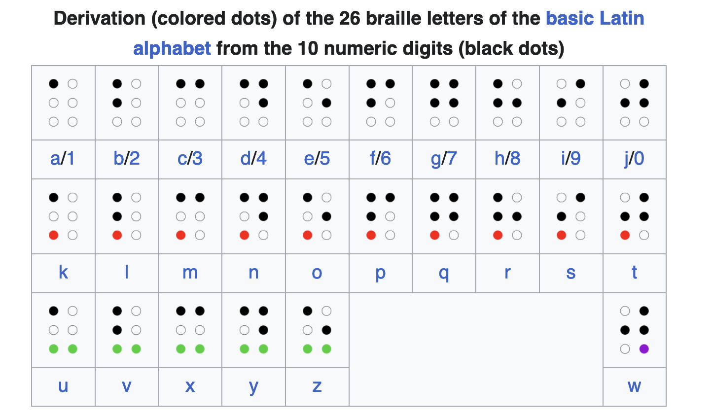
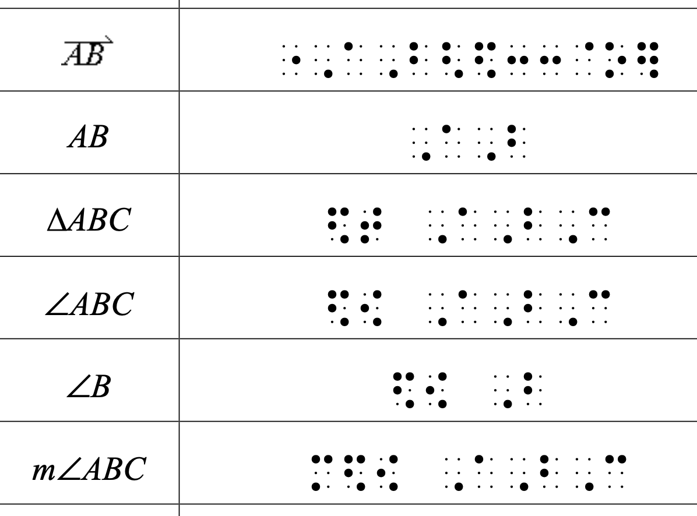
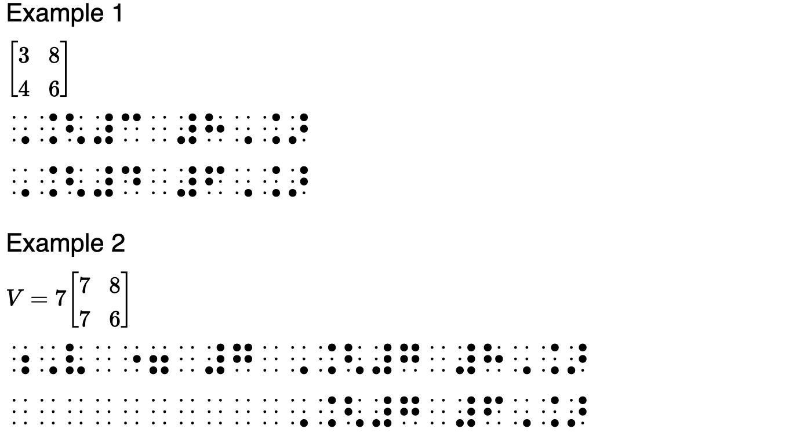
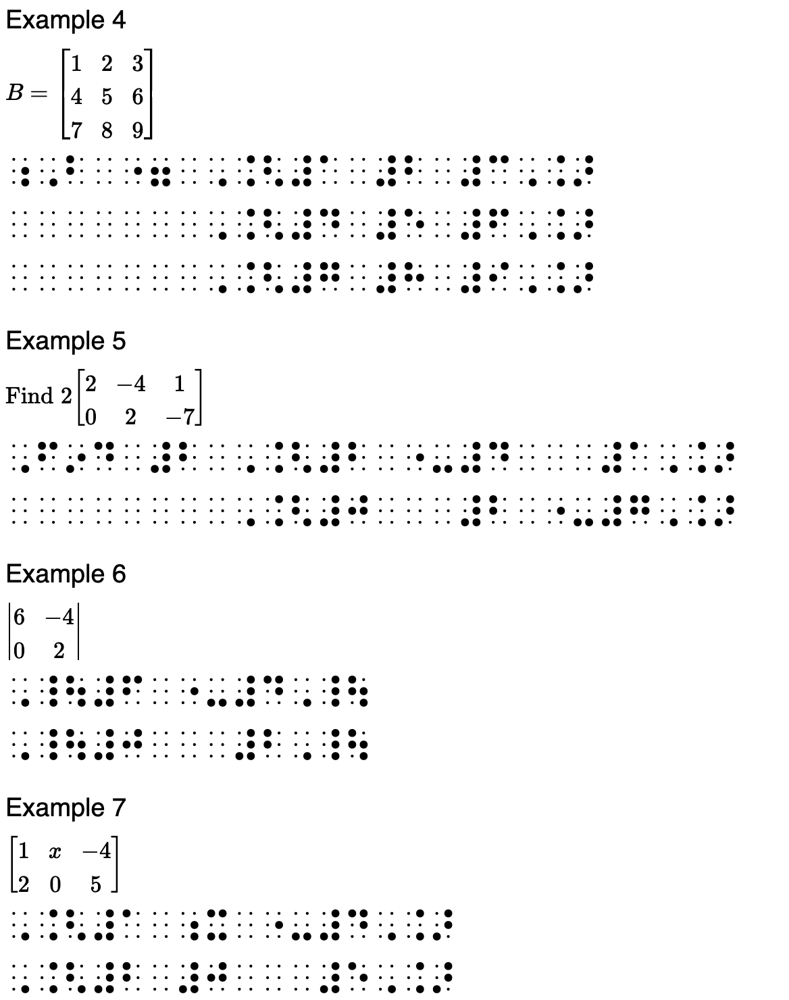
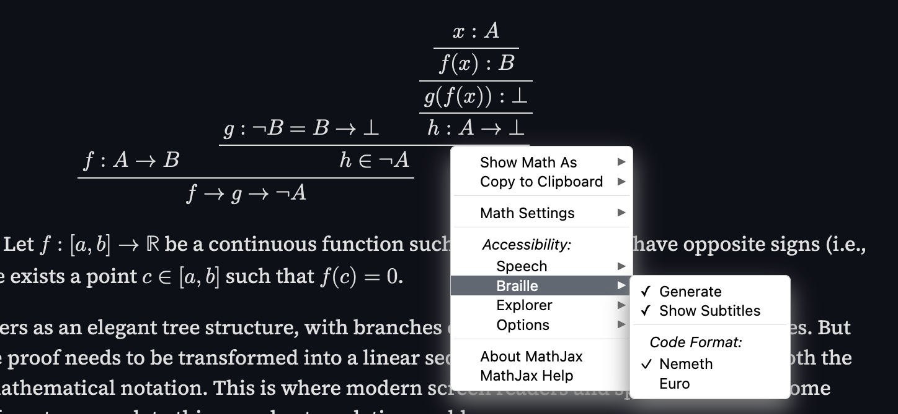
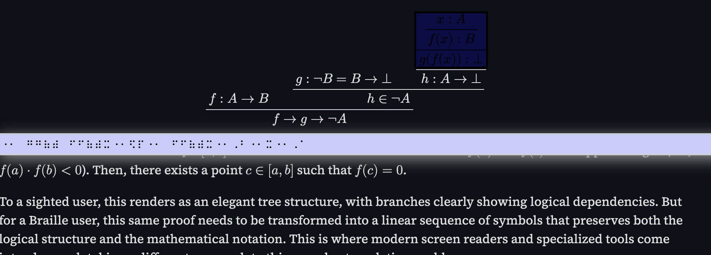

+++
title = "Braille, Dyscalculia, and Mathematics: How?"
description = "A guy explores the obvious intersection of his two majors."
date = "2024-12-31"

[extra]
comment = true
read_time = true

[taxonomies]
tags=["math", "linguistics", "educational"]
+++

# Motivation

Yes, I am a math major, and yes, I am a linguistics major. I know what you're thinking: "Of course, he is into category theory and formal languages because of this 🙄." Wrong. I am into those things, but that's just because I'm a "nerd"™ not because of my majors. The truth is I like Math because [too long to explain here], and I like Linguistics because [also too long to explain here], yet I never thought about the obvious intersection until I took a course on Braille at my university.

"Ling 327: Research on Braille" transformed my understanding of writing systems, disabilities, and most importantly, how we encode mathematical meaning. What began as a fascinating exploration of a tactile writing system evolved into a profound questioning of how we represent abstract mathematical concepts. The class didn't just teach me about Braille – it challenged my fundamental assumptions about notation systems and accessibility in mathematics (this blog is, in part, an excuse to share that rabbit hole with you).

I should note upfront: this isn't your typical academic exposition. While I've written a formal research proposal on being multipled disabilities, tactile systems, and mathematics for my final paper, this blog aims to be something different. Consider it a journey through the questions that kept me awake at night, the unexpected connections I discovered, and the sobering realizations about accessibility in mathematical education.

A disclaimer: I'm still learning Grade 2 Braille (don't worry, we'll get to what that means), and I make no claims to expertise. Instead, I offer perspective as someone straddling two worlds – the abstract realm of mathematics and the structured landscape of linguistics – discovering how they converge in unexpected ways through Braille. My hope is that by sharing these insights and questions, we can spark a broader conversation about how we represent and teach mathematics across different modalities.

{{ note(clickable=true, header="Note", body="I have tried my best to make this blog accessible to all readers, including those who are blind or visually impaired. If you encounter any issues with accessibility, please let me know so I can address them.") }}

# Braille: A Brief Introduction

If you've ever run your fingers across Braille text, you've encountered one of humanity's most ingenious writing systems. But calling Braille merely a "translation" of print does it a disservice – it's a fully realized tactile representation of language, as distinct from print English as cursive is from typeface. Like any writing system, Braille has evolved to meet the needs of its users, developing its own conventions, shortcuts, and solutions to linguistic challenges.

At its core, Braille consists of cells – small rectangular units containing up to six raised dots arranged in two columns of three. These dots, through various combinations, can represent letters, numbers, punctuation marks, and even entire words. 

Below is a visual representation of the basic Braille alphabet:

But what makes Braille fascinating isn't just its tactile nature – it's how it has evolved into different grades of complexity to serve different needs.

Grade 1 Braille is what most people envision: a one-to-one representation of letters and numbers. Each letter corresponds to a specific dot pattern, making it ideal for beginners or materials requiring exact spelling, like dictionaries. Grade 2 Braille introduces contractions – symbols that represent common letter combinations or whole words. Imagine an entire system of abbreviations akin to how "&" represents "and" in print. The word "the," for example, is reduced to a single character, enhancing reading speed and efficiency. For personal notes and shorthand, there is Grade 3 Braille, a more abbreviated form used informally.

It's important to note that Braille isn't exclusively for those with total vision loss. Legal blindness, defined as visual acuity of 20/200 or worse in the better-seeing eye with correction or a visual field of 20 degrees or less, affects individuals across a spectrum of visual abilities. Many legally blind people can perceive shapes, light, or read large print, and Braille remains a vital tool for literacy.

The digital age has expanded Braille's accessibility. Refreshable Braille displays, online tutorials, and Braille translation software have made learning and using Braille more convenient. This shift has democratized Braille education, allowing broader access beyond specialized instruction.

Ultimately, Braille stands as a testament to human ingenuity, demonstrating how language can transcend sight. While print English relies on visual spacing and layout, Braille translates the same information into a form accessible by touch. It is not just a writing system – it's a bridge that ensures literacy and communication for all.

# How Do You Do Math in Braille?  

Mathematics in Braille is where language meets logic – where theoretical elegance confronts practical necessity. If you thought reading math in print was challenging, imagine transforming the spatial dance of equations into linear patterns of raised dots. This fundamental challenge birthed two remarkable systems: Nemeth Code and Unified English Braille (UEB) technical notation, each representing different philosophies about how mathematical concepts should be touched, read, and understood.

## Nemeth Code: A System Born from Necessity  

Nemeth Code, developed by Dr. Abraham Nemeth in 1952, revolutionized how blind and visually impaired individuals engage with mathematics. As a blind mathematician frustrated by the inadequacies of existing Braille systems for higher math, Nemeth designed a code that could represent everything from simple arithmetic to advanced calculus.  

Nemeth's brilliance lies in how it repurposes the lower part of the Braille cell to represent numbers and mathematical symbols. This makes numbers immediately distinguishable from letters, akin to having a dedicated "math mode" in LaTeX. For instance, the digit "5" and the letter "e" might share the same dot pattern, but context and specific rules ensure no confusion. This compact and efficient system allows for clearer, more streamlined representations of complex expressions.  

Here are some examples of Nemeth Code in action:

## Unified English Braille (UEB): The All-in-One Approach  
UEB, adopted officially in the United States in 2016, strives to standardize Braille across all contexts – including literature, science, and mathematics. UEB technical notation integrates math within the general Braille code, avoiding the need to switch between different systems (like literary Braille and Nemeth). However, this comes at a cost: UEB often requires more cells to represent mathematical expressions.  

Consider a basic equation like \(2 + 2 = 4\). In UEB, each operator (like "+" and "=") typically takes two cells to convey, whereas Nemeth can express the same equation more compactly. UEB prioritizes consistency over efficiency, making it more intuitive for individuals who prefer seamless transitions between math and text.  

## The U.S. Approach: A Dual-System Landscape  

In the United States, students are not strictly bound to one system. Educational institutions often let students and educators choose between Nemeth and UEB, depending on factors such as:  
- The student’s prior exposure to Braille math systems.  
- Academic aspirations (Nemeth is generally preferred for advanced STEM fields).  
- Instructional resources available in each code.  
- Cognitive and learning preferences of the student.  

Think of it like programming languages: Nemeth is Python – concise, specialized, and efficient for math-heavy environments. UEB, on the other hand, is Java – verbose but consistent, allowing integration across different domains.  

## Handling Spatial Relationships in Braille Math  

One of the most remarkable challenges in Braille math is conveying spatial relationships. In print, superscripts, subscripts, and fractions are visually obvious. Braille, being linear, can't rely on visual positioning. Instead, both Nemeth and UEB use special markers and indicators to show spatial concepts.  

For example:  
- Fractions are denoted by opening and closing symbols, much like parentheses in programming, clearly outlining the numerator and denominator.  
- Superscripts and subscripts are indicated by specific prefix symbols that “shift” the reader into a different context temporarily.  

This ensures that mathematical structure isn't lost – a crucial aspect of learning math tactilely.  

## The Choice: A Story of Trade-offs

The existence of both systems in the U.S. isn't just about providing options – it's about recognizing the deeply personal nature of mathematical understanding. Some students thrive with Nemeth's efficient specialization, while others prefer UEB's consistent approach across all subjects. This choice mirrors broader debates in education about specialization versus integration, efficiency versus accessibility.

What makes this narrative particularly compelling is how it challenges our assumptions about mathematical notation. For sighted readers, mathematical symbols are visual shortcuts, but in Braille, they become tactile pathways to understanding. Whether through Nemeth's elegant efficiency or UEB's systematic consistency, these codes demonstrate that mathematics isn't just about what we see – it's about how we think.

# A Random Segment: Math on the Web  

Let’s talk about something that often flies under the radar: how do blind and visually impaired individuals read mathematical equations online? While sighted users enjoy beautifully rendered LaTeX or MathML equations (thanks to tools like MathJax), navigating mathematical content without vision requires an entirely different toolkit.  

Take this Type Theory proof tree, for instance:  

\begin{prooftree}
\AxiomC{$f : A \rightarrow B$}
\AxiomC{$g : \neg B = B \rightarrow \bot$}
\AxiomC{$x : A$}
\UnaryInfC{$f(x) : B$}
\UnaryInfC{$g(f(x)) : \bot$}
\UnaryInfC{$h : A \rightarrow \bot$}
\BinaryInfC{$h \in \neg A$}
\BinaryInfC{$f \rightarrow g \rightarrow \neg A$}
\end{prooftree}

Or this theorem: *Theorem:* Let $f: [a, b] \rightarrow \mathbb{R}$ be a continuous function such
that $f(a)$ and $f(b)$ have opposite signs (i.e., $ f(a) \cdot f(b) < 0 $).
Then, there exists a point $ c \in [a, b] $ such that $ f(c) = 0 $.

To a sighted user, this renders as an elegant tree structure, with branches clearly showing logical dependencies. But for a Braille user, this same proof needs to be transformed into a linear sequence of symbols that preserves both the logical structure and the mathematical notation. This is where modern screen readers and specialized tools come into play, each taking a different approach to this complex translation problem.

## MathJax 4.0: Bridging the Divide  

MathJax 4.0 (currently in beta) marks a major leap forward. Known for rendering LaTeX and MathML on web pages, MathJax now supports Braille outputs. This means users can experience equations tactilely or through screen readers, dynamically generating representations in either Nemeth or "Euro", depending on personal preference.  

The flexibility is remarkable – the same equation that appears visually stunning to one user can be explored in tactile form by another. This multimodal approach not only enhances accessibility but also promotes deeper engagement with mathematical content.  

## The Role of Screen Readers: JAWS and Math Navigation  

MathJax isn’t alone in this effort. JAWS (Job Access With Speech), one of the leading screen readers, has developed impressive math capabilities. When encountering equations in Microsoft Word or MathML on web pages, JAWS activates its Math Viewer – essentially an interactive tool that breaks down equations into manageable components.  

Users can navigate equations piece by piece using keyboard shortcuts, with tactile feedback via Braille displays. It’s like dissecting an equation step-by-step, mirroring how sighted users might “scan” an equation visually.  

Even more exciting is JAWS’s Braille Math Editor. This feature allows users to input equations in Nemeth Braille directly from a Braille display. As they type, the system generates a visual preview for teachers or collaborators, fostering seamless interaction between sighted and visually impaired mathematicians.  

## Math Isn't Just Visual – It's Multimodal  

The real significance of these tools extends beyond accessibility. They challenge the assumption that mathematics is inherently visual. When complex spatial relationships (like fractions, superscripts, and matrices) are translated into linear Braille sequences, new insights into mathematical structure and logic emerge.  

This shift highlights something profound: mathematics is about relationships and patterns, not just symbols on a page. By adapting to tactile and auditory forms, math becomes a richer, more inclusive experience.  

## Challenges Ahead  

Despite these advancements, barriers persist. Not all online math content is accessible – many equations exist as images or untagged PDFs, which screen readers can’t interpret. Even when MathML is used, improper markup can create stumbling blocks.  

Moreover, while tools like MathJax and JAWS excel with structured equations, more esoteric notations or heavily visual mathematical diagrams (like graphs or geometry) remain challenging to translate.  

Yet the progress is undeniable. As these technologies evolve, they promise to reshape the landscape of online math education, ensuring that everyone, regardless of visual ability, can explore the beauty and rigor of mathematics.  


Check this out! [latex2nemeth](https://www.tug.org/tug2021/assets/pdf/Andreas-Papasalouros-slides.pdf). I geeked out when I found this – it's a LaTeX package that converts LaTeX math expressions into Nemeth Braille. The fact that someone thought to create this shows the incredible creativity and dedication of the accessibility community.

Also, there is this cool video: {{ youtube(id="94swlF55tVc") }} that shows how a blind programmer...well, programs. It's a fascinating look at how someone navigates code without sight, relying on screen readers and Braille displays. It's a reminder that accessibility isn't just about reading content – it's about creating content, too.



# The Question  

Here’s what sent me down this rabbit hole: the intersection of dyscalculia and Braille mathematics. Let me back up a bit—dyscalculia, often oversimplified as "math dyslexia," is a learning disability that affects the ability to understand and process numerical concepts. Some people seem to inherently "get" numbers, while others wrestle with even basic mathematical relationships. Dyscalculia makes those struggles neurological rather than purely educational.  

While taking "Ling 327: Research in Braille," I stumbled across an idea that wouldn’t let me sleep. We know dyslexia is fundamentally neurological—it persists whether someone reads print or Braille. This hit me like a mathematical proof that just clicks: if dyslexia transcends the medium, what about dyscalculia? And more importantly, what happens when these conditions intersect with visual impairment, creating what researchers term "multiple disabled" conditions?  

The academic silence on this is almost poetic in its completeness. There's extensive research on multiple disabilities in education, yet this intersection—dyscalculia and visual impairment—remains largely unexplored. Dig through papers and databases, and you'll find studies on visual impairment and learning, or on dyscalculia in sighted learners. But the overlap? It’s a void where understanding should be.  

Consider this: reading text, whether in print or Braille, is linear—you follow a path, tracing a thread through space. Mathematics, though, demands more. A fraction isn’t just a string of symbols; it’s a spatial relationship. An equation isn’t merely characters in a line; it’s a choreography of elements arranged in patterns that convey meaning. How does the brain interpret these spatial relationships when they’re translated into linear sequences of raised dots? And what happens when that brain already processes numbers differently?  

This isn’t just academic curiosity—it’s about understanding the nuanced interplay of multiple disabilities. If someone experiences both visual impairment and dyscalculia, are they simply dealing with two parallel challenges, or does something more intricate emerge from that intersection? Research on multiple disabilities shows that conditions rarely stack neatly; they interact, creating unique learning needs that can’t be addressed by treating each condition separately.  

The implications are profound. Systems like Nemeth and UEB already translate visual mathematics into tactile representations, but have we ever considered how those systems interact with neurodivergent cognition? Could the very tools designed to make math accessible inadvertently pose new obstacles for learners with dyscalculia?  

I couldn’t shake these questions. They followed me from the classroom to the library, from research papers to late-night conversations. And maybe that’s exactly what’s needed—not immediate answers, but better questions about how to support learners navigating multiple intersecting disabilities.  

The way forward isn’t just about plugging gaps in academic literature—it’s about recognizing that every intersection of disability offers unique insights into how we process and learn mathematics. This exploration might not only aid students with multiple disabilities; it could shift how we fundamentally understand mathematical cognition.  

# What Comes Next?

And here we are—at the end of this mathematical journey (or perhaps just the beginning?). I've dragged you through the fascinating world of Braille mathematics, down the rabbit hole of multiple disabilities, and into the uncharted territory of dyscalculia in tactile systems. If your head is spinning with questions, welcome to the club – that’s exactly how I felt after that Braille course!

The gap in our understanding of dyscalculia in Braille users isn’t just a research oversight – it’s a call to action. Each unanswered question represents an opportunity to make mathematics more accessible, to deepen our understanding of how the brain processes numerical concepts, and ultimately, to foster more inclusive educational environments.

I hope this exploration has sparked your curiosity as much as it did mine. Whether you're a mathematician, educator, disability researcher, or just someone who enjoys diving into unexpected intellectual adventures, there’s something profound about discovering these unexplored intersections. They remind us that even in fields as well-studied as mathematics and disability research, mysteries remain—waiting to be unraveled.
