+++
title = "Every day is an Owl's Birthday! A rigorous exploration to a classic problem through math and rust"
date = "2024-06-20"
description = "A guy decides to overthink a simple question from his university's anonymous forum"

[extra]
comment = true
repo_view = true
read_time = true

[taxonomies]
tags=["math", "rust", "educational"]
+++

# Motivation
A few days ago, I was working on a UI framework (in rust btw) for a personal project; abruptly, I decided to check my group chat and noticed a screenshot of a question from our university's anonymous forum, Fizz. As it so happened, the question was a math problem--instantly, it became clear to me that I was [nerd sniped](https://xkcd.com/356/) (as any math major would). The question was simple and one you have probably thought about at some point in your life:

> Do yall think there is a person at rice for every birthday in the year? Like
> do you think every birthday is represented in the student body?<br>
> <cite>-- Anonymous</cite>

Not only that, but it was a classic problem in probability theory! Unfortunately, by the time I saw the question, someone had posted a pretty good answer (funnily enough, someone thought I was the one who anonymously posted the answer). Alas, my nerd-sniped brain was already in full gear, so instead, I am taking this as an opportunity to polish my writing skills :sunglasses:. Join me as I walk you through my (hopefully rigorous) exploration of this classic problem.

# The Problem and possible leads

In all honestly, this question is fun and can be approached in many ways. Clearly, a trivial solution would involve me, a rice student, having 365 (.25?) friends and checking if each of them has a different birthday. Best case, the answer is yes; worst case, the answer is no. Unfortunately, I spend most of my time at the library, so such a method would be infeasible; a more rigorous approach is desirable. Now, as a math major, I have found abstraction to be often easier to work with than a specific case. Naturally, we'll start by abstracting the problem to a more general form and then working our way back to the original problem.

If you are familiar with continuous probability theory, then perhaps you've heard about the Birthday Paradox. The paradox states that for a random group of 23 people, there is a 50% chance that two people share the same birthday (suprising, I know). While this is not the same problem as our question, they are tangentially related! Hence, we will be using some of the same techniques (most notably counting :sob:). Let's rephrase the question with some assumptions for our first lead! 

> "Do you think it's likely that a collection of Rice University students would include at least one student with each possible birthday? Assuming each birthday is equally likely, how many students would be needed to expected that every day of the year, 365 days, is someone's birthday?" <br>
> --- Problem 1.1

The most important part of this rephrasing are the assumptions (a restriction which we will remove later) of equally likely birthdays and number of days. Moreover, while the rephrasing is a bit awkward to some -- to others it may remind them of another problem: The Coupon Collector!

# The Coupon Collector Problem and Expected Value

Now, I'm not a computer scientist, so I won't simply "reduce" the problem and call it a day. First, the goal of the coupon collector problem is to determine the expected number of coupons needed to collect all coupons, i.e., instead of coupons we deal with birthdays, and quantify the number of students needed to ensure having all birthdays. In other words, we are trying to calculate the expected number of students needed to have all birthdays, which is precisely Problem 1.1!

The idea is simple: keep adding students one by one until you have all birthdays. As you follow this process, you notice that the first student is guaranteed to have a unique birthday. Moreover, each new student has a probability of $\frac{x}{365}$ of having a new birthday, where $x$ is the number of unique birthdays left. In contrast, the expected probability of how many students you have to go through until you see a new birthday is the reciprocal of the probability of seeing a new birthday, i.e., $\frac{365}{x}$. We derive this as if $k$ birthdays are already taken, the probability of $P_{\text{new}}$ is given by $P_{\text{new}} = \frac{365 - k}{365}$; hence, geometric distribution (proof: [^1]) tell us that the probability to counter an event with probability $P_{\text{new}}$ is $\frac{1}{P_{\text{new}}}$---which is $\frac{365}{365 - k}$. Finally, from our assumptions we know that the birthday is equally likely (independent), which means a new birthday does not depend on the previous birthdays. Therefore, I claim we can sum the expected number of students needed to see a new birthday for each $k$ unique birthday multiplied by the number of birthdays. Let's prove this:



**Proof**: Let $T$ be the number of students needed for all birthdays to be seen and let $T_k$ be the number of students needed to see a new birthday given that $k - 1$ birthdays are already taken. As we have noted before, the probability of seeing a new birthday is $P_k = \frac{365 - k}{365}$, which means the expected number of students needed to see a new birthday is $\frac{1}{p_k} = \frac{365}{365 - k}$. Now, let's readjust the sum to avoid diving by zero and we see:

$$
\begin{align*}
\mathbb{E}[T] &= \mathbb{E}[(T_1 + T_2 + \ldots + T_{365})]& &\\\\
&= \mathbb{E}[T_1] + \mathbb{E}[T_2] + \ldots + \mathbb{E}[T_{365}]& &\quad\text{by linearity of expectation}\\\\
&= \frac{1}{p_1} + \frac{1}{p_2} + \ldots + \frac{1}{p_{365}}& &\quad\text{by definition of expectation}\\\\
&= \frac{365}{365} + \frac{365}{364} + \ldots + \frac{365}{1}& &\quad\text{by definition of } \frac{1}{p_k}\\\\
&= 365 \left( \frac{1}{365} + \frac{1}{364} + \ldots + \frac{1}{1} \right)& &\quad\text{by distributive property}\\\\
&= 365 \sum_{i=1}^{365} \frac{1}{i}& &\quad\text{as desired} \tag*{$\blacksquare$}
\end{align*}
$$ 



Now, we would be done here, but notice that the last summation is the $n^{th}$ [harmonic number](https://en.wikipedia.org/wiki/Harmonic_number), $H_n$. summation is known to be $\ln(n) + \gamma + \epsilon(n)$, where $\gamma$ is the Euler-Mascheroni constant and $\epsilon(n)$ is the error term. Hence, we can approximate the expected number of students needed to see all birthdays as $365 H_{365} \approx 365 \ln(365) + 365 \gamma + \epsilon(365)$. If we let $\gamma \approx 0.5772156649$ and the error bound be bounded by $\frac{1}{n} + \mathcal{O}(\frac{1}{n})$, then we can calculate this as approximately $2364$ students needed!

## Exploring leap days through our lead

However, an astute reader would notice that this is still the expected number of students needed to see all birthdays, not the number of students needed to ensure all birthdays are seen. For now, however, we will explore this setup a bit more. For instance, what if we account for leap days, i.e., someone is born on February 29th? Let's rephrase the problem with this in mind:

> "Do you think it's likely that a collection of Rice University students would include at least one student with each possible birthday? Assuming each birthday is equally likely, how many students would be needed to expected that every day of the year, including leap days, is someone's birthday?" <br>
> --- Problem 1.15

Easily, we can change our sum to $365.25$ instead of $365$ and the expected number of students needed to see all birthdays would be $\frac{365.25}{365} \cdot 2364 \approx 2366$ students, but this is *without* our error bound i.e., the probabilities of the event happening adjusting for leap days. In fact, to get the error bound we have to multiple all the probability of covering all possible birthdays in a random group process such that each day has a slightly different probability due to our leap day. Using the logic described previously, we to calculate such a risk we can multiply:

$$
 \frac{365}{365.25} \times \frac{364}{364.25} \times \frac{363}{363.25} \times \cdots \times \frac{1}{1.25} = \frac{365!}{365.25^{365}} = \prod_{i=1}^{365} \frac{i}{i + 0.25}
$$ 

While this might look complicated (it is!) -- thankfully, this looks like the [gamma function](https://en.wikipedia.org/wiki/Gamma_function)! The gamma function is a generalization of the factorial function to the $\mathbb{R}^+$, and it is defined as $\Gamma(n) = (n - 1)!$. This allows us to deal with some non-integer values, and in our case, we can use the gamma function to calculate the probability of seeing all birthdays in a group of 365.25 students. Hence, 

$$
\prod_{i=1}^{365} \frac{i}{i + 0.25} = \frac{\Gamma(366)\Gamma(1.25)}{\Gamma(366.25)} 
$$ 

Now, thanks to wolfram alpha, we can calculate this:

```wolframscript
result = (Gamma[366] * Gamma[1.25]) / Gamma[366.25]
result
```

But, we are on an exploration, so let's calculate this by hand! Honestly, without wikipedia I would have been stuck, but it turns out that we have a general formula for the gamma function in the form of $\Gamma(n + \frac{1}{4}) = \Gamma(\frac{1}{4}) \frac{(4n - 3)!!!!}{4^n}$. However, what's even nicer is that we can approximate: $\frac{\Gamma(n + \frac{1}{4})}{\Gamma(n)}$ by using $\frac{\Gamma(a + \epsilon)}{\Gamma(a)} \approx \left(a + \frac{\epsilon}{2} - \frac{1}{2}\right)^{\epsilon}$. Hence, we get: 

$$
\frac{\Gamma(366.25)}{\Gamma(366)} \approx \left(366 + \frac{0.25}{2} - \frac{1}{2}\right)^{0.25} = \left(366 + 0.125 - 0.5\right)^{0.25} = \left(365.625\right)^{0.25}
$$ 

Which means, the original expression can then be approximated as:

$$
\frac{\Gamma(366) \Gamma(1.25)}{\Gamma(366.25)} \approx \Gamma(1.25) \left(365.625\right)^{-0.25}
$$

Now by expanding out the gamma function $\Gamma(\frac{5}{4}) = \frac{1}{4} \Gamma(\frac{1}{4})$, we can calculate this as[^2]:

$$
\frac{\Gamma(366)\Gamma(1.25)}{\Gamma(366.25)} \approx \frac{\Gamma(\frac14)}{4 \sqrt[4]{365.625}}
$$ 


Now, thanks to the work of [others](https://oeis.org/A068466), we find that $\Gamma(\frac{1}{4}) = 3.6256099082219083119$. Which means, we can calculate the probability of seeing all birthdays in a group of 365.25 students as:

$$
\frac{\Gamma(366)\Gamma(1.25)}{\Gamma(366.25)} \approx 0.20728
$$ 

Hell ya! Finally, we can calculate the expected number of students needed to see all birthdays in a group of 365.25 students as:

$$
2366 + 0.20728 \cdot \frac{365.25}{0.25} \approx 2669
$$ 

We can actually continue with this lead, but I want to explore another lead that I have in mind for now -- we'll return to this later!

# The Inclusion-Exclusion Principle

So far, we've tackled the problem using the Coupon Collector approach, which gave us a great starting point. However, there's another powerful method in combinatorics that can provide us with more insight: the Inclusion-Exclusion Principle. This was the method that the person who responded on Fizz used! Now, this principle is particularly useful for counting the number of elements in the union of several sets, especially when those sets are not disjoint.

> "Do you think it's likely that a collection of Rice University students would include at least one student with each possible birthday? How can we calculate the probability that every birthday is represented assuming uniform distribution?" <br>
> --- Problem 1.2

In other words, we want to find the probability that at least one student has each birthday. In fact, this is reverse of asking if nobody has a birthday on those days, which is easier to calculate (I'll explain in a bit). We can use the Inclusion-Exclusion Principle to calculate the probability that nobody has a birthday on a particular day! The inclusion principle states that if we have events $A_i, i = \{ 1, 2, \ldots, n\}$ and $\mathcal{P}(A_i)$ is the probability of event $A_i$, then the probability of the union of their union (i.e., the probability that at least one of the events occurs) is given by:

$$
\begin{align*}
\mathcal{P} \left( \bigcup_{i=1}^n A_i \right) &= \sum_{i=1}^n \mathcal{P}(A_i)\ - \sum_{1\leq i<j\leq n} \mathcal{P}(A_i \cap A_j) \\\\
&+ \quad \sum_{1\leq i<j<k\leq n}\mathcal{P}(A_i \cap A_j \cap A_k) - \cdots + (-1)^{n-1} \mathcal{P}( A_1 \cap \cdots \cap A_n) \\\\
&= \sum_{\emptyset \neq J\subseteq \{1,2,\ldots ,n\}} (-1)^{|J|-1}\mathcal{P}\left(\bigcap_{j\in J}A_{j}\right)
\end{align*}
$$ 

The intuitive way to think about the Inclusion-Exclusion Principle is as a method for correcting overcounts when calculating the probability of at least one of several events occurring. In the context of our problem with Rice University students, each event $A_i$ can be thought of as the event that no student has their birthday on day $i$. Since these events overlap (students can share birthdays or not have birthdays on multiple specific days), we need to adjust for the overlap to avoid double-counting the probabilities. Now, before we use it, however, let's prove it and a claim that will be useful for our proof.


**Proof**: We proceed by the principle of induction. Let's denote the principle as

$$
p(n) = \mathcal{P} \left( \bigcup_{i=1}^n A_i \right) = \sum_{\emptyset \neq J\subseteq \{1,2,\ldots ,n\}} (-1)^{|J|-1}\mathcal{P}\left(\bigcap_{j\in J}A_{j}\right), n \in \mathbb{N}, |A_i| = n, n \geq 2
$$ 

**Base Case**: For $n = 2$, let us denote $A_1 = E$ and $A_2 = F$. Then, observe that $E$ and $F-E$ are exclusive events, which means that their union $\mathcal{P}(E \cup F) = \mathcal{P}(E \cup (F - E)) = \mathcal{P}(E) + \mathcal{P}(F - E)$. Moreover, we also know that $F-E$  and $F \cup E$ are exclusive events with their union being $F$. Hence, we can write $\mathcal{P}(F)$ $= \mathcal{P}((F - E) \cup (F \cap E)) = \mathcal{P}(F - E) + \mathcal{P}(F \cap E)$. Thus:

$$
\begin{align*}
\mathcal{P}(E \cup F) &= \mathcal{P}(E) + \mathcal{P}(F - E)\\\\
&= \mathcal{P}(E) + \left(\mathcal{P}(F) - \mathcal{P}(E \cap F)\right)\\\\
&= \sum_{\emptyset \neq J\subseteq \{1,2\}} (-1)^{|J|-1}\mathcal{P}\left(\bigcap_{j\in J}A_{j}\right)
\end{align*}
$$ 

Where the second line follows from the fact that $E \cap F = E$ and $F - E = F$. To read the last line notice that the non-empty subsets of $J$ are $\\{1, 2\\}$, $\\{1\\}$, $\\{2\\}$, so the summation is $\mathcal{P}(E) + \mathcal{P}(F) - \mathcal{P}(E \cap F)$; the base case holds.

**Inductive Step**: Assume that $p(k)$ holds for some $k \in \mathbb{N}$, we show that $p(k+1)$ holds. Let $A_1, A_2, \ldots, A_{k+1}$ be events, then we can write:

$$
\begin{align*}
\mathcal{P} \left( \bigcup_{i=1}^{k+1} A_i \right) &= \mathcal{P} \left( \left[\bigcup_{i=1}^{k} A_i \right] \cup A_{k+1} \right)& &\text{by definition}\\\\
&= \mathcal{P}\left( \bigcup_{i=1}^{k} A_i \right) + \mathcal{P}(A_{k+1}) - \mathcal{P} \left( \left[\bigcup_{i=1}^{k} A_i \right] \cap A_{k+1} \right)& &\text{base case with } E = \bigcup_{i=1}^{k} A_i, F = A_{k+1}\\\\
&= \mathcal{P}\left( \bigcup_{i=1}^{k} A_i \right) + \mathcal{P}(A_{k+1}) - \mathcal{P} \left( \bigcup_{i=1}^{k} \left(A_i \cap A_{k+1}\right) \right)& &\text{by distributive property}
\end{align*}
$$

Notice, that the first and last terms are $n-$unions, thus the inductive hypothesis holds:


$$
\begin{align*}
\mathcal{P} \left( \bigcup_{i=1}^{k+1} A_i \right) &= \mathcal{P}\left( \bigcup_{i=1}^{k} A_i \right) + \mathcal{P}(A_{k+1}) - \mathcal{P} \left( \bigcup_{i=1}^{k} \left(A_i \cap A_{k+1}\right) \right)& &\\\\
&= \left[\sum_{\emptyset \neq J\subseteq \{1,2,\ldots ,k\}} (-1)^{|J|-1}\mathcal{P}\left(\bigcap_{j\in J}A_{j}\right)\right] + \mathcal{P}(A_{k+1})& & \\\\
&- \left[\sum_{\emptyset \neq J\subseteq \{1,2,\ldots ,k\}} (-1)^{|J|-1}\mathcal{P}\left(\bigcap_{j\in J} \left(A_{j} \cap A_{k+1}\right)\right)\right]& &\text{by inductive hypothesis}\\\\
\end{align*}
$$

Now, observe:

$$
\mathcal{P}(A_{k+1}) = \sum_{\substack{J \subseteq \{1, 2, \ldots, k+1\} \\ k+1 \in J, |J|=1}} (-1)^{|J|-1} \mathcal{P} \left( \bigcap_{j \in J} A_j \right)
$$

And for the terms with intersections $ A_j \cap A_{k+1} $:

$$
\mathcal{P} \left( \bigcap_{j \in J} (A_j \cap A_{k+1}) \right) = \mathcal{P} \left( \bigcap_{j \in (J \cup \{k+1\})} A_j \right)
$$

Thus, the equation becomes:

$$
\begin{align*}
\mathcal{P} \left( \bigcup_{i=1}^{k+1} A_i \right) &= \sum_{\emptyset \neq J \subseteq \{1, 2, \ldots, k\}} (-1)^{|J|-1} \mathcal{P} \left( \bigcap_{j \in J} A_j \right) \\\\
&\quad + \sum_{\substack{J \subseteq \{1, 2, \ldots, k+1\} \\ k+1 \in J, |J|=1}} (-1)^{|J|-1} \mathcal{P} \left( \bigcap_{j \in J} A_j \right) \\\\
&\quad - \sum_{\emptyset \neq J \subseteq \{1, 2, \ldots, k\}} (-1)^{|J|-1} \mathcal{P} \left( \bigcap_{j \in (J \cup \{k+1\})} A_j \right)
\end{align*}
$$

Combining all these terms, I claim we have $(\star)$:

$$
\mathcal{P} \left( \bigcup_{i=1}^{k+1} A_i \right) = \sum_{\emptyset \neq J' \subseteq \{1, 2, \ldots, k+1\}} (-1)^{|J'|-1} \mathcal{P} \left( \bigcap_{j \in J'} A_j \right)\quad (\star)
$$

All that is left is proving $(\star)$, but it's not that important for the reader.

<details>
<summary>Proof of $(\star)$</summary>
<p>

Let $E = \{ J \subseteq \{1, 2, \ldots, k\} \mid J \neq \emptyset \}$ and $F = \{ J \subseteq \{1, 2, \ldots, k+1\} \mid J \neq \emptyset \}$. Then, $F - E = \{ \{k+1\} \} \cup \{ \{k+1\} \cup x \mid x \in E \}$.

To prove the claim, we need to show that every element $y$ in $F - E$ is in $\{ \{k+1\} \} \cup \{ \{k+1\} \cup x \mid x \in E \}$ and vice versa. Suppose $y \in F - E$. This means $y \in F$ and $y \notin E$. Since $y \in F$, we have $y \subseteq \{1, 2, \ldots, k+1\}$ and $y \neq \emptyset$. Additionally, $y \notin E$ implies $y \not\subseteq \{1, 2, \ldots, k\}$. This means there exists an element $m \in y$ such that $m \notin \{1, 2, \ldots, k\}$. The only such $m$ is $k+1$, so $k+1 \in y$.

Consider two cases: $y = \{k+1\}$ or $y \supset \{k+1\}$, i.e., $y = \{k+1\} \cup x$ for some $x \subseteq \{1, 2, \ldots, k\}$. In the second case, since $y \notin E$, $x \neq \emptyset$, implying $x \in E$. Thus, $y \in \{ \{k+1\} \} \cup \{ \{k+1\} \cup x \mid x \in E \}$.

Conversely, suppose $y \in \{ \{k+1\} \} \cup \{ \{k+1\} \cup x \mid x \in E \}$. This means either $y = \{k+1\}$ or $y = \{k+1\} \cup x$ for some $x \in E$. In both cases, $y \subseteq \{1, 2, \ldots, k+1\}$ and $y \neq \emptyset$, so $y \in F$. Additionally, $y \notin E$ because if $y = \{k+1\}$, clearly $y \not\subseteq \{1, 2, \ldots, k\}$, and if $y = \{k+1\} \cup x$ and $x \in E$, $y$ contains $k+1$ which is not in $\{1, 2, \ldots, k\}$. Hence, $y \in F - E$.

Combining both directions, we have shown $F - E = \{ \{k+1\} \} \cup \{ \{k+1\} \cup x \mid x \in E \}$. This completes the proof of $(\star)$.
</p>
</details>

Equivalently, we can express $J'$ as $J' = (J \cup \{ \\{k+1\\} \} \cup \\{ \\{k+1\\} \cup x \mid x \in J \\})$ through our claim. This completes the inductive step; thus, through the principle of induction, we have proven the Inclusion-Exclusion Principle, $p(n)$ for $n \in \mathbb{N}$. $$\tag*{$\blacksquare$}$$ 


That took a bit, but now we can use it freely :sunglasses:! Fix $n$, the number of students, and let $m$ be a set of birthdays. Clearly, for a set of $m$ days, the probability that nobody has a birthday on those days is $(1 - \frac{m}{365})^n)$. Now in order to tie this to the Inclusion-Exclusion Principle, we need to state a corollary 🙃:


**Corollary**: In the probabilistic version of the inclusion-exclusion principle, the probability of the intersection $A_i, i \in I$ only depends on the cardinality of $I$, meaning for every $k \in \{1, \ldots, n\}$, there exists $a_k$ such that

$$
a_k = \mathcal{P}(A_I) \quad \text{for every} \quad I \subseteq \{1, \ldots, n\} \quad \text{with} \quad |I| = k
$$ 

Then, the formula simplifies to

$$
\mathcal{P} \left( \bigcup_{i=1}^n A_i \right) = \sum_{k=1}^n (-1)^{k-1} \binom{n}{k} a_k
$$


This result arises due to the combinatorial interpretation of the binomial coefficient $\binom{n}{k}$ and the independence of the events $A_i$. 

<details>
<summary>Proof of Corollary</summary>
 <p>

 Let's denote the probability of the union of $n$ events $A_i$ as $\mathcal{P} \left( \bigcup_{i=1}^n A_i \right)$. According to the inclusion-exclusion principle, we have:

  $$
  \mathcal{P} \left( \bigcup_{i=1}^n A_i \right) = \sum_{\emptyset \neq J \subseteq \{1, 2, \ldots, n\}} (-1)^{|J|-1} \mathcal{P} \left( \bigcap_{j \in J} A_j \right)
  $$ 

  Given that the probability of the intersection $A_i$ only depends on the cardinality of $I$, we let $a_k = \mathcal{P}(A_I)$ for any $I$ with $|I| = k$. We can then rewrite the inclusion-exclusion formula as:

  $$
  \mathcal{P} \left( \bigcup_{i=1}^n A_i \right) = \sum_{k=1}^n \sum_{\substack{J \subseteq \{1, 2, \ldots, n\} \\ |J| = k}} (-1)^{k-1} a_k
  $$

  Since there are $\binom{n}{k}$ subsets $J$ of size $k$ from $n$ elements, the expression simplifies to:
  $$
  \mathcal{P} \left( \bigcup_{i=1}^n A_i \right) = \sum_{k=1}^n (-1)^{k-1} \binom{n}{k} a_k
  $$ 

  For the case where the events $A_i$ are independent and identically distributed, we have $\mathcal{P}(A_i) = p$ for all $i$, and thus $a_k = p^k$. Substituting $a_k = p^k$ into the formula, we get:

  $$
  \mathcal{P} \left( \bigcup_{i=1}^n A_i \right) = \sum_{k=1}^n (-1)^{k-1} \binom{n}{k} p^k
  $$

  Which completes the proof of the corollary. $$
  \tag*{$\blacksquare$}
  $$ 
</p>
</details>



Using the corollary, we can now finally calculate the probability our question asks for! Let $A_i$ be the event that nobody has a birthday on day $i$, then the probability that at least one student has each birthday is given by:


$$
\sum_{m=0}^{365} (-1)^m \binom{365}{m} \left(1 - \frac{m}{365}\right)^n = \frac{1}{365^n} \sum_{m=0}^{365} (-1)^m \binom{365}{m} (365 - m)^n
$$ 

Now, we can calculate this for $n = 2366$ and $n = 2669$ to see if our results match up!

```wolframscript
(* Define the summation function *)
s[n_] := Sum[(-1)^m Binomial[365, m] (1 - m/365)^n, {m, 0, 365}]

(* Compute the summation for n = 2366 *)
s2366 = s[2366]

(* Compute the summation for n = 2669 *)
s2669 = s[2669]
```

We end up with $n = 2366$ having a probability of $0.573$ and $n = 2669$ having a probability of $0.785$.  This is a bit surprising, as the expected number of students needed to see all birthdays was $2366$ students, but the probability of seeing all birthdays was only $57.3\%$ using that number. This is due to the fact that the expected number of students needed to see all birthdays is the average number of students needed to see all birthdays, but the probability of seeing all birthdays is the one minus the probability of not seeing all birthdays. This is a subtle but important distinction, and shows the power of different methods (and leads) in probability theory!

# Monte Carlo Simulation

Now, that we came up with two different methods to solve similar problems, I want to explore another lead: Monte Carlo Simulation (honestly, so this blog has pictures lol). Monte Carlo simulations are particularly useful when dealing with complex probability problems. Instead of solving the problem analytically, we simulate the scenario many times and observe the outcomes. In our case, we will simulate the assignment of birthdays to students repeatedly and count how often all 365 days are represented. Unfortunately, we need to move to the `computing` land and code it up. I wanted a easy, fast, and clean language to prototype this, so of course I choose [rust](https://www.rust-lang.org/) :crab:.

This is suppose to be math blog, so I'll try to keep the code to a minimum. The idea is simple: we generate a random birthday for each student and check if all 365 days are represented. We repeat this process many times and calculate the probability of seeing all birthdays. I want to create different models to optimize them for the problem, so I decided to have an interface for our simulations (or a trait in Rust land):

```rust
pub trait Simulation {
    // Number of students that will be assigned birthdays
    fn students(&self) -> [u16; 10] {
        [2366, 2669, 3000, 4000, 4500, 5000, 6000, 7000, 8000, 9000]
    }

    fn days(&self) -> u16 { // Number of days in a year
        365
    }

    fn simulations(&self) -> u16 { // Number of simulations to run
        10_000
    }

    fn run(&self) -> Vec<f64>;
}

```

This will allow us to create different models for our simulations, such as a simple model that assigns birthdays randomly to students, and two more two more I have in mind. Here is our first model:

```rust
pub struct BasicModel{}

impl Simulation for BasicModel {
    fn run(&self) -> Vec<f64> {
        let (days, simulations, students) =
            (self.days() as usize, self.simulations(), self.students());

        let mut rng = rand::thread_rng();
        let mut birthdays: HashSet<_, RandomState> = HashSet::with_capacity(days);

        students
            .into_iter()
            // for each number of students
            .map(|num| {
                (0..simulations) // we run the simulation
                    // for each simulation
                    .map(|_| {
                        birthdays.clear(); // so we don't have to allocate each time

                        birthdays.extend((0..num).map(|_| {
                            rng.gen_range(0..days) // Generate a random day of the year
                        })); // add a random birthday to the HashSet

                        usize::from(birthdays.len() == days)
                    })
                    .sum::<usize>() as f64 // sum the results of the simulations
                    / simulations as f64 // divide by the number of simulations
            })
            .collect()
    }
}
```

In this model, we generate a random birthday for each student and check if all 365 days are represented through a hashset. We repeat this process many times and calculate the probability of seeing all birthdays. We then get the probability of seeing all birthdays for each number of students in our `students` array. Now, we simply run the code with `cargo run --release`:

```rust
fn main() {
    let now = std::time::Instant::now(); // Benchmarking
    let model = basic::BasicModel {};
    let results = model.run();
    for (num, result) in model.students().iter().zip(results.iter()) {
        println!("Num Students: {}, Probability: {}", num, result);
    }
    println!("Elapsed: {:?}", now.elapsed());
}
```

Here are the results:

```bash
$ cargo run --release 
Num Students: 2366, Probability: 0.5698
Num Students: 2669, Probability: 0.7893
Num Students: 3000, Probability: 0.9072
Num Students: 4000, Probability: 0.9948
Num Students: 4500, Probability: 0.9988
Num Students: 5000, Probability: 0.9996
Num Students: 6000, Probability: 0.9999
Num Students: 7000, Probability: 1
Num Students: 8000, Probability: 1
Num Students: 9000, Probability: 1
Elapsed: 6.503436542s
```

Anyway, I wanted to make this fast to run more simulations so here is a slightly optimized version of the model where we parallelize the simulation. Parallelizing is a technique that allows us to run multiple computations simultaneously, which can be useful when we have a large number of simulations to run as in this case!

```rust
impl Simulation for ParModel {
    fn run(&self) -> Vec<f64> {
        let (days, simulations, students) =
            (self.days() as usize, self.simulations(), self.students());

        students
            .into_par_iter() // parallelize the outer loop
            .map_init(
                // init set and rand generator
                || (HashSet::with_capacity(days), rand::thread_rng()),
                // for each number of students
                |(birthdays, rng), num| {
                    (0..simulations)
                        .map(|_| {
                            birthdays.clear(); // so we don't have to allocate each time

                            birthdays.extend((0..num).map(|_| {
                                rng.gen_range(0..days as u16) // Generate a random day of the year
                            })); // add a random birthday to the HashSet

                            u16::from(birthdays.len() == days)
                        })
                        .sum::<u16>() as f64
                        / simulations as f64 // sum the results of the simulations
                },
            )
            .collect::<Vec<f64>>()
    }
}
```

Now, let's change the main function and the number of simulations to run `100,000` simulations and test the models:

```rust
pub trait Simulation: std::fmt::Debug { // Add Debug trait
    fn students(&self) -> [u16; 10] {
        [2366, 2669, 3000, 4000, 4500, 5000, 6000, 7000, 8000, 9000]
    }

    fn days(&self) -> u16 {
        365
    }

    fn simulations(&self) -> u32 {
        100_000
    }

    fn run(&self) -> Vec<f64>;
}

fn main() {
    let models: Vec<Box<dyn Simulation>> = vec![
        Box::new(basic::BasicModel {}),
        Box::new(parallel::ParModel {}),
    ];

    for model in models {
        let now = std::time::Instant::now();
        let results = model.run();
        println!("Model: {:?}", model);
        for (num, result) in model.students().iter().zip(results.iter()) {
            println!("Num Students: {}, Probability: {}", num, result);
        }
        println!("Elapsed: {:?}", now.elapsed());
    }
}
```

This surprisingly only took `2m 40s` for both models to run $100000$ simulations, which is pretty fast! Here are the results again:

```bash
$ cargo run --release
Model: BasicModel
Num Students: 2366, Probability: 0.57235
Num Students: 2669, Probability: 0.7869
Num Students: 3000, Probability: 0.90672
Num Students: 4000, Probability: 0.99357
Num Students: 4500, Probability: 0.99841
Num Students: 5000, Probability: 0.99958
Num Students: 6000, Probability: 0.99997
Num Students: 7000, Probability: 1
Num Students: 8000, Probability: 1
Num Students: 9000, Probability: 1
Elapsed: 141.827488417s
Model: ParModel
Num Students: 2366, Probability: 0.5726
Num Students: 2669, Probability: 0.78389
Num Students: 3000, Probability: 0.90653
Num Students: 4000, Probability: 0.99389
Num Students: 4500, Probability: 0.99826
Num Students: 5000, Probability: 0.99954
Num Students: 6000, Probability: 0.99999
Num Students: 7000, Probability: 1
Num Students: 8000, Probability: 1
Num Students: 9000, Probability: 1
Elapsed: 12.1203835s
```

Clearly, paralleling the model was worth it. In either case, we see that using a monte carlo simulation, we can get a good approximation of the probability of seeing all birthdays in a group of students. I don't like computation but you gotta admit, this is cool as it matches our work so far! But now, let's move on to---the proof of[^3]---jk the third model and pretty pictures!

# The IEP model and plots!

Let's move on to the third model, which will simply use the Inclusion-Exclusion Principle. Since the IEP is deterministic, we don't need to run simulations. Instead, we can calculate the probability of seeing all birthdays in a group of students directly. Here is the code for the model:

```rust
impl Simulation for IEPModel {
    fn run(&self) -> Vec<f64> {
        let (days, students) = (self.days() as usize, self.students());

        students
            .into_par_iter() // parallelize the outer loop
            .map(|num| self.iep(days, num))
            .collect::<Vec<f64>>()
    }
}

impl IEPModel {
    fn iep(&self, days: usize, students: u16) -> f64 {
        let scale = 10u64.pow(12);

        let mut sum = BigInt::from(0i8);
        let mut sign = 1i8;
        let year = BigUint::from(days);
        let power = BigInt::from_biguint(num_bigint::Sign::Plus, year.pow(students.into()));

        let big_days = BigUint::from(days);
        let mut binomial_iter = IterBinomial::new(big_days);

        for (m, binom) in (0..=days).zip(&mut binomial_iter) {
            let diff = (&year - BigUint::from(m)).pow(students.into());
            let iterm = BigInt::from_biguint(num_bigint::Sign::Plus, binom * diff);

            match sign == 1 {
                true => sum += iterm,
                false => sum -= iterm,
            }

            // Alternate signs
            sign *= -1;
        }

        let scaled_probability = &sum * BigInt::from(scale) / &power; // Scaled by 10e12 to allow precision
        let actual_probability = scaled_probability.to_u64_digits().1[0] as f64;

        actual_probability / scale as f64
    }
}
```

Running the model, we get the following results:

```bash
Model: IEPModel
Num Students: 2366, Probability: 0.573025123519
Num Students: 2669, Probability: 0.785229207305
Num Students: 3000, Probability: 0.907229336079
Num Students: 4000, Probability: 0.993761854096
Num Students: 4500, Probability: 0.998414022451
Num Students: 5000, Probability: 0.999597463865
Num Students: 6000, Probability: 0.999974093862
Num Students: 7000, Probability: 0.999998333033
Num Students: 8000, Probability: 0.999999892737
Num Students: 9000, Probability: 0.999999993098
Elapsed: 73.884958ms
```

WOW, the IEP model is super fast and accurate! I mean it makes sense since it's a formula, but still, I did not expect $73$ms. With that being said, let's make some pretty graphs :). First, since this is an exploration, I'll show the trace graphs of the models (I think it's really cool). To make these graphs I used `env CARGO_PROFILE_RELEASE_DEBUG=true cargo flamegraph --root -o flamegraph.svg` with the [flamegraph crate](https://github.com/flamegraph-rs/flamegraph). You can right-click and open these images in a new tab to explore their traces!

The basic model:
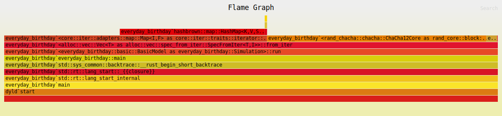

The parallel model:
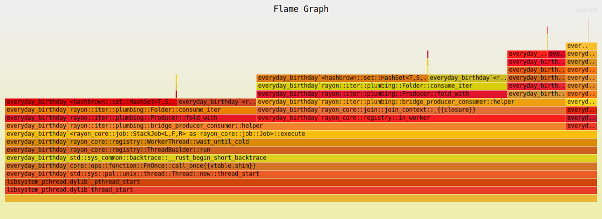

The IEP model:
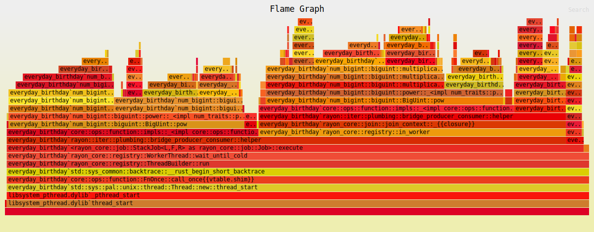

Now, let's plot the results[^4] of the parallel and IEP model to see how they compare. To make these graphs more prettier, I decided to map over a range of number of students, 0 to 9,000, and to only run 10,000 simulations.


First, here is the rust code I used to write the data I wanted to python:
```rust
for model in models {
    let title = format!("{:?}.csv", model);
    let csv = File::create(title).unwrap();
    let mut bufread = BufWriter::new(csv);
    let header = "model,students,probability,time\n";
    bufread.write_all(header.as_bytes()).unwrap();
    let results = model.run();
    for (num, (result, time)) in results.iter().enumerate() {
        let line = format!("{:?},{},{},{:?}\n", model, num, result, time);
        bufread.write_all(line.as_bytes()).unwrap();
    }
}
```
```python
import pandas as pd
import seaborn as sns
import matplotlib.pyplot as plt

# Load your data
df = pd.read_csv("data.csv")

# Set the overall aesthetics
sns.set_theme()

# Create the plot
plt.figure(figsize=(14, 8))  # Larger figure size for better visibility
# Define custom colors for each model
palette = {"IEPModel": "deepskyblue", "ParModel": "coral"}
plot = sns.lineplot(
    x='students',
    y='probability',
    hue='model',
    style='model',
    markers=False,
    dashes=False,
    data=df,
    palette=palette
)

# Customizing x-axis ticks
plt.xticks(
    [0, 1000, 2000, 3000, 4000, 5000, 6000, 7000, 8000, 9000],
    ['0', '1k', '2k', '3k', '4k', '5k', '6k', '7k', '8k', '9k']
)

# Adding annotations (customize as needed)
plt.axhline(0.57, ls='--', color='gray')
plt.axvline(2366, ls='--', color='gray')  # Example vertical line
plot.text(1000, 0.55, 'Expected Average', verticalalignment='bottom', horizontalalignment='right')

# Enhancing the plot
plt.title('Probability Comparison Between Models')
plt.xlabel('Number of Students')
plt.ylabel('Probability')
plt.ylim(0, 1)  # Set y-axis limits
plt.grid(True, which="both", ls="--", linewidth=0.5)

# Legend
plt.legend(title='Model', loc='upper left')

# Save or show the plot
plt.savefig('comparison_plot.png')
# clear plot
plt.clf()

# Create a violin plot
plt.figure(figsize=(14, 8))
sns.violinplot(x='model', y='probability', data=df, palette="Pastel1")

# Enhancing the plot
plt.title('Probability Distribution by Model')
plt.xlabel('Model')
plt.ylabel('Probability')

# Show the plot
plt.savefig('violin.png')

plt.clf()

# Assuming time is in the format '866.458µs' and you want to convert it to milliseconds
df['time_ms'] = df['time'].replace({'µs': '*1e-3', 'ms': '*1', 's': '*1000'}, regex=True).map(pd.eval)

# Create the scatter plot with regression line
plt.figure(figsize=(14, 8))
sns.lmplot(x='students', y='time_ms', hue='model', data=df, ci=None, palette="Set1")

# Enhancing the plot
plt.title('Simulation Time vs Number of Students', pad=5)
plt.subplots_adjust(top=0.85)  # Adjust the top spacing of the subplot area
plt.xlabel('Number of Students')
plt.ylabel('Time (milliseconds)')
plt.grid(True)

# Show the plot
plt.savefig('scatter.png')
plt.show()
```


Now, here are our plots:

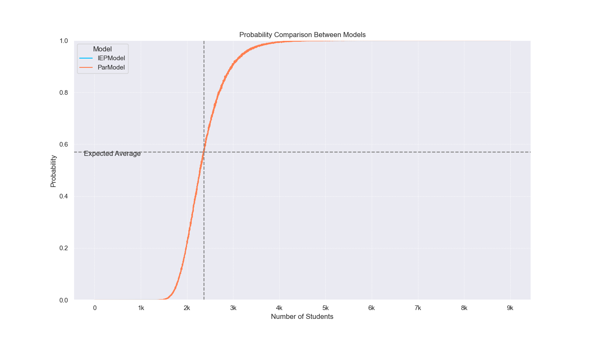

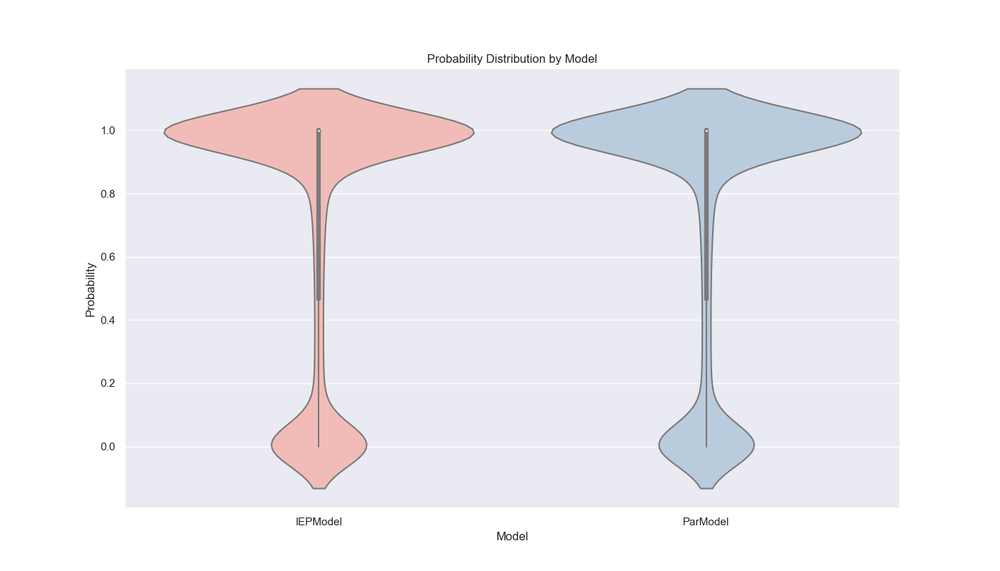

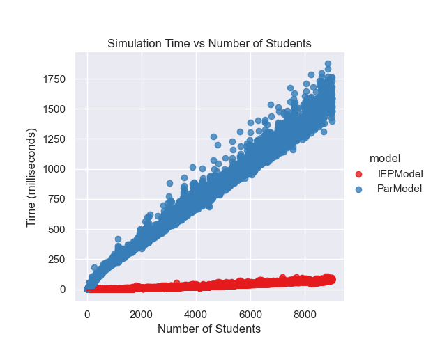

I like graphs because they help us visualize the data and see patterns that might not be immediately obvious from the numbers. In this case, we can see that the IEP model is much faster than the parallel model, and that the probability of seeing all birthdays increases as the number of students increases. The violin plot also shows the distribution of probabilities for each model, with the IEP model having a narrower distribution than the parallel model. Finally, we can see that IEP scales linearly with the number of students, while the parallel model scales exponentially. Now, let's move on to our final section and last model!

# I read a paper and found...

Honestly, I was going to call it a day because although I said we would explore the original question, I didn't know how to account for the fact that the birthdays are not uniformly distributed. I had an idea on how to get the actual probabilities, and the last model (soon btw) was going to implement this based on data I got, but it felt like a cop out. Or at least it was until I found a paper!

First, let's talk about the assumptions we made. The most important thing to note is that birthdays are not uniformly distributed. The most famous blog about this can be found [here](https://www.panix.com/~murphy/bday.html) by Roy Murphy. For instance, according to the data he collected, August is the most common month to have a birthday.  This means that the probability of seeing all birthdays in a group of students is not simply $1 - \frac{m}{365}$, but rather a more complex function that depends on the distribution of birthdays. Moreover, Rice is a specific group of the general population, so it could have a different distribution of birthdays than the general population. It might be possible to answer the question well if I got specific data like zipcode and birthdate, but due to ethical reasons, I totally don't have that data. So that was a dead end --- until, I found this [paper](https://doi.org/10.1016/0166-218X(92)90177-C), <cite> Birthday paradox, coupon collectors, caching algorithms and self-organizing search by Philippe Flajolet</cite>.

So I read the paper (I totally didn't just read the part that was relevant to my problem 🤧) and it turns out the Coupon Collector's Problem can be generalized to non-uniform distributions. Specifically, in Theorem $4.1$, Dr. Flajolet gives us the equation:

$$
E(T) = \int_0^\infty \left(1 - \prod_{i=1}^m (1 - e^{-p_i t}) \right) dt.
$$

This is equal to

$$
E(T) = \sum_{q=0}^{m-1} (-1)^{m-1-q} \sum_{|J|=q} \frac{1}{1 - P_J},
$$

where $ m $ denotes the number of coupons to be collected and $ P_J $ denotes the probability of getting any coupon in the set of coupons $ J $. Let's prove this!



I lied to you. While I did understand the general proof Dr. Flajolet provided, I am not confident in providing a proof here. However, I will say that he used generating functions to generalize the Coupon Collector's Problem to non-uniform distributions, and it's actually pretty cool! In either case if you want a proof, please read the paper!



With the proof finished 😎, we will allow ourselves to use the theorem. Moreover, we will implement this as our last model. Let's first talk about the data to generate the probabilities. The SSA (Social Security Administration) has a record of birthdays in the US. Since we want to talk about Rice students, I decided to get the data for the years 2002 to 2005 (sorry super seniors). I found this data [here](https://github.com/fivethirtyeight/data/blob/master/births/US_births_2000-2014_SSA.csv). Calculating the probabilities for each day was easy:


```rust
use chrono::{Datelike, NaiveDate};
use std::{collections::HashMap, fs::File, path::PathBuf};

fn day_of_year(year: u32, month: u32, day: u32) -> Option<u32> {
    NaiveDate::from_ymd_opt(year as i32, month, day).map(|d| d.ordinal() - 1)
}

pub fn get_probabilities(file_path: PathBuf) -> Option<HashMap<u32, f64>> {
    let mut total_births: usize = 0;
    let mut birth_counts: HashMap<u32, f64> = HashMap::with_capacity(366);
    let file = File::open(file_path).ok()?;
    let mut rdr = csv::Reader::from_reader(file);

    for record in rdr.records() {
        let record = record.ok()?;
        let year = record[0].parse::<i32>().ok()?;
        let month = record[1].parse::<u32>().ok()?;
        let day = record[2].parse::<u32>().ok()?;
        let births = record[4].parse::<u32>().ok()?;

        total_births += births as usize;

        let day_index = day_of_year(year as u32, month, day)?;

        birth_counts
            .entry(day_index)
            .and_modify(|b| *b += births as f64)
            .or_insert(births as f64);
    }

    for (_, count) in birth_counts.iter_mut() {
        *count /= total_births as f64;
    }

    Some(birth_counts)
}
```


Now, we just gotta implement the formula to get the expected number of students needed to see all birthdays given the data from 2002 to 2005:

```rust
pub struct Flajolet {}

impl Simulation for Flajolet {
    fn run(&self) -> Vec<f64> {
        let probabilities = self
            .get_probabilities()
            .expect("failed to get probabilities");
        let days = self.days() + 1; // 366 days
        vec![self.flajolet(days, probabilities)]
    }
}

impl Flajolet {
    fn flajolet(&self, days: u16, probabilities: HashMap<u32, f64>) -> (f64, Duration) {
        let now = Instant::now();

        let total_coupons = days as usize;
        let mut expected_value = 0.0;

        let mut memo = HashMap::new();

        for curr_coupons in 0..total_coupons {
            let sign = if (total_coupons - 1 - curr_coupons) % 2 == 0 {
                1.0
            } else {
                -1.0
            };

            // we will memorize the product of the probabilities of the subsets
            let subset_sum = match curr_coupons {
                0 => {
                    // the probability of getting any coupon in the empty set
                    // is zero, so (1 - 0) = 1 and 1/1 = 1:
                    1f64
                }
                1 => {
                    let mut inner_sum = 0.0;
                    probabilities.keys().for_each(|&key| {
                        let val = 1.0 - probabilities[&key];
                        inner_sum += 1.0 / val;
                        memo.insert(vec![key], val);
                    });

                    inner_sum
                }
                _ => {
                    let mut inner_sum = 0.0;
                    for subset in probabilities.keys().combinations(curr_coupons) {
                        let subset = subset.into_iter().copied().collect::<Vec<_>>();
                        let rest = &subset[..curr_coupons - 1];
                        let new = [subset[curr_coupons - 1]];
                        let product = memo[rest] * memo[new.as_slice()];

                        let val = 1.0 / (1.0 - product);
                        inner_sum += val;

                        memo.insert(subset, product);
                    }
                    inner_sum
                }
            };

            expected_value += sign * subset_sum;
        }

        (expected_value, now.elapsed())
    }
}
```

Now, all we have to do is modify our main function to run the Flajolet model and plot the results:

```rust
fn main() {

    let model = flajolet::Flajolet {};
    let result = model.run()[0];

    println!("The expected value is: {}, This took {:?} to calculate", result.0, result.1);
}
```

After, I ran it, I found the actual expected number of Rice Owls needed to see all birthdays including leap days and real birthday distributions was:



I lied naturally as I breathe. Look, honestly, I ran the model, but there is a **huge** problem! Let's take a look:

```rust
for subset in probabilities.keys().combinations(curr_coupons) {...}
```

Which is supposed to implement this part of the formula:

$$
\sum_{|J|=q} \frac{1}{1 - P_J}
$$

If you know anything about computational complexity, you will immediately realize the problem: combinatorial explosion. The number of subsets of a set of size $n$ is $2^n$, so the number of subsets of a set of size $366$ is $2^{366}$. This is a huge number, and even after my all my smart optimizations (I tried really), the model won't ever end. I tried it for small number of days, and it works as per my calculations; however, the universe will end before I get the answer for $366$ days. So, I am sorry, but I can't give you the final answer because I will die before I get it. In a way, that's motivation, honestly. If the $P = NP$ problem is solved, then we can come back to this problem knowing there might be a polynomial time solution. But until then, we need to be content with an approximation.



With that we finally have a good enough answer to our original question 😉! I hope you enjoyed this exploration, and I hope you learned something new. Now before we conclude, I wanted to compare an informed monte carlo simulation with the parallel model assuming equally probabilities for 366 days. I will use the probabilities we calculated from the data to run the simulation. 

# One Last Time: Informed Monte Carlo Simulation

Since we have the data, we can simply use the probabilities to make a more informed monte carlo simulation. I will use the same model as the parallel model, but instead of assuming equal probabilities for each day, I will use the probabilities we calculated from the data. Here is the code for the model:

```rust
impl Simulation for InformedModel {
    fn run(&self) -> Vec<f64> {
        let (days, simulations, students) =
            (self.days() as usize, self.simulations(), self.students());
        let days = days + 1; // 366 days
        let probabilities = self
            .get_probabilities()
            .expect("failed to get probabilities");
        let (keys, values): (Vec<u32>, Vec<f64>) = probabilities.into_iter().unzip();

        // Create a WeightedIndex distribution based on the probabilities
        let dist = WeightedIndex::new(&values).expect("Invalid probabilities");

        students
            .into_par_iter() // parallelize the outer loop
            .map_init(
                // init set and rand generator
                || (HashSet::with_capacity(days), rand::thread_rng()),
                // for each number of students
                |(birthdays, rng), num| {
                    (0..simulations)
                        .map(|_| {
                            birthdays.clear(); // so we don't have to allocate each time

                            birthdays.extend((0..num).map(|_| {
                                keys[dist.sample(rng)] // Generate a random day based on the probabilities
                            })); // add a random birthday to the HashSet

                            usize::from(birthdays.len() == days)
                        })
                        .sum::<usize>() as f64
                        / simulations as f64 // sum the results of the simulations
                },
            )
            .collect::<Vec<f64>>()
    }
}
```

Now, that we are done with everything. I'd like to show you why I implemented the `Simulation` trait:

```rust
fn main() {
    let models: Vec<Box<dyn Simulation>> = vec![
        Box::new(basic::BasicModel {}),
        Box::new(parallel::ParModel {}),
        Box::new(iep::IEPModel {}),
        Box::new(flajolet::Flajolet {}),
        Box::new(informed::InformedModel {}),
    ];

    for model in models.iter() {
        let now = std::time::Instant::now();
        let results = model.run();
        println!("Model: {:?}", model);
        for (num, result) in model.students().iter().zip(results.iter()) {
            println!("Num Students: {}, Probability: {}", num, result);
        }
        println!("Elapsed: {:?}", now.elapsed());
    }
}
```
See! We can easily run all the models and compare them (even if some won't ever finish) and another pretty plot:

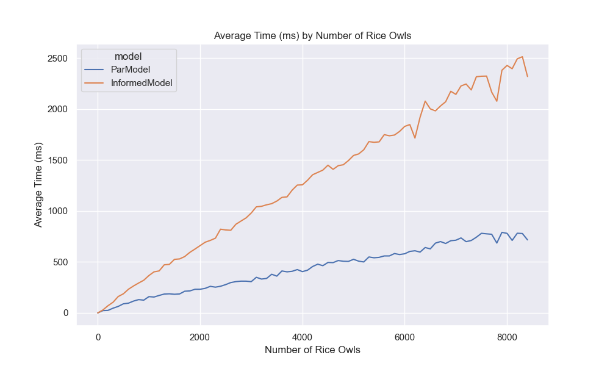

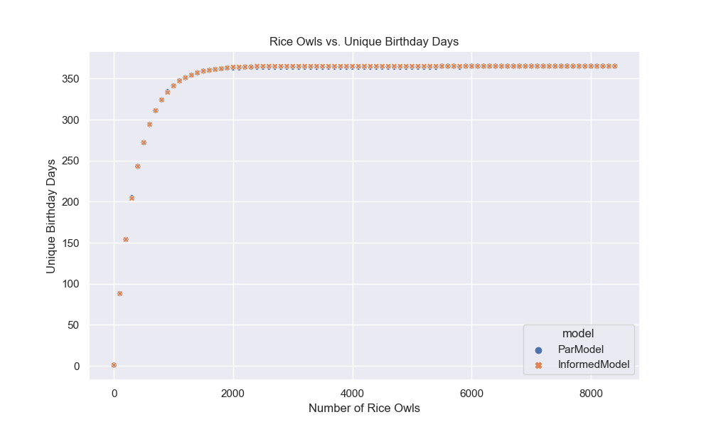

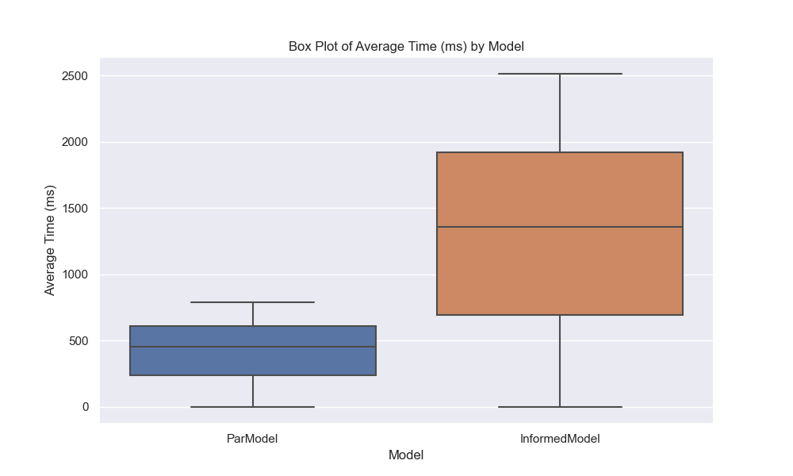

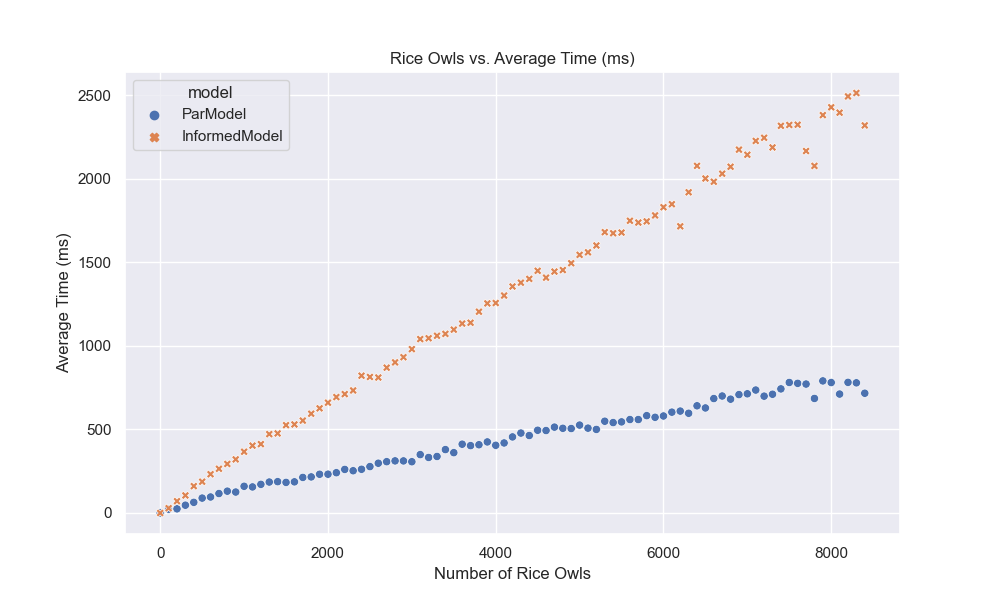

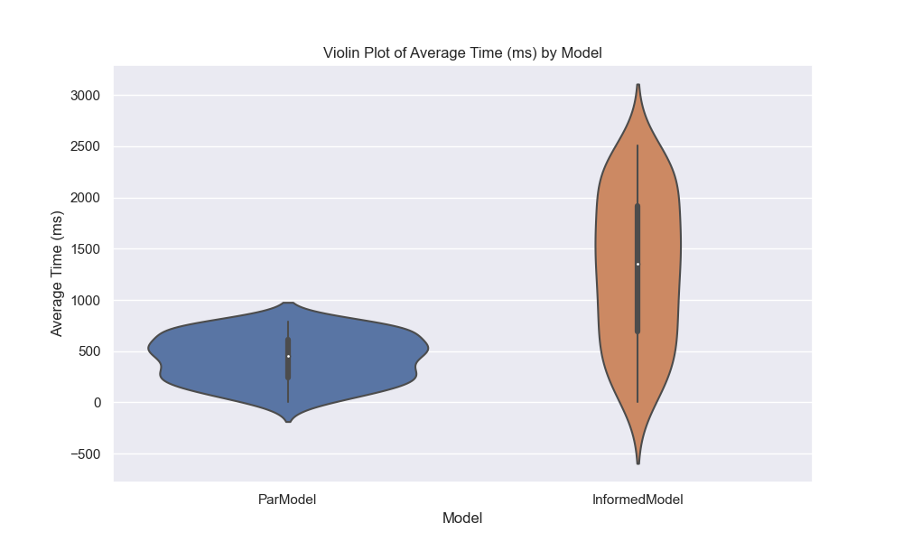

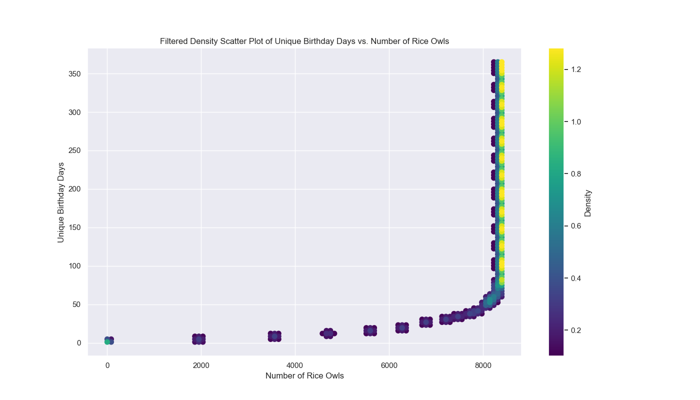

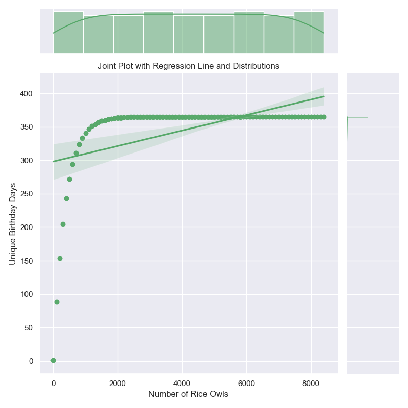

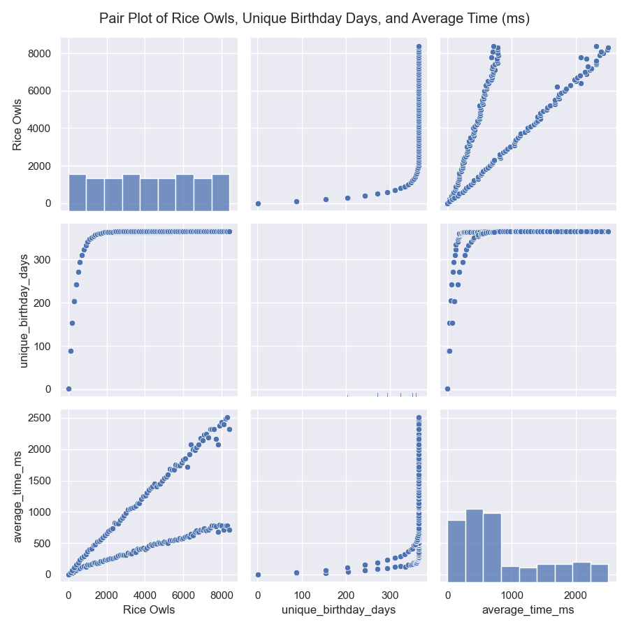


```python
import seaborn as sns
import matplotlib.pyplot as plt
import pandas as pd
import numpy as np
from scipy.ndimage import gaussian_filter

sns.set_theme()

# Load the data from the uploaded CSV file
data = pd.read_csv("./final.csv")

# Rename 'students' to 'Rice Owls'
data.rename(columns={"students": "Rice Owls"}, inplace=True)

# Line plot of average_time_ms by 'Rice Owls' for each model
plt.figure(figsize=(10, 6))
sns.lineplot(data=data, x='Rice Owls', y='average_time_ms', hue='model')
plt.title('Average Time (ms) by Number of Rice Owls')
plt.xlabel('Number of Rice Owls')
plt.ylabel('Average Time (ms)')
plt.savefig('last_lineplot.png')
plt.clf()

# Scatter plot of 'Rice Owls' vs. unique_birthday_days
plt.figure(figsize=(10, 6))
sns.scatterplot(data=data, x='Rice Owls', y='unique_birthday_days', hue='model', style='model')
plt.title('Rice Owls vs. Unique Birthday Days')
plt.xlabel('Number of Rice Owls')
plt.ylabel('Unique Birthday Days')
plt.savefig('last_scatterplot.png')
plt.clf()

# Box plot of average_time_ms for each model
plt.figure(figsize=(10, 6))
sns.boxplot(data=data, x='model', y='average_time_ms')
plt.title('Box Plot of Average Time (ms) by Model')
plt.xlabel('Model')
plt.ylabel('Average Time (ms)')
plt.savefig('last_boxplot.png')
plt.clf()

# Scatter plot of 'Rice Owls' vs. average_time_ms
plt.figure(figsize=(10, 6))
sns.scatterplot(data=data, x='Rice Owls', y='average_time_ms', hue='model', style='model')
plt.title('Rice Owls vs. Average Time (ms)')
plt.xlabel('Number of Rice Owls')
plt.ylabel('Average Time (ms)')
plt.savefig('last_scatterplot2.png')
plt.clf()

# Violin plot of average_time_ms for each model
plt.figure(figsize=(10, 6))
sns.violinplot(data=data, x='model', y='average_time_ms')
plt.title('Violin Plot of Average Time (ms) by Model')
plt.xlabel('Model')
plt.ylabel('Average Time (ms)')
plt.savefig('last_violinplot.png')
plt.clf()

# Adjust the plot to only show densities above a certain threshold
# Correcting the density sorting and plotting method

# Data preparation
x = data["Rice Owls"]
y = data["unique_birthday_days"]

# Calculate density using Gaussian filter on the histogram
data_points = np.vstack([x, y])
density = gaussian_filter(np.histogram2d(x, y, bins=100)[0], sigma=1)

# Convert histogram to coordinates
x_density, y_density = np.meshgrid(
    np.linspace(x.min(), x.max(), 100), np.linspace(y.min(), y.max(), 100)
)
density = density.ravel()
x_density = x_density.ravel()
y_density = y_density.ravel()

# Sorting points by density (for plotting purposes)
idx = np.argsort(density)
x_density, y_density, density = x_density[idx], y_density[idx], density[idx]

# Define a density threshold
density_threshold = 0.1

# Filter out points below the density threshold
mask = density > density_threshold
filtered_x_density = x_density[mask]
filtered_y_density = y_density[mask]
filtered_density = density[mask]

# Plotting with the density threshold
plt.figure(figsize=(14, 8))
sc = plt.scatter(
    filtered_x_density, filtered_y_density, c=filtered_density, cmap="viridis", s=50
)
plt.colorbar(sc, label="Density")
plt.xlabel("Number of Rice Owls")
plt.ylabel("Unique Birthday Days")
plt.title(
    "Filtered Density Scatter Plot of Unique Birthday Days vs. Number of Rice Owls"
)
plt.grid(True)
plt.savefig('last_density_scatterplot.png')


# Hexbin Plot with a Color Bar
plt.figure(figsize=(10, 6))

# Joint Plot with Regression Line
sns.jointplot(x='Rice Owls', y='unique_birthday_days', data=data, kind='reg', color='g', height=8)
plt.title('Joint Plot with Regression Line and Distributions')
plt.xlabel('Number of Rice Owls')
plt.ylabel('Unique Birthday Days')
plt.tight_layout()
plt.savefig('last_jointplot.png')

# Pair Plot
sns.pairplot(data[['Rice Owls', 'unique_birthday_days', 'average_time_ms']], height=3)
plt.suptitle('Pair Plot of Rice Owls, Unique Birthday Days, and Average Time (ms)')
plt.xlabel('Number of Rice Owls')
plt.ylabel('Unique Birthday Days')
plt.tight_layout()
plt.savefig('last_pairplot.png')
```


With that all being said, we are at the end of our journey. I really hope everything was clear, I tried my best. If you see any mistakes: just know it's not me who made a mistake, it's you who needs a check up /s (email me at seniormars@rice.edu or write a comment below). Have a great year!

# Conclusion

Throughout this article, I came to realize that I hate stats. Thank you fizz, I'll probably deregister from MATH 412: Probability Theory now. On a serious note, writing for a public audience -- especially for math -- is incredibly hard. If you read up to this point, then I hope you enjoyed it.

---



[^1]: This is a very easy proof, so let's do it. Let $X$ be a random variable, that has a probability between $[0,1]$, then

$$
\begin{align*}
\mathbb{E}[X] &= \sum_i^\infty i p_x(i) = \sum_i^\infty i (1 - p_x)^{x - 1} p = p \sum_i^\infty i (1 - p)^{i - 1}& & \\\\
&= p \sum_i^\infty -\frac{d(1 - p)^i}{dp} & &\text{taking the derivative and } x = 1-p\\\\
&= p \frac{d}{dp} \left( -\sum_i^\infty (1 - p)^i \right)& &\text{by linearity of derivative}\\\\
&= p \frac{d}{dp} \left( -\frac{1}{1 - (1 - p)} \right)& &\text{by geometric series formula}\\\\
&= p \frac{d}{dp} \left( -\frac{1}{p} \right) = \frac{p}{p^2} = \frac{1}{p}& &\text{algebra} \tag*{$\blacksquare$}
\end{align*}
$$ 

[^2]: This might be wrong, 😎😎😎.

[^3]: If I have time I'll research on how to prove things about Monte Carlo simulations, and update this section.

[^4]: I was going to plot these graphs in Rust, but I do have a life...


