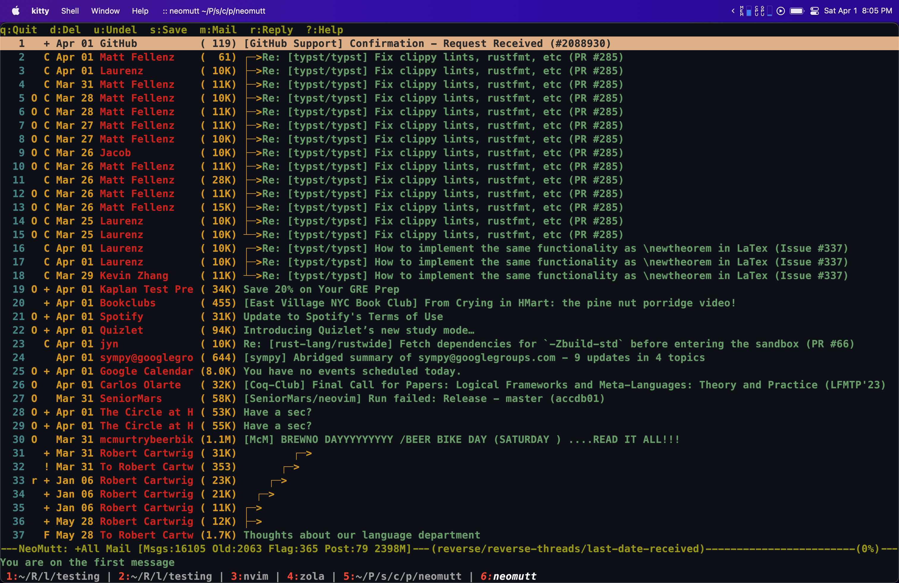
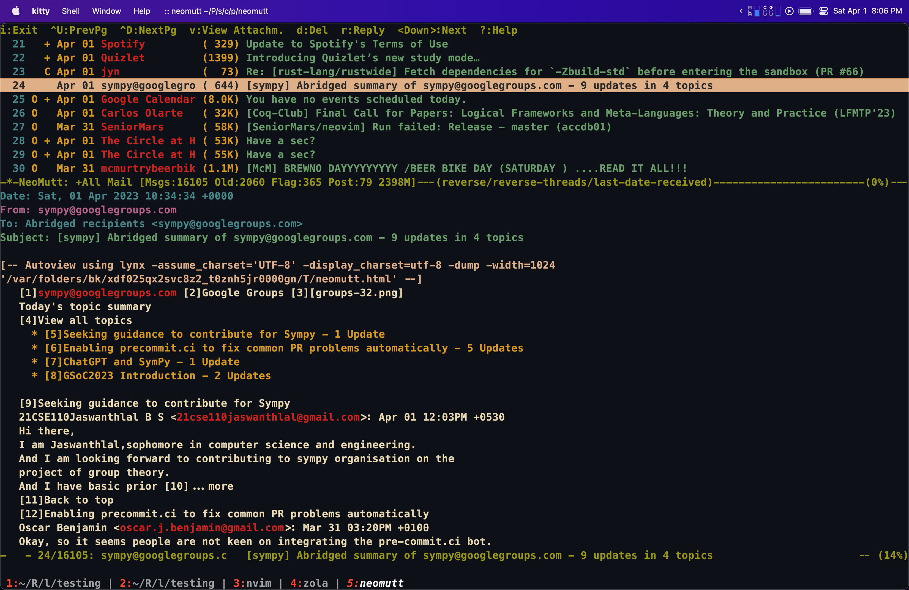
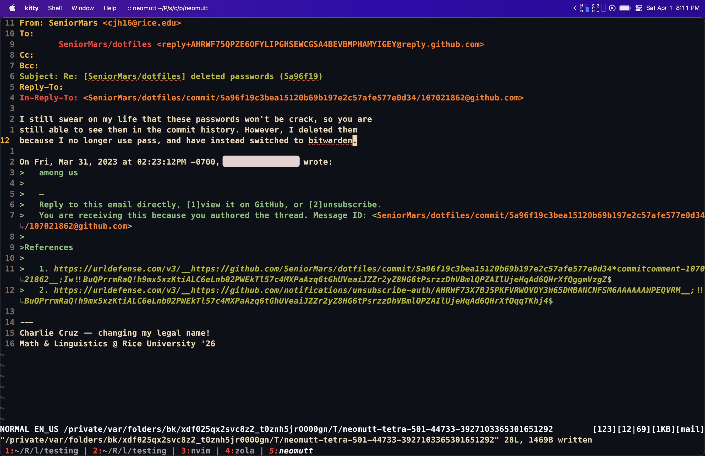
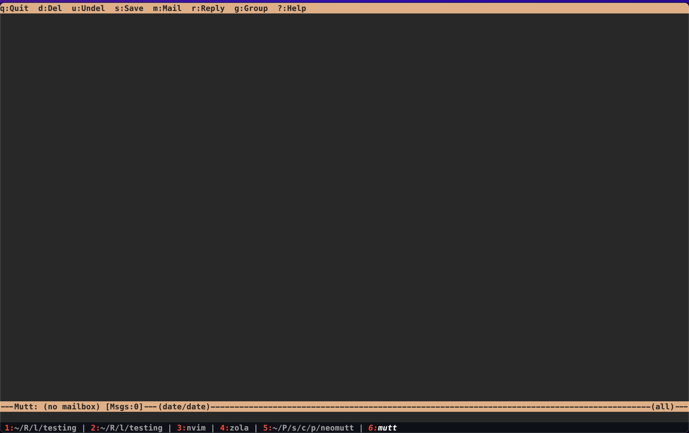
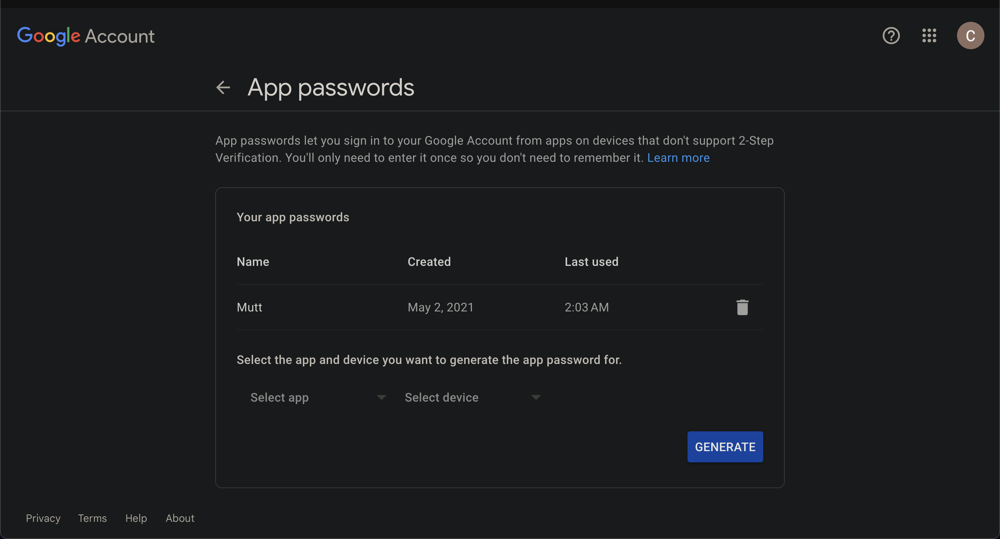
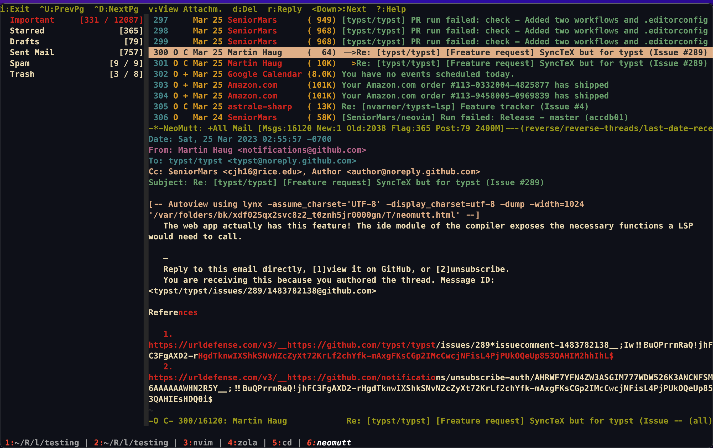
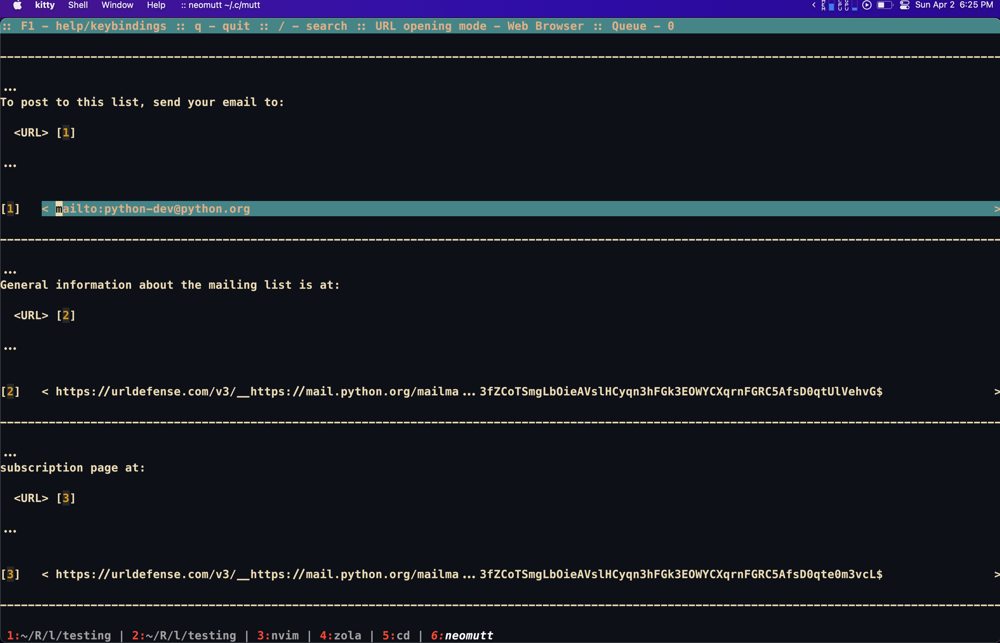
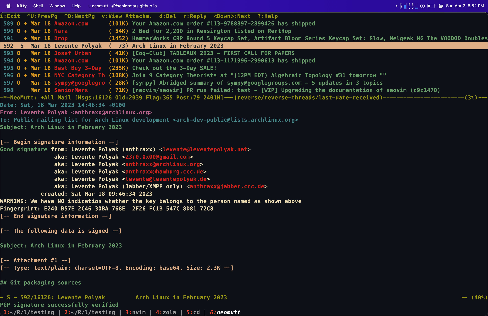

+++
title = "A Terminal Email Client As An Alternative To Gmail: The Old Dog Neomutt"
date = "2023-04-02"
+++

# Motivation

In this day and age, every university pairs a student's email address with their administered Google suite platform.
Typically, for most students, this default saves them a lot of trouble—that is, if you stay
within the constraints of what your university considers “normal use”. For instance, if you want to
use Google domains, Google cloud's APIs, or customize your Google security options, you are going to have a
bad time. Don't get me wrong, I understand why some of these rules are forced upon students, but
precisely because they are forced, I believe that there should be leeway for students that wish to
opt out of the default settings. Now, this blog post won't teach how to petition your university to
rid of Google, but it will teach you how to set up a terminal alternative to Gmail (most notably
this blog is for college students that are forced to use Google's email platform).


Note: 

<center>
This blog assumes basic terminal maturity
</center>

# Neomutt

## End Goal
Before I continue, I would like to show you what the result will look like:



Here is an image with an email open:



Finally, here is an image with a reply open (also `s/crack/cracked`):


At the end of this blog, I'll show the configuration we came up with.

## Introduction and WHY?

Ok, you have seen the images, but now you wonder: 1) what am I looking at? And 2) why would I want
to use this? Let's start with the first question. These images are of a terminal email client called
Neomutt and it is my go-to email client. It supports all the basic email features that you would expect
from an email client, plus way more! The second question is a bit more
complex, as I cannot speak for everyone, but I will explain why I use Neomutt.

- Auto-image blocking: In the age where everyone is trying to get your attention, it is nice to have
  a client that doesn't render images by default. Instead of those annoying images, I get a plain
  view of the email, and concentrate on the content of the email.
- Lightweight: Gmail is a resource hog. It takes seconds to load, and a
  pain to use when you have a slow internet connection. Neomutt loads in a fraction of a second and
  allows you filter through your emails quickly.
- Configurable: Neomutt is extremely configurable. You can change the color scheme, the keybindings,
  and even the email client's behavior. For instance, In my current configuration, I have grammar
  checking, auto-completion for words, and auto-completion for email addresses. Everything is done
  through the keyboard.

Now, if none of these reasons appeal to you, then Neomutt is not for you. Click the back button.
But, if you are still here, then let's get started!

## Installation


For this blog, I'll be detailing the installation process for Arch Linux, Gentoo, Ubuntu, and macOS.
Since I know these distributions extremely well, I can provide more detailed instructions. If
you are using Windows, I recommend using WSL2, and you can follow along with the Ubuntu instructions.

### macOS

I'll be using Homebrew to install Neomutt:

Note: `$` is the prompt for a user without root access. You don't need to type it.
```bash
$ /bin/bash -c "$(curl -fsSL https://raw.githubusercontent.com/Homebrew/install/HEAD/install.sh)"
$ # wait for the installation to finish and put homebrew in your path
$ # ...
$ brew install neomutt
$ # additionally, I would recommend installing:
$ brew install gnupg
$ # I'll explain why later
```

### Arch Linux

```bash
$ sudo pacman -Syu neomutt
$ sudo pacman -Syu gnupg
$ # or
$ sudo paru -Syu neomutt
$ sudo paru -Syu gnupg
```

### Gentoo

```bash
$ sudo emerge --ask mail-client/neomutt
$ sudo emerge --ask app-crypt/gnupg
```

### Ubuntu and WSL2 using Ubuntu

```bash
$ sudo apt install neomutt
$ sudo apt install gnupg
```


## Running Neomutt for the first time

The first time you run Neomutt, you will be greeted with a screen that looks like this that prompts
you for your email address and password:



This is the default configuration that Neomutt comes with, but not very useful. We need to customize it first. 
To demonstrate how to configure Neomutt, I'll have two code blocks for each section.
The first code block will be the configuration that I use, and the second code block is the one you
should modify to fit your needs.


## Initial Mutt Configuration

We are going to take configuration step by step. I will explain what each section does, and why.
The first we need to do is make a `muttrc` file. This file is where we will store all of our configuration.
By default, Neomutt will look for a file called `muttrc` in the following location: `XDG_CONFIG_HOME/mutt/muttrc`.

Note:
<center>
XDG_CONFIG_HOME is an environment variable that points to the location of your configuration files. 

Read more about it [here](https://wiki.archlinux.org/title/XDG_Base_Directory).
</center>

For example, on my machine, the location of my `muttrc` file is `~/.config/mutt/muttrc`.

If this file does not exist, then you can create it by running the following command:

```bash
$ mkdir -p ~/.config/mutt
$ touch ~/.config/mutt/muttrc
```
Let's put a hold on this to introduce the next section:

### Google, Gmail, and App-specific passwords

As I said before, this blog is intended for students that are forced to use Google's email platform. Which
means I'll be detailing how to configure Neomutt to work with Gmail. Thus, before we move any further, it is important to get an "app-specific password" from Google.

Note:
<center>
An app-specific password is a password for applications that do not support 2-factor authentication
or are considered "unsecure". Google wants you to use Gmail >:(
</center>


To get an app-specific password, follow these steps:
- Go to [Google's app-specific password page](https://security.google.com/settings/security/apppasswords)
- Sign in with your Google account
- Select “Mail” as the app or other and select “Other (custom name)” as the device. I use “Mutt” as
  the name.
- Click “Generate” and copy the password that is generated. You will need this password later. Store
  it!
- Profit??!!!

Here is a screenshot of the result:


### Accessing Gmail with Neomutt

Now that we have an app-specific password, we can configure Neomutt to access Gmail. To accomplish this,
let's open up our `muttrc` (i.e., `$EDITOR XDG_CONFIG_HOME/mutt/muttrc`) file with our favorite editor. I'll be using `nvim` for this blog, but
you can use any editor you want. Now, let's add the following configuration to our `muttrc` file:


Mine:
```conf
# User
set from = "cjh16@rice.edu"
set realname = "Charlie Cruz"

# Gmail
set imap_user = "cjh16@rice.edu"
set smtp_url = "smtps://cjh16@rice.edu@smtp.gmail.com:465/"
set smtp_authenticators = 'gssapi:login'
set imap_pass = "my_app_specific_password"
set smtp_pass = "my_app_specific_password"

# Ensure TLS is enforced
set ssl_starttls = yes
set ssl_force_tls = yes
```

Yours:
```conf
# User
set from = "your_email_address"
set realname = "Your Name"

# Gmail
set imap_user = "your_email_address"
set smtp_url = "smtps://YOUR_EMAIL@smtp.gmail.com:465/"
set smtp_authenticators = 'gssapi:login'
set imap_pass = "your_app_specific_password"
set smtp_pass = "your_app_specific_password"

# Ensure TLS is enforced
set ssl_starttls = yes
set ssl_force_tls = yes
```
Note:
<center>
    Plain text for passwords is a bad idea. See the encryption section of this blog.
</center>

Let's break down this section:
First, it's pretty self-explanatory for the first few lines, but for `set smtp*`, we need to
explain.

`set smtp_url` is the URL that Neomutt will use to send emails. The format is as follows:
`smtps://email@server:port`. For Gmail, the server is `smtp.gmail.com` and the port is `465`. This
is from the [Gmail SMTP server documentation](https://support.google.com/mail/answer/7126229?hl=en).

`set smtp_authenticators` is the authentication method that Neomutt will use to send emails. For
Gmail, we will use `gssapi:login` as the authentication method.

`set imap_pass` and `set smtp_pass` are the passwords that Neomutt will use to access your email.
Note this is plaintext, we will fix this later.

`set ssl_starttls` and `set ssl_force_tls` are used to ensure that Neomutt uses TLS when connecting
to the server. This is important because Gmail will not allow you to connect to the server without
these properties.

After you have added this configuration to your `muttrc` file, save it, and in theory, you
can now access your email! But, there are a few more things we need to do to make this more useful.

## Mailboxes

The next step is to specify which mailboxes you want to access. To achieve this, we add:

```conf
# My mailboxes
set folder = "imaps://imap.gmail.com:993/[Gmail]"
set spoolfile = "+All Mail"
set postponed = "+Drafts"
set record = "+Sent Mail"
set trash = "+Trash"

mailboxes =Important =Starred =Drafts ="Sent Mail" =Spam =Trash

# Where to put the stuff
set header_cache = "$XDG_CACHE_HOME/mutt/headers"
set message_cachedir = "$XDG_CACHE_HOME/mutt/bodies"
set certificate_file = "$XDG_CACHE_HOME/mutt/certificates"
unset record
```

Let's break this down:

- `set folder` is the folder that Neomutt will use to access your emails. 993 is just the port for imap.
- `set spoolfile` is your home inbox. This is the inbox that you see when you log into Gmail. You
  can change this to whatever you want. i.e., `set spoolfile = "+Important"`. I like to see all my
  emails, so I use `+All Mail`.
- `set postponed`, `set record`, and `set trash` are the folders that Neomutt will use to store
  emails that you have sent, drafts, and trash respectively in Gmail.
- `mailboxes` is a list of mailboxes that you want to access. You can add as many as you want, but I
  keep it simple with just the ones I use.
- `set header_cache` and `set message_cachedir` are the locations that Neomutt will use to cache
  your emails. This is important because it will make your email client much faster. `set certificate_file` is similar.
- `unset record` is used to disable the recording of sent emails. This is because Gmail already
  records sent emails, so we don't need to do it twice.

At this point, you should be able to access your email! Now, let's make this even more useful.


## Settings I highly recommend

Alright, so now that we have a basic configuration, but what about modifying how we reply to emails,
or how we interact with our email client? Let's add the following to our `muttrc` file:

I added comments to explain what each line does.
```conf
# settings
set pager_index_lines = 10          
set pager_context = 3                # show 3 lines of context
set pager_stop                       # stop at end of message
set menu_scroll                      # scroll menu
set tilde                            # use ~ to pad mutt
set move=no                          # don't move messages when marking as read
set mail_check = 30                  # check for new mail every 30 seconds
set imap_keepalive = 900             # 15 minutes
set sleep_time = 0                   # don't sleep when idle
set wait_key = no		     # mutt won't ask "press key to continue"
set envelope_from                    # which from?
set edit_headers                     # show headers when composing
set fast_reply                       # skip to compose when replying
set askcc                            # ask for CC:
set fcc_attach                       # save attachments with the body
set forward_format = "Fwd: %s"       # format of subject when forwarding
set forward_decode                   # decode when forwarding
set forward_quote                    # include message in forwards
set mime_forward                     # forward attachments as part of body
set attribution = "On %d, %n wrote:" # format of quoting header
set reply_to                         # reply to Reply to: field
set reverse_name                     # reply as whomever it was to
set include                          # include message in replies
set text_flowed=yes                  # correct indentation for plain text
unset sig_dashes                     # no dashes before sig
unset markers

# Sort by newest conversation first.
set charset = "utf-8"
set uncollapse_jump
set sort_re
set sort = reverse-threads
set sort_aux = last-date-received
# How we reply and quote emails.
set reply_regexp = "^(([Rr][Ee]?(\[[0-9]+\])?: *)?(\[[^]]+\] *)?)*"
set quote_regexp = "^( {0,4}[>|:#%]| {0,4}[a-z0-9]+[>|]+)+"
set send_charset = "utf-8:iso-8859-1:us-ascii" # send in utf-8
```

I highly recommend these settings, but you may want to change `askcc, edit_headers, fast_reply, envelope_from`.

## Sidebar

The sidebar is a very useful feature that allows you to see all your mailboxes in a sidebar. Here is
a screenshot of what it looks like:



Here is how to add it to your `muttrc` file:

```conf
#sidebar
set sidebar_visible # comment to disable sidebar by default
set sidebar_short_path
set sidebar_folder_indent
set sidebar_format = "%B %* [%?N?%N / ?%S]"
set mail_check_stats
bind index,pager \CJ sidebar-prev
bind index,pager \CK sidebar-next
bind index,pager \CE sidebar-open
bind index,pager B sidebar-toggle-visible
```

Now, you should be able to see the sidebar when you open your email client and press `<shift-b>` to toggle it!

## Signature

The signature is the text that you add to the bottom of your emails. To add it to Neomutt, you need
to:

1. Create a file (call it `signature` or whatever you prefer)
2. Add your signature to the file. For example, here is mine:

```bash
$ cat signature

---
Charlie Cruz -- changing my legal name!
Math & Linguistics @ Rice University '26
```
3. link the file to your `muttrc` file:
```conf
set signature = "$XDG_CONFIG_HOME/mutt/signature"
```

Now, when you send an email, your signature will be added to the bottom of the email.

## Editor

The editor is the program that you use to compose emails. By default, Neomutt uses `vi` as the editor, but you can change this to whatever you want. For instance, I use `nvim` as my editor, so I add the following to my `muttrc` file:

```conf
set editor = "nvim"
```

Note:
<center>
In (Neo)Vim with patch 6e649224926b and partial 113cb513f76d now include mail.vim, which is a filetype plugin for mail. This plugin provides syntax highlighting, indentation, and other features for mail files.
</center>

### (N)vim and Mail

If you use `nvim` as your editor, you may want to add the following to your `nvim/after/ftplugin/mail.{lua,vim}` file:

Lua:
```lua
vim.opt_local.spell = true
vim.opt_local.spelllang = 'en_us'
vim.opt_local.fo:append('aw')
local map = vim.api.nvim_buf_set_keymap
local options = { noremap = true, silent = true}
map(0, 'n', '<leader>x', 'ZZ', options)
```
Vim:
```vim
setlocal spell
setlocal spelllang=en_us
setlocal fo+=aw
nnoremap <leader>x ZZ
```

These settings will enable spell checking, better paragraph wrapping, and `<leader>x` will save and quit.

### Keybindings

I highly recommend adding the following keybindings to your `muttrc` file for more vim-like keybindings:

```conf
macro index A \
    "<tag-pattern>~N<enter><tag-prefix><clear-flag>N<untag-pattern>.<enter>" \
    "mark all new as read"

bind index j next-entry
bind index k previous-entry
bind pager j next-line
bind pager k previous-line

bind attach,index,pager \CD next-page
bind attach,index,pager \CU previous-page
bind pager g top
bind pager G bottom
bind attach,index g first-entry
bind attach,index G last-entry
```

The first marco isn't very vim-like, but it is very useful. It allows you to mark all new emails as read by pressing `A` in the index.

The next set of keybindings are for scrolling. I use `j` and `k` to scroll up and down, and `g` and `G` to go to the top and bottom of the page.

## Mailcap

The mailcap file is used to determine how to open attachments. For instance, if you have a `.pdf`
file, you would want to open it with your prefer PDF viewer. This is most useful for rendering HTML
in emails.

1. Create a file called `mailcap` in your `$XDG_CONFIG_HOME/mutt` directory.
2. Add the following to the file:
```
text/html; firefox %s; test=test -n "$display"; needsterminal;
text/html; lynx -assume_charset=%{charset} -display_charset=utf-8 -dump -width=1024 %s; nametemplate=%s.html; copiousoutput;
text/plain; cat %s; copiousoutput
application/pdf; firefox %s; test=test -n "$display"; needsterminal;
```

Of course, you can change the browser, and pdf viewer to whatever you want. On Mac, you might want
`open -a firefox %s` or `open -a Preview %s`.

Note: 
<center>
Firefox now supports editing PDFs!
</center>

3. Now install `lynx`

macOS
```bash
$ brew install lynx
```

Arch Linux
```bash
$ sudo pacman -Syu lynx # or paru -Syu lynx
```

Gentoo
```bash
$ sudo emerge -av www-client/lynx
```

Ubuntu
```bash
$ sudo apt install lynx
```

4. Link the file to your `muttrc` file and add the following to your `muttrc` file:
```conf
# link to mailcap file
set mailcap_path = "$XDG_CONFIG_HOME/mutt/mailcap"
# open attachments with mailcap with <return>
bind attach <return> view-mailcap             
# save attachments to a folder
macro attach s '<save-entry> <bol>~/Documents/attachments/<eol>' 'save attachment'
auto_view text/html		# automatically show html (mailcap uses lynx)
```

You can see more mailcap examples in my dotfiles [here](https://github.com/SeniorMars/dotfiles/blob/master/.config/mutt/mailcap).

Now you should be able to open attachments with your prefered program and automatically render HTML in emails! NO PICTURES THOUGH :)

## Colors
You can change the colors of Neomutt by adding the following to your `muttrc` file:

```conf
color status green default
# in general, the order is:
# color <element> <color> <attr> optional<regex>
```
My theme can be found [here](https://github.com/SeniorMars/dotfiles/blob/master/.config/mutt/colors.muttrc).

## External programs

While, Neomutt is a great email client, it is not perfect. For instance, it doesn't have a built-in
query support, urls are not clickable, and it doesn't encrypt emails. To resolve these issues, we can
use external programs.


### Urlscan

Let's take a look at the first issue: urls are not clickable. To fix this, we can use `urlscan` to make urls clickable.

The GitHub repo for `urlscan` is [here](https://github.com/firecat53/urlscan), and you can install it
via pip:

```bash
$ pip install --user urlscan
```

Now, we need to add the following to our `muttrc` file:

```conf
macro index,pager \cb "<pipe-message> urlscan<Enter>" "call urlscan to extract URLs out of a message"
macro attach,compose \cb "<pipe-entry> urlscan<Enter>" "call urlscan to extract URLs out of a message"
```

Now, when you press `<Ctrl+b>` in the index or pager, `urlscan` will be called and the urls will be
extracted. You can then press `<Enter>` to open the url in your browser.

See image below:



### Query

The next issue is that Neomutt doesn't have a built-in query support. To fix this, we can use
`goobook` to search our contacts or `lbdbq` to use apple's address book.

For goobook, I recommend looking at archlinux's [wiki](https://wiki.archlinux.org/title/Mutt#Goobook) for more information. It basically comes down to getting a token from Google.

Since, I currently use macOS, I will show you how to use `lbdbq` to search my contacts.

1. Install `lbdbq`:
```bash
$ brew install lbdbq
```

2. Modify `lbdbq`'s config file (either `$HOME/.lbdbrc` or `/opt/homebrew/Cellar/lbdb/0.51.1/etc/lbdb.rc`) to include the following:
```conf                                                                                         
METHODS="m_inmail m_osx_addressbook m_muttalias"
```
You are done!

3. Add the following to your `muttrc` file:
```conf
set query_command="/opt/homebrew/bin/lbdbq '%s'"
bind editor <Tab> complete-query
```

Now, when you press `<Tab>` in the editor when prompted for an email, you will be able to search your MacBook contacts!

Note:

<center>
You can add your Google contacts to your MacBook contacts by linking your Google account to your MacBook contacts. Which is not great, but I still did it.
</center>

### Encrypt

I use `gpg` to encrypt my emails. This is very useful for GitHub, and other services that require security. This is especially useful on mailing lists where you need to verify information. I find that everyone in the Arch Linux Mailing list uses it!

1. We already installed `gpg` in the beginning, so we are good to go!
2. Create a key and follow the instructions that are prompted:
```bash
$ gpg --full-generate-key
```
3. Copy your public key:
```bash
$ gpg --list-secret-keys --keyid-format=long
```

For instance, my public key is: `7C668A6D13D5729989FB126B183357B41320BB2B`. You can see the full
version here: [https://github.com/SeniorMars.gpg](https://github.com/SeniorMars.gpg)

4. Add the following to your `muttrc` file:
```conf
# Use GPGME
# Use my key for signing and encrypting
set pgp_default_key = 7C668A6D13D5729989FB126B183357B41320BB2B

# Use GPGME
set crypt_use_gpgme = yes

# Automatically sign all out-going email
set crypt_autosign = yes

# Sign replies to signed emails
set crypt_replysign = yes

# Encrypt replies to encrypted emails
set crypt_replyencrypt = yes

# Encrypt and sign replies to encrypted and signed email
set crypt_replysignencrypted = yes

# Attempt to verify signatures automatically
set crypt_verify_sig = yes

# Attempt to encrypt automatically, if possible
# I would recommend setting this to no as university often have spam filters
# And this will cause your emails to be marked as spam
# as they can't decrypt your emails LMAO
set crypt_opportunistic_encrypt = no

# So you can view encrypted emails automatically
auto_view application/pgp-encrypted
```
5. Plaintext is a bad idea, which is why we are going to use GPG to encrypt our passwords.

In your `muttrc` delete the following lines:
```conf
set imap_pass = "my_app_specific_password"
set smtp_pass = "my_app_specific_password"
```
Now go to your terminal and create a file called `passwords` in your `muttrc` directory and add
the lines you just deleted.
Now, encrypt the file:
```bash
$ gpg --encrypt --sign  -r YOUR_GPG_KEY passwords
```

You should end up with a file called `passwords.gpg` in your `muttrc` directory.

Now, add the following to your `muttrc` file:
```conf
source "gpg -dq $XDG_CONFIG_HOME/passwords.gpg |"
```

Remove the plaintext `passwords` file.
```bash
$ shred -u passwords
```
Now, you have encrypted your passwords!

Image below (notice the `Good signature` and ` The following data is signed`):



And that's it! You should now have a fully functional email client!

# Conclusion

I hope you enjoyed this tutorial! If you have any questions, don't ask /s.

I am going to upload a talk I gave on setting up Neovim for non-programmers soon. This talks about
grammar checking, spell keybinds, and more. So stay tuned!

Thanks for reading and have a nice day!

SeniorMars
