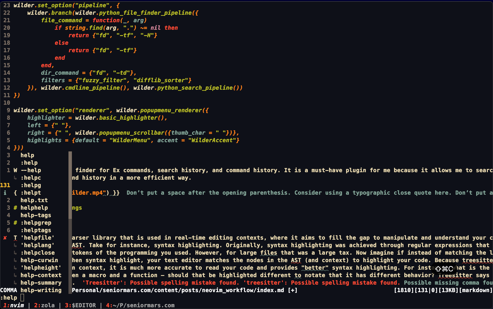
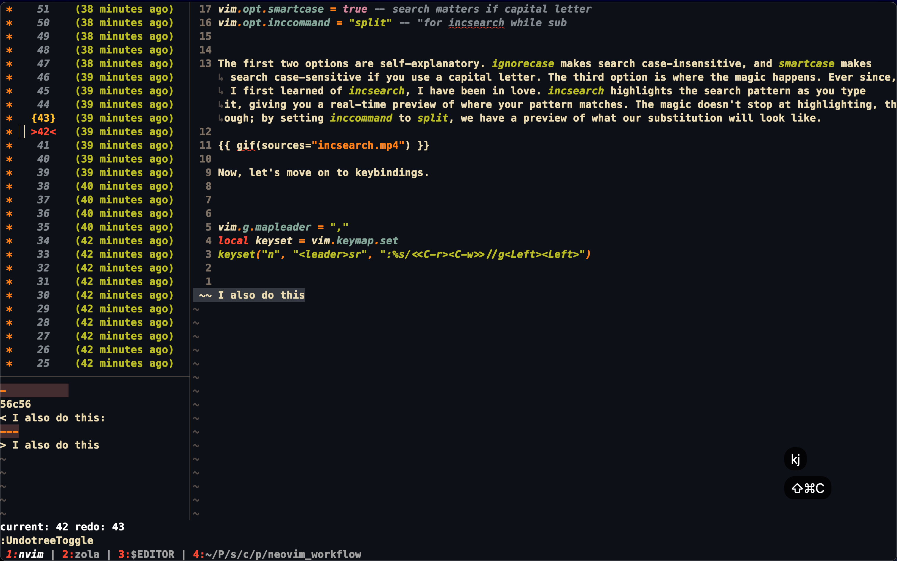
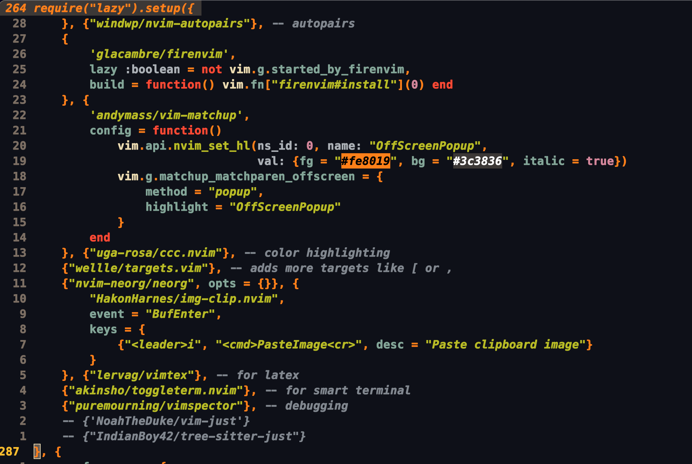
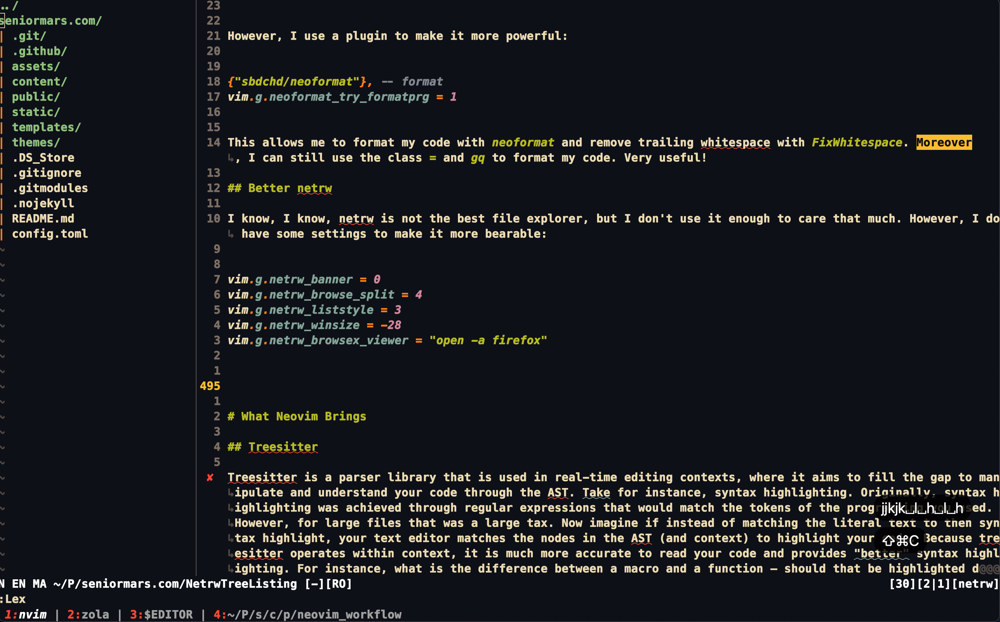
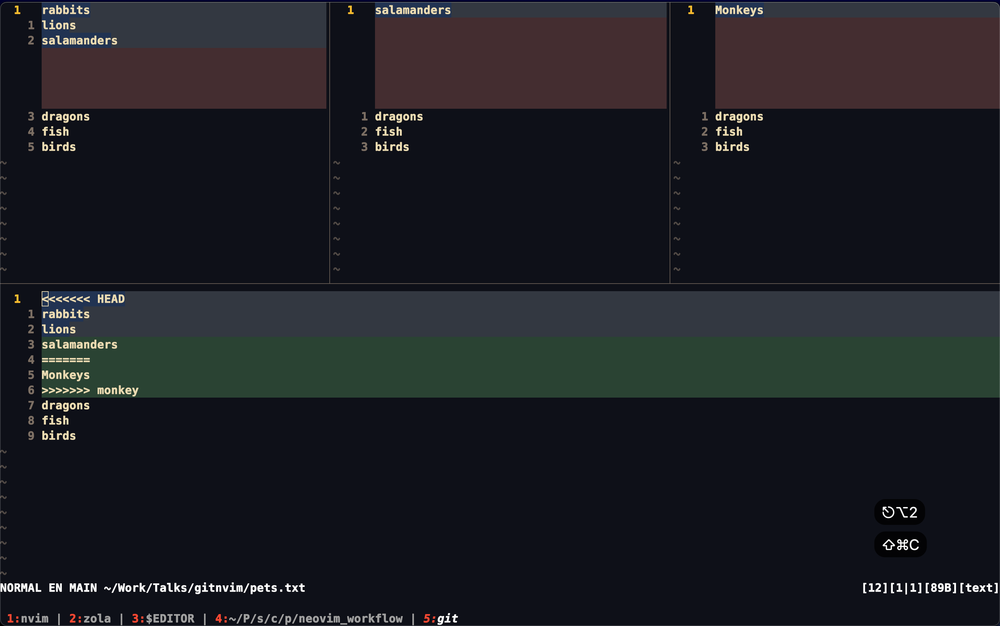
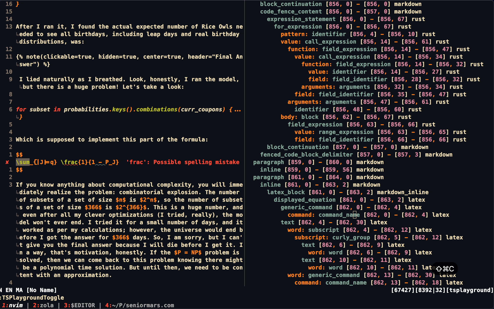
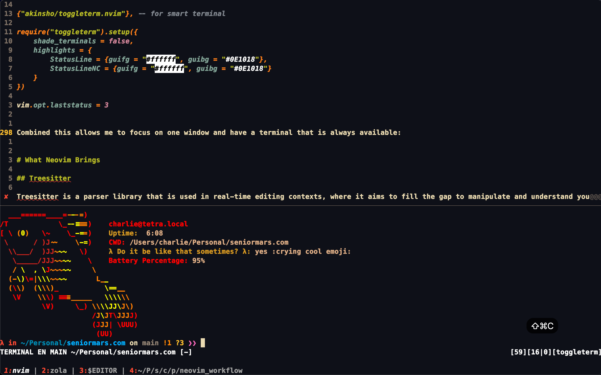
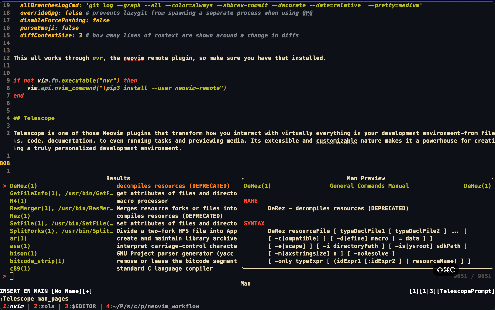

+++
title = "An Experienced (Neo)Vimmer's Workflow"
date = "2024-06-25"
description = "A guy decides to show off his Neovim setup."

[extra]
comment = true
repo_view = true
read_time = true

[taxonomies]
tags=["tutorial", "educational"]
+++

# Motivation

Ever since [TJ](https://github.com/tjdevries) said "Personalized Development Environment," the phrase latched onto me like a cobweb in a mineshaft. A Personalized Development Environment (PDE) describes an ideal setup that is tailored to your needs and preferences -- it lies between a bare-bone text editor and a full-fledged IDE. It is a place where you can be productive, efficient, and comfortable. It is a place that suits you and only you. 

I started using Vim in my sophomore year of high school when my computer couldn't run Visual Studio Code and Windows simultaneously, so the terminal (and Linux) became my home. I still remember my early days as a Linux user --- filled with frustration, confusion, and much googling. I remember my computer being unable to connect to my printer because Linux didn't have a patch yet. I remember the first time my bootloader was corrupted due to a Windows update, and I was praying I could still boot into my precious setup. I remember when I decided to delete Windows for good, but I forgot that I had mounted the partition and ended up nuking my hard drive. Going down this path means headaches, but it also means growth. It means learning how to fix your own problems and learning how to be self-sufficient. 

I cannot, in good faith, teach you how to debug every issue you will encounter (those errors will structure your ideal PDE), but I can inspire you and your setup. I am now going to be a junior in College, so I have had a few years to refine my setup, and I hope you do the same. I'll show you the workflow that I have built over the years and how I have optimized it to be as efficient as possible. This is the way of SeniorMars; this is my way!


I know people will ask, so here they are: [SeniorMars' Dotfiles](https://github.com/SeniorMars/dotfiles). Moreover, I will be assuming you are using Neovim 0.10!


# Improving the (Neo)Vim Experience

Although, I stated this was not for beginners, I still need to point out the fundamentals. Without these, I would not consider neovim to even approach the basics of a PDE. If you think this is too basic, then you can skip this section -- I promise you will learn something.

## Search and Replace

Let's first start with something simple, so you get a taste on what kind of tips I will be giving you. Let's start with search and replace. 

```lua
vim.opt.ignorecase = true -- search case insensitive
vim.opt.smartcase = true -- search matters if capital letter
vim.opt.inccommand = "split" -- "for incsearch while sub
```

The first two options are self-explanatory. `ignorecase` makes search case-insensitive, and `smartcase` makes search case-sensitive if you use a capital letter. The third option is where the magic happens. Ever since, I first learned of `incsearch`, I have been in love. `incsearch` highlights the search pattern as you type it, giving you a real-time preview of where your pattern matches. The magic doesn't stop at highlighting, though; by setting `inccommand` to `split`, we have a preview of what our substitution will look like. 

{{ gif(sources=["incsearch.mp4"]) }}

Now, let's move on to keybindings.

```lua
vim.g.mapleader = ","
local keyset = vim.keymap.set
keyset("n", "<leader>sr", ":%s/<<C-r><C-w>>//g<Left><Left>")
```

Moreover, when I know I want to rename a variable, I do the following:

1. Place my cursor on the variable I would like to rename.
2. Use the keybinding `*` in normal mode to highlight all instances of the variable.
3. Do `cgn` to change the word under the cursor and move to the next instance.
4. Press `.` to repeat the change on the next instance.


{{ gif(sources=["change_word.mp4"]) }}

Now, for some plugins.

```lua
-- I use lazy.nvim to load plugins 
{"mhinz/vim-grepper"}

vim.g.mapleader = ","
local keyset = vim.keymap.set
keyset("n", "<leader>fs", ':GrepperRg "" .<Left><Left><Left>')
keyset("n", "<leader>fS", ":Rg<space>")
keyset("n", "<leader>*", ":Grepper -tool rg -cword -noprompt<cr>")
keyset("n", "gs", "<Plug>(GrepperOperator)")
keyset("x", "gs", "<Plug>(GrepperOperator)")
```

This allows me to use `rg` to search for a word under the cursor, search for a word in the current director, and search for a word in the current directory. Grepper Operator allows me to use other vim motions to select text and search for it. 

{{ gif(sources=["grepper.mp4"]) }}

Now, to do something similar to other commands like `:norm`, I use:

```lua
{
    "smjonas/live-command.nvim", -- live command
    config = function()
        require("live-command").setup({commands = {Norm = {cmd = "norm"}}})
    end
}
```

## Ex Commands and `g` command

If you have read the vim help docs, you may know some of these, but these are the little things that make a big difference. 

```lua
vim.opt.wildmode = "list:longest,list:full" -- for : stuff
vim.opt.wildignore:append({".javac", "node_modules", "*.pyc"})
vim.opt.wildignore:append({".aux", ".out", ".toc"}) -- LaTeX
vim.opt.wildignore:append({
    ".o", ".obj", ".dll", ".exe", ".so", ".a", ".lib", ".pyc", ".pyo", ".pyd",
    ".swp", ".swo", ".class", ".DS_Store", ".git", ".hg", ".orig"
})
vim.opt.suffixesadd:append({".java", ".rs"}) -- search for suffexes using gf
```

The first option is for the `:` command. It allows you to use the tab completion to find the longest common match and then show the full list. The second option is for the `wildignore` option. It allows you to ignore certain files when using tab completion. The third option is for the `suffixesadd` option. It allows you to use `gf` to open files with the given suffixes. You can customize these to your liking, but adding this allows you to filter out the noise and focus on what you want to see.

Additionally, this is one of the must-have plugins:

```lua
--- lazy.nvim
{"gelguy/wilder.nvim", build = ":UpdateRemotePlugins"}, -- : autocomplete
-- wilder
local wilder = require("wilder")
wilder.setup({modes = {":", "/", "?"}})
wilder.set_option("pipeline", {
    wilder.branch(wilder.python_file_finder_pipeline({
        file_command = function(_, arg)
            if string.find(arg, ".") ~= nil then
                return {"fd", "-tf", "-H"}
            else
                return {"fd", "-tf"}
            end
        end,
        dir_command = {"fd", "-td"},
        filters = {"fuzzy_filter", "difflib_sorter"}
    }), wilder.cmdline_pipeline(), wilder.python_search_pipeline())
})

wilder.set_option("renderer", wilder.popupmenu_renderer({
    highlighter = wilder.basic_highlighter(),
    left = {" "},
    right = {" ", wilder.popupmenu_scrollbar({thumb_char = " "})},
    highlights = {default = "WilderMenu", accent = "WilderAccent"}
}))
```

Wilder is a fuzzy finder for Ex commands, search history, and command history. It is a must-have plugin for me because it allows me to search for commands and history in a more efficient way. 



# Undo and Redo

Undo and Redo are essential to any text editor. However, in Vim, you can make this more powerful! First,

```lua
vim.opt.undofile = true -- save undo history
local keyset = vim.keymap.set
keyset("i", ",", ",<C-g>U")
keyset("i", ".", ".<C-g>U")
keyset("i", "!", "!<C-g>U")
keyset("i", "?", "?<C-g>U")
```

The first option allows you to save your undo history. The next options add more power to undo as this updates undo when you use other vim operations. Now, we add:

```lua
{"mbbill/undotree", lazy = true, cmd = "UndotreeToggle"}, -- see undo tree

keyset("n", "<leader>u", ":UndotreeToggle<cr>")

```



This allows you to see your undo tree and navigate it with diffs -- extremely useful when you want to see what you have done and what you can undo.

Combine this with `AutoSession`, I can open a project and have all my windows, buffers, and undo history saved. 

```lua
{
    "rmagatti/auto-session", -- auto save session
    config = function()
        require("auto-session").setup({
            log_level = "error",
            auto_session_suppress_dirs = {
                "~/", "~/Downloads", "~/Documents"
            },
            auto_session_use_git_branch = true,
            auto_save_enabled = true
        })
    end
}
```

## Movement

Movement is essential to any text editor. However, in Vim, you can make this more powerful! First,

```lua
vim.opt.splitbelow = true -- split windows below
vim.opt.splitright = true -- split windows right

-- Movement
local keyset = vim.keymap.set
keyset("i", "jk", "<esc>")

keyset("v", "J", ":m '>+1<cr>gv=gv")
keyset("v", "K", ":m '<-2<cr>gv=gv")
keyset("n", "<space>h", "<c-w>h")
keyset("n", "<space>j", "<c-w>j")
keyset("n", "<space>k", "<c-w>k")
keyset("n", "<space>l", "<c-w>l")
keyset("n", "<leader>wh", "<c-w>t<c-h>H")
keyset("n", "<leader>wk", "<c-w>t<c-h>K")
keyset("n", "<down>", ":resize +2<cr>")
keyset("n", "<up>", ":resize -2<cr>")
keyset("n", "<right>", ":vertical resize +2<cr>")
keyset("n", "<left>", ":vertical resize -2<cr>")
keyset("n", "j", "(v:count ? 'j' : 'gj')", {expr = true})
keyset("n", "k", "(v:count ? 'k' : 'gk')", {expr = true})
```
This allows us to move line around in visual mode, move windows, and reside windows. Moreover, we can go up and down in long lines!

Furthermore, I have some auto commands that allow me to move between windows and resize them:

```lua
local autocmd = vim.api.nvim_create_autocmd
vim.api.nvim_create_augroup("Random", {clear = true})

autocmd("VimResized", {
    group = "Random",
    desc = "Keep windows equally resized",
    command = "tabdo wincmd ="
})

autocmd("TermOpen", {
    group = "Random",
    command = "setlocal nonumber norelativenumber signcolumn=no"
})
```

This allows me to keep my windows equally resized and to remove the number column when I open a terminal.

Finally, I have some plugins that help me with movement and manipulating text:

```lua
{"tpope/vim-repeat"}, -- repeat
{
    "kylechui/nvim-surround", -- surround objects
    config = function() require("nvim-surround").setup({}) end
},
{"windwp/nvim-autopairs"}, -- autopairs 
{
    'andymass/vim-matchup',
    config = function()
        vim.api.nvim_set_hl(0, "OffScreenPopup",
                            {fg = "#fe8019", bg = "#3c3836", italic = true})
        vim.g.matchup_matchparen_offscreen = {
            method = "popup",
            highlight = "OffScreenPopup"
        }
    end
},
{"wellle/targets.vim"}, -- adds more targets like [ or ,

--- setup
local rule = require("nvim-autopairs.rule")
local cond = require("nvim-autopairs.conds")
local autopairs = require("nvim-autopairs")

autopairs.add_rules({
    rule("$", "$", {"tex", "latex"}):with_cr(cond.none())
})

autopairs.get_rules("`")[1].not_filetypes = {"tex", "latex"}
autopairs.get_rules("'")[1].not_filetypes = {"tex", "latex", "rust"}
```

This allows me to repeat commands, add more targets like `[]`, and auto complete pairs like `()`. Moreover, with nvim-surround, I can surround text objects with different characters like quotes, brackets, and braces. Finally with vim-matchup, I can see the matching pair of brackets, braces, and quotes. If the code is very long it also shows the top matching pair in a popup window.



## Better quickfix

If are not taking advantage of the quickfix list, you are missing out. The quickfix list is a powerful tool that allows you to navigate through errors, warnings, and search results -- anything as long as you know how to use it. However, I like to use a plugin to make it more powerful.

```lua
{"kevinhwang91/nvim-bqf"}, -- better quickfix
--- later in the config
keyset("n", "<leader>cn", ":cnext<cr>")
keyset("n", "<leader>cp", ":cprevious<cr>")
```

This allows me to navigate through the quickfix list with ease. In fact, this is the setup I used to showoff grepper. 

{{ gif(sources=["grepper.mp4"]) }}

I integrated the quickfix list with other tools I'll get to later.


## Spell Check

Vim has a built-in spell checker, but of course, we need to make it better. 

```lua
function SpellToggle()
    if vim.opt.spell:get() then
        vim.opt_local.spell = false
        vim.opt_local.spelllang = "en"
    else
        vim.opt_local.spell = true
        vim.opt_local.spelllang = {"en_us"}
    end
end

keyset("n", "<leader>5", ":lua SpellToggle()<cr>")
keyset("n", "<leader>z", "[s1z=``")
```
This allows me to toggle spell check and fix spelling mistakes with `<leader>z` while not moving my cursor! In addition to this I use a language server (LSP) to check my spelling through language tool: [ltex](https://www.npmjs.com/package/coc-ltex/v/12.2.0).

## Status Line

At one point in your vim carer, you would have downloaded a status line plugin. After a while, though, you realize that you don't need a status line plugin. You can make your own status line! Here is mine:

```lua
-- Get branch name
local git_branch = function()
    if vim.g.loaded_fugitive then
        local branch = vim.fn.FugitiveHead()
        if branch ~= "" then
            if vim.api.nvim_win_get_width(0) <= 80 then
                return " " .. string.upper(branch:sub(1, 2))
            end
            return " " .. string.upper(branch)
        end
    end
    return ""
end

-- Get file size in human readable format
local human_file_size = function()
    local format_file_size = function(file)
        local size = vim.fn.getfsize(file)
        if size <= 0 then return "" end
        local sufixes = {"B", "KB", "MB", "GB"}
        local i = 1
        while size > 1024 do
            size = size / 1024
            i = i + 1
        end
        return string.format("[%.0f%s]", size, sufixes[i])
    end

    local file = vim.api.nvim_buf_get_name(0)
    if string.len(file) == 0 then return "" end
    return format_file_size(file)
end

-- Get smart file path that shortens the path if the window is too small
local smart_file_path = function()
    local buf_name = vim.api.nvim_buf_get_name(0)
    if buf_name == "" then return "[No Name]" end
    local is_term = false
    local file_dir = ""

    if buf_name:sub(1, 5):find("term") ~= nil then
        ---@type string
        file_dir = vim.env.PWD
        if file_dir == home then return "$HOME " end
        is_term = true
    else
        file_dir = vim.fs.dirname(buf_name)
    end

    ---@diagnostic disable-next-line: need-check-nil
    file_dir = file_dir:gsub(home, "~", 1)

    if vim.api.nvim_win_get_width(0) <= 80 then
        file_dir = vim.fn.pathshorten(file_dir)
    end

    if is_term then
        return file_dir .. " "
    else
        return string.format("%s/%s ", file_dir, vim.fs.basename(buf_name))
    end
end

-- Get word count
local word_count = function()
    local words = vim.fn.wordcount()
    if words.visual_words ~= nil then
        return string.format("[%s]", words.visual_words)
    else
        return string.format("[%s]", words.words)
    end
end

-- Get current mode and set it to short or long name
local modes = setmetatable({
    ["n"] = {"NORMAL", "N"},
    ["no"] = {"N·OPERATOR", "N·P"},
    ["v"] = {"VISUAL", "V"},
    ["V"] = {"V·LINE", "V·L"},
    [""] = {"V·BLOCK", "V·B"},
    [""] = {"V·BLOCK", "V·B"},
    ["s"] = {"SELECT", "S"},
    ["S"] = {"S·LINE", "S·L"},
    [""] = {"S·BLOCK", "S·B"},
    ["i"] = {"INSERT", "I"},
    ["ic"] = {"INSERT", "I"},
    ["R"] = {"REPLACE", "R"},
    ["Rv"] = {"V·REPLACE", "V·R"},
    ["c"] = {"COMMAND", "C"},
    ["cv"] = {"VIM·EX", "V·E"},
    ["ce"] = {"EX", "E"},
    ["r"] = {"PROMPT", "P"},
    ["rm"] = {"MORE", "M"},
    ["r?"] = {"CONFIRM", "C"},
    ["!"] = {"SHELL", "S"},
    ["t"] = {"TERMINAL", "T"}
}, {
    __index = function()
        return {"UNKNOWN", "U"} -- handle edge cases
    end
})

-- Get current mode
local get_current_mode = function()
    local mode = modes[vim.api.nvim_get_mode().mode]
    if vim.api.nvim_win_get_width(0) <= 80 then
        return string.format("%s ", mode[2]) -- short name
    else
        return string.format("%s ", mode[1]) -- long name
    end
end

-- Get file type and shorten it if the window is too small
local file_type = function()
    local ft = vim.bo.filetype
    if ft == "" then return "[None]" end

    local width = vim.api.nvim_win_get_width(0)

    if width > 80 then
        return string.format("[%s]", ft)
    else
        local buf_name = vim.api.nvim_buf_get_name(0)
        if buf_name == "" and ft == "" then
            return "[*]"
        elseif buf_name == "" then
            return string.format("[%s]", ft)
        else
            local ext = vim.fn.fnamemodify(buf_name, ":e")
            local len = string.len
            local shorter = (len(ft) < len(ext)) and ft or ext

            return string.format("[%s]", shorter)
        end
    end
end

---@diagnostic disable-next-line: lowercase-global
-- Get status line
function status_line()
    return table.concat({
        get_current_mode(), -- get current mode
        "%{toupper(&spelllang)}", -- display language and if spell is on
        git_branch(), -- branch name
        " %<", -- spacing
        smart_file_path(), -- smart full path filename
        "%h%m%r%w", -- help flag, modified, readonly, and preview
        "%=", -- right align
        "%{get(b:,'gitsigns_status','')}", -- gitsigns
        word_count(), -- word count
        "[%-3.(%l|%c]", -- line number, column number
        human_file_size(), -- file size
        file_type() -- file type
    })
end

-- Set status line
vim.opt.statusline = "%!luaeval('status_line()')"

vim.wo.fillchars = "eob:~" -- fillchars of windows

```

This is my status line. It shows the current mode, language, branch name, file path, git status, word count, line number, column number, file size, and file type. It is a lot, but I hope my documentation helps you understand what each part does. It is extremely minimum but provides me with all the information I need depending on my current state.


## Formatting

Formatting is essential to any text editor:

```lua
vim.api.nvim_create_user_command("FixWhitespace", [[%s/\s\+$//e]], {})
keyset("n", "<leader>3", ":retab<cr>:FixWhitespace<cr>")
```

However, I use a plugin to make it more powerful:

```lua
{"sbdchd/neoformat"}, -- format
vim.g.neoformat_try_formatprg = 1
```

This allows me to format my code with `neoformat` and remove trailing whitespace with `FixWhitespace`. Moreover, I can still use the class `=` and `gq` to format my code. Very useful!

## Better netrw

I know, I know, netrw is not the best file explorer, but I don't use it enough to care that much. However, I do have some settings to make it more bearable:

```lua
vim.g.netrw_banner = 0
vim.g.netrw_browse_split = 4
vim.g.netrw_liststyle = 3
vim.g.netrw_winsize = -28
vim.g.netrw_browsex_viewer = "open -a firefox"
```

These settings remove the banner, open the file explorer in a vertical split, use the tree style, and set the size of the file explorer. Moreover, I can open files in the browser with `gx`.




## Git Integration

Now, I made a video about this ([here](https://www.youtube.com/watch?v=57x4ZzzCr2Y)), so I won't go into too much detail. However, I will show you how I set it up:

```lua
{"tpope/vim-fugitive"}, -- Git control for vim

-- fugitive
keyset("n", "<leader>gg", ":Git<cr>", {silent = true})
keyset("n", "<leader>ga", ":Git add %:p<cr><cr>", {silent = true})
keyset("n", "<leader>gd", ":Gdiff<cr>", {silent = true})
keyset("n", "<leader>ge", ":Gedit<cr>", {silent = true})
keyset("n", "<leader>gw", ":Gwrite<cr>", {silent = true})
keyset("n", "<leader>gf", ":Commits<cr>", {silent = true})
```

Honestly, although this pretty simple, it is extremely powerful. I can see the git status, add files, diff files, edit files, write files, and see commits. Together with `gh` the github cli, I can do everything I need to do with git (though I do have more, which I will talk about in a later section)!

Finally, I set Neovim to be my merge tool and diff tool (through `~/gitconfig`):

```
[user]
	email = seniormars@rice.edu
	name = SeniorMars
	username = SeniorMars
	signingkey = 7C668A6D13D5729989FB126B183357B41320BB2B
[core]
	pager = delta
	editor = nvim
	excludesfile = /Users/charlie/.config/git/gitignore_global
[credential]
	helper = cache
[init]
	defaultBranch = main
[diff]
	algorithm = patience
	compactionHeuristic = true
	tool = nvimdiff
[difftool "nvimdiff"]
	cmd = nvim -d \"$LOCAL\" \"$REMOTE\" -c \"wincmd w\" -c \"wincmd L\"
[merge]
	tool = nvimdiff4
	prompt = false
[mergetool "nvimdiff4"]
	cmd = nvim -d $LOCAL $BASE $REMOTE $MERGED -c '$wincmd w' -c 'wincmd J' -c 'set diffopt&' -c 'set diffopt+=algorithm:patience'
	keepBackup = false
```

I then use `diffget` and `diffput` to merge my files with `git mergetool`

```lua
vim.opt.diffopt:append("linematch:50")
```



With this, we have completed all the fundamentals! 

# Getting the full power out of Neovim

In the last section, I spent a lot of time buffing vim features. However, Neovim has been progressing and has added many new features that I have been taking advantage of. In this section, I will show you how I use these features to make my workflow more efficient.

## Treesitter

Treesitter is a parser library that is used in real-time editing contexts, where it aims to fill the gap to manipulate and understand your code through the AST. Take for instance, syntax highlighting. Originally, syntax highlighting was achieved through regular expressions that would match the tokens of the programming you used. However, for large files that was a large tax. Now imagine if instead of matching the literal text to then syntax highlight, your text editor matches the nodes in the AST (and context) to highlight your code. Because treesitter operates within context, it is much more accurate to read your code and provides "better" syntax highlighting. For instance, what is the difference between a macro and a function — should that be highlighted different to notate that it has different behavior? Treesitter says yes, and I agree.

However, if this were the only benefit, I would just shrug off the tool. It's a lot of development to support a feature like this. It turns out however that treesitter updates its tree while you are typing in real time, which provides additional benefits than just more stable syntax highlighting. Yet, what catches my eyes is the extensibility of treesitter. Here we have a tool that can manipulate the AST -- what can you with that? Well, you decide, but here are some of my uses: better code folding, swap function parameters, refactoring entire functions in a way a LSP can't, and provide integration across multiple programming files.  Note the last one, which, I believe, is a feature that should impress you because if treesitter can work on a file with multiple languages, it can tell you what how comments work in that language, what indentation is ideal, what.a function block is in a language. That's compelling, and what you can do with treesitter is up to you: you have full control of your text editor and AST.

Treesitter is a tool for a programmer to do more with their code editor and I believe it brings more power to editing, reviewing, and writing code. Let's take a look at how I write these blogs: I often have Rust, Markdown, and LaTeX:



Notice, that treesitter can highlight the syntax of all three languages in the same file!

Here is how I set up treesitter:

```lua
--- I use lazy.nvim to load plugins 
{"numToStr/Comment.nvim"}, -- comment
{"nvim-treesitter/nvim-treesitter", build = ":TSUpdate"}, -- :TSInstallFromGrammar
{"nvim-treesitter/nvim-treesitter-textobjects", event = "InsertEnter"}, -- TS objects
{"JoosepAlviste/nvim-ts-context-commentstring"}, -- use TS for comment.nvim
{"danymat/neogen", config = function() require("neogen").setup({}) end}, 
```

This setups treesitter, treesitter text objects, treesitter context, and treesitter commentstring. I also use neogen to generate doc comments for me. Additionally, I have the following settings:

```lua
keyset("n", "<leader>t", ":lua require('neogen').generate()<CR>", {silent = true})
vim.opt.foldmethod = "expr" -- treesiter time
vim.opt.foldexpr = "nvim_treesitter#foldexpr()" -- treesiter

vim.g.skip_ts_context_commentstring_module = true

require("Comment").setup({
    pre_hook = function()
        return
            require("ts_context_commentstring.internal").calculate_commentstring()
    end
})

local ts_repeat_move = require("nvim-treesitter.textobjects.repeatable_move")
keyset({"n", "x", "o"}, ";", ts_repeat_move.repeat_last_move_next)
keyset({"n", "x", "o"}, ",", ts_repeat_move.repeat_last_move_previous)
keyset({"n", "x", "o"}, "f", ts_repeat_move.builtin_f)
keyset({"n", "x", "o"}, "F", ts_repeat_move.builtin_F)
keyset({"n", "x", "o"}, "t", ts_repeat_move.builtin_t)
keyset({"n", "x", "o"}, "T", ts_repeat_move.builtin_T)

require("nvim-treesitter.configs").setup({
    highlight = {enable = true, disable = {"latex"}},
    indent = {enable = true, disable = {"python"}},
    textobjects = {
        move = {
            enable = true,
            set_jumps = true, -- whether to set jumps in the jumplist
            goto_next_start = {
                ["]m"] = "@function.outer",
                ["]]"] = {query = "@class.outer", desc = "Next class start"},
                ["]s"] = {
                    query = "@scope",
                    query_group = "locals",
                    desc = "Next scope"
                }
            },
            goto_previous_start = {
                ["[m"] = "@function.outer",
                ["[["] = "@class.outer"
            },
            goto_next_end = {
                ["]M"] = "@function.outer",
                ["]["] = "@class.outer"
            },
            goto_previous_end = {
                ["[M"] = "@function.outer",
                ["[]"] = "@class.outer"
            },
            goto_next = {["]d"] = "@conditional.outer"},
            goto_previous = {["[d"] = "@conditional.outer"}
        },
        swap = {
            enable = true,
            swap_next = {["<leader>a"] = "@parameter.inner"},
            swap_previous = {["<leader>A"] = "@parameter.inner"}
        },
        select = {
            enable = true,
            lookahead = true,
            keymaps = {
                ["af"] = "@function.outer",
                ["if"] = "@function.inner",
                ["ac"] = "@class.outer",
                ["ic"] = "@class.inner"
            },
            selection_modes = {
                ["@parameter.outer"] = "v", -- charwise
                ["@function.outer"] = "V", -- linewise
                ["@class.outer"] = "<c-v>" -- blockwise
            }
        }
    },
    incremental_selection = {
        enable = true,
        keymaps = {
            init_selection = "<space>i",
            scope_incremental = "<space>i",
            node_incremental = "<space>n",
            node_decremental = "<space>p"
        }
    }
})
```

Together, I am able to swap function parameters, select text objects, and move between text objects. More important, I can generate doc comments and use treesitter to provide context for my code.

{{ gif(sources=["treesitter.mp4"]) }}

## Better terminal

Neovim has `:Term`, but I prefer a terminal that persists, can open other TUI apps, and is customizable. 

```lua
{"akinsho/toggleterm.nvim"}, -- for smart terminal

require("toggleterm").setup({
    shade_terminals = false,
    highlights = {
        StatusLine = {guifg = "#ffffff", guibg = "#0E1018"},
        StatusLineNC = {guifg = "#ffffff", guibg = "#0E1018"}
    }
})

vim.opt.laststatus = 3
```

Combined, this allows me to focus on one window and have a terminal that is always available:



In fact, I can combine this with [LazyGit](https://github.com/jesseduffield/lazygit) to have a terminal that can run `lazygit` and `nvim` at the same time. Let's have a look:

{{ gif(sources=["lazygit.mp4"]) }}

This allows me to work with git extremely efficiently. Here is the config I use:

```lua
keyset("n", "<space><space>", ":ToggleTerm size=15<cr>", {silent = true})
keyset("n", "<space>t", ":ToggleTerm size=70 direction=vertical<cr>", {silent = true})

local Terminal = require("toggleterm.terminal").Terminal

local lg_cmd = "lazygit -w $PWD"
if vim.v.servername ~= nil then
    lg_cmd = string.format(
                 "NVIM_SERVER=%s lazygit -ucf ~/.config/nvim/lazygit.toml -w $PWD",
                 vim.v.servername)
end

vim.env.GIT_EDITOR = "nvr -cc split --remote-wait +'set bufhidden=wipe'"

local lazygit = Terminal:new({
    cmd = lg_cmd,
    count = 5,
    direction = "float",
    float_opts = {
        border = "double",
        width = function() return vim.o.columns end,
        height = function() return vim.o.lines end
    },
    -- function to run on opening the terminal
    on_open = function(term)
        vim.cmd("startinsert!")
        vim.api.nvim_buf_set_keymap(term.bufnr, "n", "q", "<cmd>close<CR>",
                                    {noremap = true, silent = true})
    end
})

function Edit(fn, line_number)
    local edit_cmd = string.format(":e %s", fn)
    if line_number ~= nil then
        edit_cmd = string.format(":e +%d %s", line_number, fn)
    end
    vim.cmd(edit_cmd)
end

function Lazygit_toggle() lazygit:toggle() end

keyset("n", "<leader>lg", "<cmd>lua Lazygit_toggle()<CR>", {silent = true})
```

And here is the `lazygit.toml` file I use:

```toml
os:
  edit: 'nvim --server $NVIM_SERVER'
  editAtLine: "{{editor}} --remote-send '<C-\\><C-n>:5ToggleTerm<CR>:lua Edit({{filename}}, {{line}})<CR>'"
git:
  branchLogCmd: "git log --graph --color=always --abbrev-commit --decorate --date=relative --pretty=medium --oneline {{branchName}} --"
  commitPrefixes:
    my_project:
      pattern: "^\\w+\\/(\\w+-\\w+).*"
      replace: '[$1] '
  paging:
    colorArg: always
    pager: delta --dark --paging=never
  commit:
    signOff: false
  merging:
    manualCommit: false
    args: ''
  log:
    order: 'topo-order'
    showGraph: 'when-maximised'
    showWholeGraph: false
  skipHookPrefix: WIP
  autoFetch: true
  autoRefresh: true
  allBranchesLogCmd: 'git log --graph --all --color=always --abbrev-commit --decorate --date=relative  --pretty=medium'
  overrideGpg: false 
  disableForcePushing: false
  parseEmoji: false
  diffContextSize: 3 # how many lines of context are shown around a change in diffs
```

This all works through `nvr`, the neovim remote plugin, so make sure you have that installed.

```lua
if not vim.fn.executable("nvr") then
    vim.api.nvim_command("!pip3 install --user neovim-remote")
end
```

## Telescope

Telescope is one of those Neovim plugins that transform how you interact with virtually everything in your development environment—from files, code, documentation, to even running tasks and previewing media. Its extensible and customizable nature makes it a powerhouse for creating a truly personalized development environment. For instance, this is telescope in action with man pages:



Now, let's set up telescope:

```lua
{
    "nvim-telescope/telescope.nvim",
    dependencies = {"nvim-lua/plenary.nvim", "nvim-lua/popup.nvim"}
}, {
    "nvim-telescope/telescope-frecency.nvim",
    config = function()
        require("telescope").load_extension "frecency"
    end
}
```

This sets up telescope and telescope-frecency. Frequency is a plugin that allows you to search for files based on how frequently you use them. Here is how I map telescope:

```lua
-- Telescope
keyset("n", "<leader><leader>f", ":Telescope git_files<cr>")
keyset("n", "<leader>fl", ":Telescope live_grep<cr>")
keyset("n", "<leader>ff", ":Telescope frecency workspace=CWD theme=ivy layout_config={height=0.4} path_display={'shorten'}<cr>")
keyset("n", "<leader>fb", ":Telescope buffers<cr>")
keyset("n", "<leader>fm", ":Telescope man_pages<cr>")
keyset("n", "<leader>ft", ":Telescope treesitter<cr>")
keyset("n", "<leader>fk", ":Telescope keymaps<cr>")
keyset("n", "<leader>fh", ":Telescope help_tags<cr>")
```

Finally, let's get to the good parts. Customizing telescope:

```lua
-- https://github-wiki-see.page/m/nvim-telescope/telescope.nvim/wiki/Configuration-Recipes
local actions = require("telescope.actions")
local previewers = require("telescope.previewers")
local Job = require("plenary.job")
local _bad = {".*%.csv"} -- Put all filetypes that slow you down in this array
local bad_files = function(filepath)
    for _, v in ipairs(_bad) do if filepath:match(v) then return false end end
    return true
end

---@diagnostic disable-next-line: redefined-local
local new_maker = function(filepath, bufnr, opts)
    opts = opts or {}
    if opts.use_ft_detect == nil then opts.use_ft_detect = true end
    opts.use_ft_detect = opts.use_ft_detect == false and false or
                             bad_files(filepath)
    filepath = vim.fn.expand(filepath)

    Job:new({
        command = "file",
        args = {"--mime-type", "-b", filepath},
        on_exit = function(j)
            local mime_type = vim.split(j:result()[1], "/")[1]
            if mime_type == "text" then
                vim.loop.fs_stat(filepath, function(_, stat)
                    if not stat then return end
                    if stat.size > 100000 then
                        vim.schedule(function()
                            vim.api.nvim_buf_set_lines(bufnr, 0, -1, false,
                                                       {"FILE TOO LARGE"})
                        end)
                    else
                        previewers.buffer_previewer_maker(filepath, bufnr, opts)
                    end
                end)
            else
                -- maybe we want to write something to the buffer here
                vim.schedule(function()
                    vim.api.nvim_buf_set_lines(bufnr, 0, -1, false, {"BINARY"})
                end)
            end
        end
    }):sync()
end
```

Since I have some large files, I have to check if the file is too large to preview. This is what the `new_maker` function dos and applies it to the previewer:


```lua
require("telescope").setup({
    defaults = {
        file_sorter = require("telescope.sorters").get_fzy_sorter,
        buffer_previewer_maker = new_maker,
        layout_config = {prompt_position = "bottom"},
        mappings = {
            i = {
                ["<Esc>"] = actions.close,
                ["<C-q>"] = actions.send_to_qflist,
                ["<C-k>"] = actions.move_selection_previous,
                ["<C-j>"] = actions.move_selection_next,
                ["<C-d>"] = actions.delete_buffer + actions.move_to_top
            }
        }
    },
    pickers = {
        find_files = {theme = "ivy", layout_config = {height = 0.4}},
        git_files = {theme = "ivy", layout_config = {height = 0.4}},
        live_grep = {theme = "ivy", layout_config = {height = 0.4}},
        buffers = {theme = "ivy", layout_config = {height = 0.4}},
        keymaps = {theme = "ivy", layout_config = {height = 0.4}},
        file_browser = {theme = "ivy", layout_config = {height = 0.4}},
        treesitter = {theme = "ivy", layout_config = {height = 0.4}},
        help_tags = {theme = "ivy", layout_config = {height = 0.5}},
        man_pages = {
            sections = {"1", "2", "3"},
            theme = "ivy",
            layout_config = {height = 0.4}
        }
    },
    extensions = {
        frecency = {
            auto_validate = false,
            matcher = "fuzzy",
            path_display = {"shorten"}
        }
    }
})
```

Together, I can move around my codebase with ease and preview files without slowing down my editor.

{{ gif(sources=["tele.mp4"]) }}

Note: I wish I could set a default theme for telescope, but I can't. I have to set it for each picker.

## Completion

Just a fair warning, I still use `coc.nvim`, but it works well for me!

### Copilot

First, I use copilot to complete test cases and boilercode -- I don't trust it for logic, but it has its uses. Specifically, I use the lua version as I find it more configurable:

```lua
{
    "zbirenbaum/copilot.lua", -- Copilot but lua
    cmd = "Copilot",
    event = "InsertEnter"
}

require("copilot").setup({
    panel = {
        enabled = true,
        auto_refresh = false,
        keymap = {
            jump_prev = "[[",
            jump_next = "]]",
            accept = "<CR>",
            refresh = "gr",
            open = "<leader>ck"
        },
        layout = { position = "bottom", ratio = 0.4 }
    },
    suggestion = {
        enabled = true,
        auto_trigger = true,
        debounce = 75,
        keymap = {
            accept = "<C-v>",
            accept_word = false,
            accept_line = "<C-q>",
            next = false,
            prev = false,
            dismiss = "<C-]>"
        }
    },
    copilot_node_command = "node",
})

keyset("n", "<leader>ck", '<cmd>lua require("copilot.suggestion").toggle_auto_trigger()<cr>')
```

This allows me to use copilot to generate boilerplate code and test cases. Moreover, I can toggle the auto trigger with `<leader>ck`. This allows me to use copilot when I need it and not when I don't.


### Coc.nvim

I use coc.nvim for completion, but I have customized almost every single thing:

```lua
{"neoclide/coc.nvim", branch = "release", build = ":CocUpdate"}, -- auto complete
{"honza/vim-snippets"}, -- Snippets are separated from the engine so coc can use
```

This sets up coc.nvim and vim-snippets. Here is how I set up coc.nvim:

```lua
vim.api.nvim_create_user_command("Format", "call CocAction('format')", {})

function _G.check_back_space()
    local col = vim.api.nvim_win_get_cursor(0)[2]
    local has_backspace = vim.api.nvim_get_current_line():sub(col, col):match(
                              "%s") ~= nil
    return col == 0 or has_backspace
end


local opts = {silent = true, noremap = true, expr = true}
vim.api.nvim_set_keymap("i", "<TAB>",
                        'coc#pum#visible() ? coc#pum#next(1) : v:lua.check_back_space() ? "<TAB>" : coc#refresh()',
                        opts)
vim.api.nvim_set_keymap("i", "<S-TAB>",
                        [[coc#pum#visible() ? coc#pum#prev(1) : "\<C-h>"]], opts)
vim.api.nvim_set_keymap("i", "<cr>",
                        [[coc#pum#visible() ? coc#pum#confirm() : "\<C-g>u\<CR>\<c-r>=coc#on_enter()\<CR>"]],
                        opts)
keyset("i", "<c-j>", "<Plug>(coc-snippets-expand-jump)")
keyset("i", "<c-space>", "coc#refresh()", {silent = true, expr = true})

--- more keymaps 

keyset("n", "K", function()
    local cw = vim.fn.expand("<cword>")
    if vim.fn.index({"vim", "help"}, vim.bo.filetype) >= 0 then
        vim.api.nvim_command("h " .. cw)
    elseif vim.api.nvim_eval("coc#rpc#ready()") then
        vim.fn.CocActionAsync("doHover")
    else
        vim.api.nvim_command(string.format("!%s %s", vim.o.keywordprg, cw))
    end
end, {silent = true})
```

I know that nvim-lsp is the new hotness, but coc.nvim just has everything I need. I can use it to format my code, check diagnostics, and use snippets. Moreover, I can use it to check the documentation of a function or keyword. I can also use it to check the definition of a function or keyword. Finally, I can use it to check the references of a function or keyword. I can do all of this with a single plugin. 

Moreover, I am able to combine it with the quickfix list:

```lua
function _G.diagnostic()
    vim.fn.CocActionAsync("diagnosticList", "", function(err, res)
        if err == vim.NIL then
            if vim.tbl_isempty(res) then return end
            local items = {}
            for _, d in ipairs(res) do
                local text = ""
                local type = d.severity
                local msg = d.message:match("([^\n]+)\n*")
                local code = d.code
                if code == vim.NIL or code == nil or code == "NIL" then
                    text = ("[%s] %s"):format(type, msg)
                else
                    text = ("[%s|%s] %s"):format(type, code, msg)
                end

                local item = {
                    filename = d.file,
                    lnum = d.lnum,
                    end_lnum = d.end_lnum,
                    col = d.col,
                    end_col = d.end_col,
                    text = text
                }
                table.insert(items, item)
            end
            vim.fn.setqflist({}, " ",
                             {title = "CocDiagnosticList", items = items})
            vim.cmd("bo cope")
        end
    end)
end

vim.api.nvim_create_augroup("CocGroup", {})

autocmd("User", {
    group = "CocGroup",
    pattern = "CocLocationsChange",
    desc = "Update location list on locations change",
    callback = function()
        local locs = vim.g.coc_jump_locations
        vim.fn.setloclist(0, {}, " ", {title = "CocLocationList", items = locs})
        local winid = vim.fn.getloclist(0, {winid = 0}).winid
        if winid == 0 then
            vim.cmd("bel lw")
        else
            vim.api.nvim_set_current_win(winid)
        end
    end
})

autocmd("User", {
    group = "CocGroup",
    pattern = "CocJumpPlaceholder",
    command = "call CocActionAsync('showSignatureHelp')",
    desc = "Update signature help on jump placeholder"
})

autocmd("CursorHold", {
    group = "CocGroup",
    command = "silent call CocActionAsync('highlight')",
    desc = "Highlight symbol under cursor on CursorHold"
})
```

For instance, Coc makes it easy to use random LSPs like ltex, which I use for grammar checking in LaTeX:

{{ gif(sources=["coc.mp4"]) }}

Finally, here is my config:

```json
{
  "suggest.noselect": true,
  "coc.preferences.jumpCommand": "drop",
  "coc.preferences.messageLevel": "warning",
  "coc.preferences.maxFileSize": "1MB",
  "coc.preferences.enableMarkdown": true,
  "ltex.language": "en-US",
  "ltex.additionalRules.motherTongue": "en-US",
  "ltex.completionEnabled": true,
  "ltex.sentenceCacheSize": 6000,
  "ltex.languageToolHttpServerUri": "https://api.languagetoolplus.com",
  "ltex.checkFrequency": "save",
  "ltex.enabled": [
    "bibtex",
    "context",
    "context.tex",
    "html",
    "latex",
    "markdown",
    "org",
    "restructuredtext",
    "rsweave",
    "mail",
    "norg",
    "help",
  ],
  "ltex.diagnosticSeverity": {
    "CONFUSED_WORDS": "warning",
    "UPPERCASE_SENTENCE_START": "warning",
    "DATE_WEEKDAY": "warning",
    "MORFOLOGIK_RULE_EN_US": "error",
    "EN_CONTRACTION_SPELLING": "error",
    "EN_A_VS_AN": "error",
    "IN_A_X_MANNER": "hint",
    "PASSIVE_VOICE": "hint",
    "EN_SPECIFIC_CASE": "hint",
    "APOS_AR": "hint",
    "DOUBLE_HYPHEN": "hint",
    "AI_EN_LECTOR_MISSING_PUNCTUATION_COMMA": "hint",
    "SENT_START_CONJUNCTIVE_LINKING_ADVERB_COMMA": "hint",
    "default": "information"
  },
  "ltex.configurationTarget": {
    "dictionary": "userExternalFile",
    "disabledRules": "userExternalFile",
    "hiddenFalsePositives": "userExternalFile",
  },
  "ltex.additionalRules.enablePickyRules": true,
  "diagnostic.hintSign": "✹",
  "diagnostic.errorSign": "✘",
  "diagnostic.warningSign": "",
  "diagnostic.infoSign": "",
  "codeLens.enable": false,
  "codeLens.separator": " ",
  "codeLens.subseparator": " | ",
  "notification.disabledProgressSources": ["*"],
  "diagnostic.virtualText": true,
  "diagnostic.virtualTextCurrentLineOnly": false,
  "diagnostic.virtualTextLineSeparator": ". ",
  "diagnostic.virtualTextPrefix": " ",
  "diagnostic.checkCurrentLine": true,
  "diagnostic.messageTarget": "float",
  "semanticTokens.enable": true,
  "semanticTokens.highlightPriority": 4096,
  "sumneko-lua.enableNvimLuaDev": true,
  "Lua.semantic.enable": true,
  "Lua.hint.enable": true,
  "Lua.hint.arrayIndex": "Disable",
  "Lua.hint.paramName": "Literal",
  "Lua.hint.setType": true,
  "coc.source.word.filetypes": [
    "norg",
    "text",
    "mail"
  ],
  "suggest.snippetIndicator": " \ue796",
  "suggest.completionItemKindLabels": {
    "keyword": "\uf1de",
    "variable": "\ue79b",
    "value": "\uf89f",
    "operator": "\u03a8",
    "function": "\u0192",
    "reference": "\ufa46",
    "constant": "\uf8fe",
    "method": "\uf09a",
    "struct": "\ufb44",
    "class": "\uf0e8",
    "interface": "\uf417",
    "text": "\ue612",
    "enum": "\uf435",
    "enumMember": "\uf02b",
    "module": "\uf40d",
    "color": "\ue22b",
    "property": "\ue624",
    "field": "\uf9be",
    "unit": "\uf475",
    "event": "\ufacd",
    "file": "\uf723",
    "folder": "\uf114",
    "snippet": "\ue60b",
    "typeParameter": "\uf728",
    "default": "\uf29c"
  },
  "snippets.ultisnips.enable": true,
  "snippets.ultisnips.pythonPrompt": false,
}
```

## Latex

Finally, as a Math major, I use LaTeX a lot. I use the following plugins to make my LaTeX experience better:

```lua
{"lervag/vimtex"}, -- LaTeX
-- Vimtex config
vim.g.vimtex_quickfix_mode = 2
vim.g.vimtex_compiler_latexmk_engines = {["_"] = "-lualatex -shell-escape"}
vim.g.vimtex_indent_on_ampersands = 0
vim.g.vimtex_view_method = 'sioyek'
vim.g.matchup_override_vimtex = 1

-- Other settings
vim.g.latexindent_opt = "-m" -- for neoformat, I use latexindent
```

Together with `sioyek`, I can compile my LaTeX documents and view them in a pdf viewer. Moreover, I can use `vimtex` to compile my LaTeX documents and view them in a pdf viewer. 

{{ gif(sources=["latex.mp4"]) }}

# Conclusions

I know that was a lot, but I hope you learned something new. I have been using Neovim for a while now, and I have to say that it has been a game changer. I have been able to customize my text editor to fit my needs and make me more productive. I hope that you can do the same.

Please let me know if you have any questions or comments. I would love to hear from you.

SeniorMars
