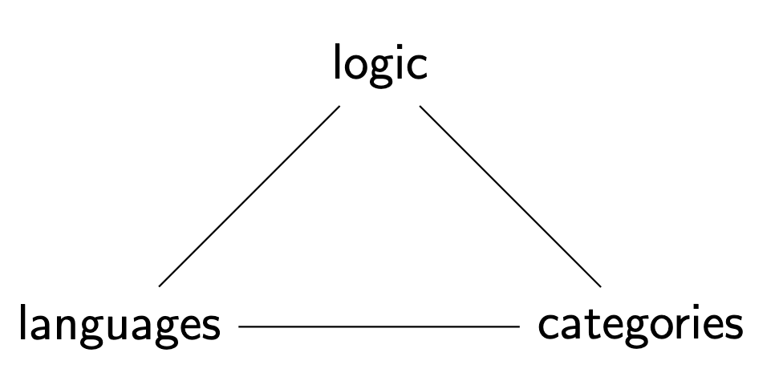
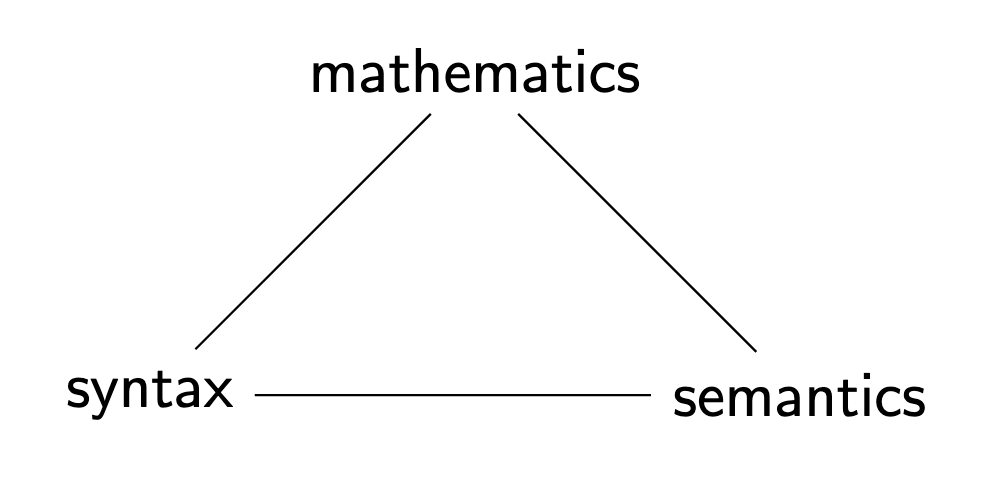
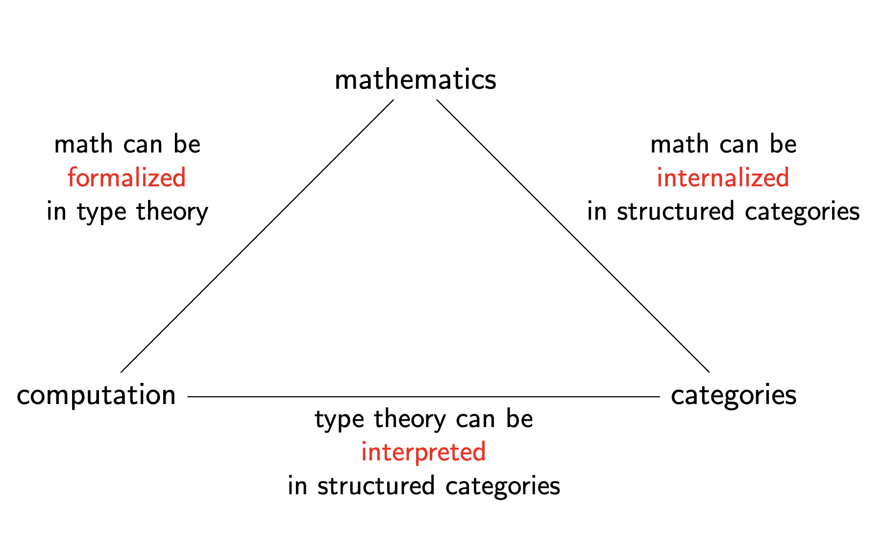
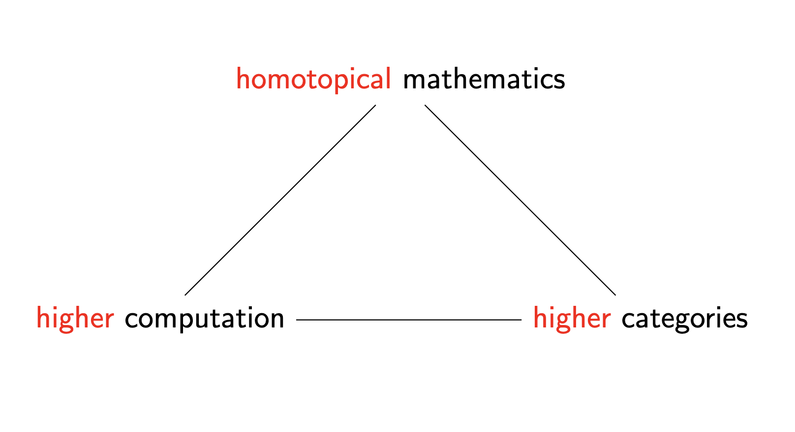
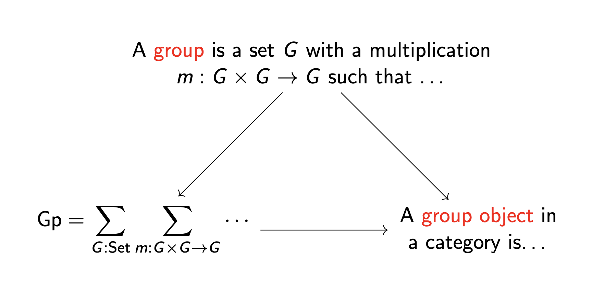
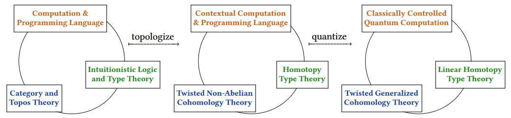

+++
title = "The Computational Trilogy: Three Perspectives, One Truth"
date = "2025-02-27"
description = "A guy explains his area of research." 

[extra]
comment = true
repo_view = true
read_time = true

[taxonomies] 
tags=["math"] 
+++

## Motivation

Everywhere we look, computation surrounds us—yet confusion about its true nature persists just as universally. Ask a computer scientist about computation, and you'll hear of algorithms and Turing machines. Pose the same question to a logician, and watch them expound on formal proofs and axioms. A category theorist, meanwhile, might wave their hands toward morphisms and elaborate commutative diagrams.

Throughout much of the 20th century, these three perspectives seemed to speak entirely different languages, each isolated in its own intellectual silo. Then something remarkable happened. Starting in the late 1900s, a profound realization began to crystallize: programming languages, formal logic, and category theory aren't separate disciplines at all! Rather, they represent different manifestations of a single underlying structure—interconnected as intimately as electricity, magnetism, and light in Maxwell's revolutionary equations.

This insight, sometimes called the Computational Trilogy, builds on a deceptively simple but profound idea:

> Proofs are programs.
> Programs are morphisms.
> Types are propositions.

Could anything be more elegant? Formalized as the Curry-Howard-Lambek correspondence, this unification suggests that logic, computation, and mathematical structure aren't just similar—they're different expressions of the same fundamental reality. Each domain offers a unique lens for viewing the others; together, they create what John Baez aptly called a "Rosetta Stone" for modern mathematics.

But why should we care?

Far beyond its elegant theoretical beauty, this framework has begun transforming everything from how we design programming languages to how we approach automated theorem proving, even reshaping the very foundations of mathematics itself. Where might this lead? Consider the emergence of homotopy type theory, the rising popularity of dependently typed programming languages, and the surprising yet seemingly inevitable convergence of classical and quantum computation—all pointing toward an ever-deeper unification.

Yet for all its power, the correspondence remains incomplete. How do the intuitive, sometimes messy proofs of human mathematicians fit into this framework? Can we extend it to embrace discrete mathematics, where combinatorial structures often resist elegant formulation? What happens when we venture beyond classical computation into quantum mechanical realms, where the rules of logic themselves appear to shift and transform?

Through this blog, I hope to explore precisely these questions. My goal isn't just to explain theoretical curiosities but to demonstrate why this unification of logic, programming, and mathematics holds such transformative potential—not just for specialists, but for anyone fascinated by computation, proof, and mathematical truth. Most importantly, it is to make this link: [https://ncatlab.org/nlab/show/computational+trilogy](https://ncatlab.org/nlab/show/computational+trilogy) more accessible to a wider audience. Note: all images are from the same link.

## The Problem With Borders

Our tendency to separate disciplines is a deeply ingrained habit of thought. Mathematicians have long viewed proofs as distinct from computation, even as the rise of proof assistants like Lean and Coq suggests that writing proofs and writing programs are becoming indistinguishable. Likewise, computer scientists often see programming languages as a domain of syntax and algorithms, without recognizing that their very structure is dictated by deep logical principles.

Category theory, for its part, often seems like an esoteric abstraction, despite the fact that it offers the most general possible language for describing computation. The reluctance to embrace these connections is understandable. Each discipline has its own historical development, its own motivations, its own culture.

But as we will see, once you adopt the computational trilogy as a guiding principle, the artificial boundaries between these fields dissolve.

- No longer is a proof just a sequence of logical deductions—it becomes an algorithm actively computing its conclusion.
- A function in programming transcends its role as mere instructions—revealing itself as a morphism in a mathematical category.
- And a logical proposition? Far more than a statement about truth—it emerges as a type describing computational possibilities.

This perspective doesn't just unify fields—it expands our tools for understanding mathematics itself.

## A Roadmap

In this blog, we will explore:

* Origins of the Trilogy
* The Curry-Howard correspondence: proofs as programs.
* Lambek's categorical extension: programs as morphisms.
* Harper's vision of computational trinitarianism.
* The Rosetta Stone of Computation
* Concrete examples of the correspondence.
* Beyond the Trilogy: New Frontiers
  - Homotopy type theory: when types behave like spaces.
  - The rise of quantum computation: from classical logic to linear logic.
  - What comes after proof? Mathematical intuition, unformalized reasoning, and the limits of formalism.

This is a story about unification—but also about boundaries, and where they begin to break down. It is about how computation, once thought to be just a tool, is becoming the very fabric of mathematics itself. All of this while trying to be as accessible as possible, without sacrificing depth.

## Origins of the Trilogy

The discovery that proofs, programs, and mathematical structures are deeply interwoven did not happen all at once. It unfolded in stages, through a series of insights spanning logic, computation, and category theory. What we now call the Computational Trilogy emerged from a confluence of three major developments:

* The Curry-Howard Correspondence – the realization that proofs are programs.
* Lambek's Categorical Perspective – the generalization that programs are morphisms.
* Harper's Computational Trinitarianism – the philosophical framework that unites logic, computation, and category theory into a single, interconnected vision.

Each of these developments transformed its respective field, but together, they form a single, powerful idea: mathematics and computation are not separate; they are two sides of the same coin.

## The Curry-Howard Correspondence: Proofs as Programs

Mathematics is the study of absolute truths, yet for centuries, mathematicians have been unknowingly writing computer programs without ever compiling them.

A proof is often thought of as a static object, a sequence of logical deductions frozen on the page. But what if we view proofs differently—not as static arguments, but as dynamic computations? This is the heart of the Curry-Howard Correspondence, a discovery that revealed a profound connection between logic and computation.

This insight wasn't just a clever academic observation—it fundamentally transformed both fields by establishing that:

- Mathematical proofs and programs share the same underlying structure
- Propositions in logic correspond directly to types in programming
- Proving a theorem is isomorphic to constructing a program of a given type

When I first encountered this correspondence in high school, it felt like discovering that two languages I had been studying separately were actually dialects of the same underlying structure. It was a moment of profound clarity—suddenly, the boundary between proving theorems and writing code disappeared.

The story begins in the early 20th century when formal logic underwent a foundational shift. David Hilbert sought to formalize all of mathematics, but this ambition was shattered by Gödel's incompleteness theorems. Gödel's work hinted at an intricate relationship between proofs and computation, which was soon made explicit by Alonzo Church and Alan Turing with their independent formalizations of computability.

But it wasn't until the work of Haskell Curry and William Howard that the full isomorphism emerged. Their insight laid the groundwork for Per Martin-Löf's intuitionistic type theory, bridging proof theory and computation. This work eventually led to modern proof assistants like Coq, Lean, and Agda, which allow mathematicians to write proofs that can be checked by a computer—effectively "compiling" mathematics for the first time.

### The Isomorphism: Beyond Simple Correspondence

The Curry-Howard Correspondence tells us that the act of proving a theorem is structurally identical to writing a well-typed functional program. This isn't a vague metaphor; it is a direct translation between propositional logic, type theory, and programming languages.

| Logic (Intuitionistic) | Type Theory | Programming |
|------------------------|-------------|-------------|
| Proposition $A$ | Type $A$ | Data type declaration |
| Proof of $A$ | Term $t : A$ | Program of type $A$ |
| Assumption $A$ | Variable $x : A$ | Function parameter |
| Implication $A \rightarrow B$ | Function type $A \to B$ | Function declaration |
| Conjunction $A \land B$ | Product type $A \times B$ | Tuple/record type (e.g., `(A, B)` in Haskell) |
| Disjunction $A \lor B$ | Sum type $A + B$ | Tagged union/variant (e.g., `Either A B` in Haskell) |
| Universal quantification $\forall x. P(x)$ | Dependent product $\Pi x:A. B(x)$ | Generic/polymorphic function |
| Existential quantification $\exists x. P(x)$ | Dependent sum $\Sigma x:A. B(x)$ | Existential type/data hiding |
| Falsity $\bot$ | Empty type $\emptyset$ | `Void` type (uninhabited) |
| Truth $\top$ | Unit type $()$ | `Unit` type (singleton) |
| Negation $\neg A$ | Function $A \to \bot$ | Function to `Void` |

This means that checking a proof for correctness is the same as type-checking a program. Running a program corresponds to simplifying a proof. If a proof contains an inconsistency, it is equivalent to a type error in a program.

### Inference Rules as Type Rules: Proofs Construct Programs

The correspondence extends beyond static structures to inference rules themselves. Every logical deduction rule has a corresponding type rule in lambda calculus.

Example 1: Implication Introduction (Function Definition)
In logic:
```
  [A]
   ⋮
   B
-------
A → B
```

In typed lambda calculus:
```
  x : A ⊢ e : B
-----------------
⊢ λx.e : A → B
```
Interpretation: Assuming $A$ allows us to derive $B$, which corresponds to defining a function that takes an argument of type $A$ and produces a result of type $B$.

Example 2: Modus Ponens (Function Application)
In logic:
```
A → B    A
-----------
    B
```

In typed lambda calculus:
```
f : A → B    x : A
-----------------
    f x : B
```
Interpretation: Applying a function of type $A \to B$ to a value of type $A$ produces a result of type $B$, just as modus ponens allows us to infer $B$ from $A \to B$ and $A$.

### Computation as Proof Normalization: Code as Proof Execution

One of the most striking aspects of the Curry-Howard Correspondence is how program execution relates to proof simplification (also known as normalization).

Consider this logical proof with an unnecessary detour:

```
  A      B
--------- ∧I
   A ∧ B
--------- ∧E₁
    A
```

This corresponds to the Haskell program:
```haskell
fst (a, b)
```

When evaluated, it reduces to `a`. Similarly, in proof theory, we normalize this proof to a simpler one:

```
A
```

Thus, evaluating a program is equivalent to simplifying a proof.

### A Concrete Example: Function Composition as Logical Transitivity

Let's prove the transitivity of implication:

$$
(A \rightarrow B) \rightarrow (B \rightarrow C) \rightarrow (A \rightarrow C)
$$

Logical proof in natural deduction:
```
[A → B]¹    [A]³
----------------- →E
       B         [B → C]²
----------------------------- →E
             C
----------------------------- →I³
           A → C
----------------------------- →I²
      (B → C) → (A → C)
----------------------------- →I¹
(A → B) → (B → C) → (A → C)
```

Corresponding Haskell program:
```haskell
compose :: (a -> b) -> (b -> c) -> (a -> c)
compose f g = \x -> g (f x)
```

Or in lambda calculus:
$$
\lambda f. \lambda g. \lambda x. g(f(x))
$$

The computational content of this proof is function composition.

### Real-World Applications: From Proof Assistants to Functional Programming

The Curry-Howard Correspondence has profoundly shaped both mathematics and computer science:

1. Proof Assistants & Dependently Typed Languages  
   - Coq, Agda, and Lean allow us to write proofs as programs.
   - Example: Proving composition in Coq:
     ```coq
     Definition compose {A B C : Type} (f : A -> B) (g : B -> C) (x : A) : C := g (f x).
     ```

2. Programming Language Design  
   - Functional languages like Haskell, Idris, and Scala directly implement Curry-Howard ideas.
   - Rust's borrow checker enforces affine logic (a variant of linear logic).

3. Effect Systems & Modal Logic  
   - Monads in Haskell correspond to modal logic.
   - Continuations implement classical logic.

### Why This Matters: Computation as Mathematics

When we write well-typed code, we are constructing mathematical proofs. A type error is a logical inconsistency. A program transformation is a proof transformation.

This perspective reshapes how we think about programming:

- Proving a theorem is just writing a program.
- Evaluating a program is just simplifying a proof.
- Refactoring code is transforming one proof into another equivalent one.

As Philip Wadler beautifully put it:
> "Proofs are programs, and programs are proofs."

The Curry-Howard Correspondence gives us our first glimpse into the computational trilogy, but it's only the beginning. To complete the picture, we need to explore how these programs—these proofs—relate to the mathematical structures of category theory. This brings us to Lambek's remarkable insight that programs are morphisms in a category.

## Lambek's Categorical Perspective: Programs as Morphisms

While the Curry-Howard Correspondence established a connection between logic and programming, Joachim Lambek extended this perspective into category theory. His work in the 1970s provided an even more abstract viewpoint: programs are morphisms in a category.

This insight generalizes the Curry-Howard Correspondence. Not only are proofs equivalent to programs, but programs themselves can be understood as morphisms—structured transformations between objects in a mathematical framework.

To fully grasp this shift, we must first define what a category is.

### Definition: Category

A category $\mathcal{C}$ consists of:

- A collection of objects (e.g., types in a programming language, propositions in logic).  
- A collection of morphisms (arrows) between these objects, representing transformations.  
- Two fundamental properties governing these morphisms:
  1. Composition: If $f : A \to B$ and $g : B \to C$, then there exists a composite morphism $g \circ f : A \to C$.
  2. Identity: Each object $A$ has an identity morphism $\text{id}_A : A \to A$, which behaves neutrally under composition.

Formally, this means:

1. Associativity: For all morphisms $f : A \to B$, $g : B \to C$, and $h : C \to D$,

   $$
   h \circ (g \circ f) = (h \circ g) \circ f.
   $$

2. Identity laws: For every morphism $f : A \to B$,

   $$
   \text{id}_B \circ f = f = f \circ \text{id}_A.
   $$

These rules ensure that morphisms behave like structured transformations, forming a robust framework for reasoning about functions, types, and proofs.

### Typed Lambda Calculus as a Category

Lambek's key insight was that typed lambda calculus naturally forms a category. In this categorical perspective:

- Types correspond to objects in a category.
- Programs (functions) correspond to morphisms between these types.
- Function composition corresponds to morphism composition.

For example, in typed lambda calculus:

1. A function of type $A \to B$ can be interpreted as a morphism $f : A \to B$.
2. If we have another function $g : B \to C$, we can compose them to obtain a new function $g \circ f : A \to C$, just as in category theory.

This correspondence can be visualized as:

$$
A \xrightarrow{f} B \xrightarrow{g} C
$$

which combines into:

$$
A \xrightarrow{g \circ f} C.
$$

### The Syntax-Semantics Connection

What makes this correspondence profound is that it connects syntax (terms in lambda calculus) with semantics (morphisms in a category). The equivalence classes of lambda terms constitute the morphisms in the induced category.

More precisely, given a typed lambda calculus L, we construct a category C(L) where:

- Objects are the types of L
- Arrows $A \to B$ are equivalence classes of terms of type B with exactly one free variable of type A
- Arrow equality is defined by beta-eta equivalence: $(x:A, M(x)) = (x':A, N(x'))$ if and only if $M(x) =_{\beta\eta} N(x)$
- Identity arrow $id_A: A \to A$ is the pair $(x:A, x)$
- Composition of $(x:A, M(x)): A \to B$ and $(y:B, N(y)): B \to C$ is $(x:A, N[M(x)/y]): A \to C$, where $N[M(x)/y]$ means substituting $M(x)$ for $y$ in $N(y)$

This construction satisfies the category axioms:

1. Associativity: $(h \circ g) \circ f = h \circ (g \circ f)$ follows from the associativity of substitution
2. Identity: $id_B \circ f = f = f \circ id_A$ follows from the definition of substitution

### Correspondence Between Typed Lambda Calculus and Category Theory

| Typed Lambda Calculus | Category Theory |
|----------------------|----------------------|
| Type | Object in a category |
| Function $A \to B$ | Morphism $f : A \to B$ |
| Lambda abstraction $\lambda x:A.M$ | Currying operation $\Lambda$ |
| Function application $M(N)$ | Evaluation morphism $eval$ |
| Identity function $\lambda x. x$ | Identity morphism $\text{id}_A$ |
| Function composition $g \circ f$ | Morphism composition $g \circ f$ |

This perspective expands the Curry-Howard Correspondence: not only are proofs equivalent to programs, but programs themselves can be understood as structured transformations within a category.

### Cartesian Closed Categories (CCCs) and the Structure of Computation

A natural question arises: what kind of category best models typed functional programming? The answer is Cartesian Closed Categories (CCCs).

A Cartesian Closed Category (CCC) is a category $\mathcal{C}$ that satisfies three conditions:

1. Terminal Object: There exists an object $1$ such that for every object $A$, there is a unique morphism $!_A: A \to 1$.
2. Products: Every pair of objects $A, B$ has a product $A \times B$ with projection morphisms:
   $$
   \pi_1 : A \times B \to A, \quad \pi_2 : A \times B \to B.
   $$
   Moreover, for any morphisms $f: C \to A$ and $g: C \to B$, there exists a unique morphism $\langle f, g \rangle: C \to A \times B$ such that $\pi_1 \circ \langle f, g \rangle = f$ and $\pi_2 \circ \langle f, g \rangle = g$.
   
3. Exponential Objects: For every pair of objects $A, B$, there exists an exponential object $B^A$ and an evaluation morphism:
   $$
   eval_{A,B} : B^A \times A \to B
   $$
   such that for any morphism $f : C \times A \to B$, there exists a unique morphism $\Lambda(f) : C \to B^A$ making the following diagram commute:
   
   $$
   \begin{array}{ccc}
   C \times A & \xrightarrow{f} & B \\\\
   \lVert\\\\
   C \times A & \xrightarrow{\Lambda(f) \times id_A} & B^A \times A & \xrightarrow{eval_{A,B}} & B
   \end{array}
   $$

These structures correspond precisely to the computational constructs in typed lambda calculus:

1. The terminal object $1$ corresponds to the unit type.
2. Products $A \times B$ correspond to pair types.
3. Exponentials $B^A$ correspond to function types $A \to B$.
4. The evaluation morphism corresponds to function application.
5. The currying operation $\Lambda$ corresponds to lambda abstraction.

The equations governing CCCs correspond exactly to the reductions in lambda calculus, including beta and eta reduction.

Now that we've established the connections between logic and programming (Curry-Howard) and between programming and category theory (Lambek), we can finally see how all three perspectives unite into a single, coherent vision of computation—what Robert Harper calls "Computational Trinitarianism."

## Harper's Vision of Computational Trinitarianism: A Unified Perspective on Computation

While Curry-Howard shows us that proofs are programs and Lambek shows that programs are morphisms, Harper's insight is that these aren't just correspondences—they are three facets of a single phenomenon. His concept of Computational Trinitarianism is an attempt to express the deep unity between logic, programming languages, and category theory—not as mere correspondences, but as three manifestations of a single mathematical truth.

Harper's vision is perhaps best summarized as:

> Logic, Programming, and Category Theory are not just similar—they are the same.
> Each provides an essential perspective on the nature of computation.

This view is doctrinal, almost theological in its emphasis on three-in-one unity. In fact, Harper explicitly borrows the language of religious doctrine to frame this insight:

> The central dogma of computational trinitarianism holds that Logic,
> Languages, and Categories are but three manifestations of one divine notion
> of computation. There is no preferred route to enlightenment: each aspect
> provides insights that comprise the experience of computation in our lives.
> — Robert Harper, 2011




The idea is not just that these fields are connected—but that any computational concept should be meaningful in all three aspects. If you discover something fundamental in one, it must have a counterpart in the other two.

What makes this perspective so powerful is how it transforms our approach to computational concepts. Rather than viewing a new idea through a single lens, we can triangulate its meaning across all three domains simultaneously. If you discover something fundamental in one realm, its counterparts in the other two realms must exist and offer complementary insights.

I remember when this unified perspective clicked for me—I was struggling to understand monads (as every functional programmer does at some point), when suddenly seeing the categorical, logical, and programming perspectives simultaneously made everything clear. The three views reinforced each other, like looking at a complex shape from multiple angles.

### The Rosetta Stone of Computation: Three Views, One Truth

In his influential paper "Physics, Topology, Logic and Computation: A Rosetta Stone," John Baez and Mike Stay explicitly drew the analogy to the ancient Rosetta Stone. Just as that archaeological artifact displayed the same text in three different languages—hieroglyphics, demotic script, and ancient Greek—allowing linguists to decode previously impenetrable language systems, the computational trilogy serves as our modern Rosetta Stone for decoding the languages of mathematics, logic, and computation.

Harper's computational trinitarianism is most clearly expressed in the following three-way correspondence between Logic, Programming, and Category Theory:

| Logic (Proofs) | Programming (Types & Terms) | Category Theory (Morphisms) |
|----------------|-----------------------------|-----------------------------|
| Proposition $A$ | Type $A$ | Object $A$ |
| Proof of $A$ | Program of type $A$ | Morphism $f: 1 \to A$ |
| Assumption $A$ | Variable $x : A$ | Projection $p_A$ |
| Implication $A \to B$ | Function type $A \to B$ | Exponential object $B^A$ |
| Conjunction $A \land B$ | Product type $A \times B$ | Cartesian product $A \times B$ |
| Disjunction $A \lor B$ | Sum type $A + B$ | Coproduct $A + B$ |
| Falsehood $\bot$ | Empty type $0$ | Initial object $0$ |
| Truth $\top$ | Unit type $()$ | Terminal object $1$ |
| Modus Ponens $A, A \to B \vdash B$ | Function application $f(a)$ | Evaluation morphism $\text{eval}$ |
| Universal quantification $\forall x. P(x)$ | Dependent function $\Pi x:A. B(x)$ | Dependent product $\Pi x:A. B(x)$ |
| Existential quantification $\exists x. P(x)$ | Dependent pair $\Sigma x:A. B(x)$ | Dependent sum $\Sigma x:A. B(x)$ |

This correspondence is more than a metaphor—it's an equivalence of structures. If you remove the surface-level differences in notation, all three fields are describing the same underlying phenomenon.



### Back to the Curry-Howard-Lambek Correspondence: When Three Worlds Collide

The deeper I've ventured into the computational trilogy, the more I've come to appreciate the sheer elegance of the Curry-Howard-Lambek correspondence. What began as separate intellectual traditions has crystallized into one of the most beautiful unifications in mathematical science.

Again, to emphasize this! The Curry-Howard-Lambek correspondence shows us that:

1. Logic (proofs)  
2. Programming (typed lambda calculus)  
3. Category Theory (cartesian closed categories)  

are three perspectives on the same underlying phenomenon. Consider two fundamental structures:

- The category $\mathbf{Set}$ of sets and functions
- A meet-semilattice $\mathbf{P}$ with implications (a model of propositional logic)

Both of these turn out to be cartesian closed categories! This gives us a three-way correspondence table that reveals the underlying unity:

| Cartesian Closed Category | $\mathbf{Set}$ | $\mathbf{P}$ (Logic) | Typed $\lambda$-calculus |
|---------------------------|---------|---------------|------------------|
| Objects/1-cells | Sets | Propositions | Types |
| Morphisms/2-cells | Functions | Entailment | Terms/Programs |
| 1-cell composition | Cartesian product $S \times T$ | Conjunction $A \wedge B$ | Product type |
| Identity 1-cell | One-element set $\{*\}$ | True proposition $\top$ | Unit type $()$ |
| Right Kan extension | Function set $T^S$ | Implication $A \rightarrow B$ | Function type |
| Evaluation morphism | Function application | Modus ponens | Term application |
| Currying | $f: C\times A\rightarrow B$ to $\Lambda f: C\rightarrow B^A$ | Deduction theorem | Lambda abstraction |

I gasped when I first saw this table. It was literally everything I was studying!

### The Dogma: No Concept Exists in Isolation



One of the most powerful aspects of Computational Trinitarianism is how it serves as a research guiding principle. It suggests that:

- If you discover a new logical system, it should have an interpretation in type theory and category theory.
- If you propose a new type system, it should correspond to proof rules and categorical structures.
- If you define a new categorical construction, it should express something in logic and computation.

I've found this principle enormously helpful in my own work. When encountering a difficult concept in one domain, I often seek its "translations" in the other two. This triangulation helps clarify the essence of what I'm studying. This explains why linear logic led to linear types, why modal logic corresponds to monads, and why higher category theory is shaping homotopy type theory.

### Sequent Calculus and Categorical Structure

Logical reasoning in sequent calculus form:

$$\frac{\{\Gamma_i \vdash \Delta_i\}_{i\in I}}{\Gamma \vdash \Delta}$$

directly corresponds to composition rules in a category. The entailment relation $A \vdash B$ (read "B follows from A") is precisely a morphism in our category!

This connection transformed how I think about type theory. When I write:

```haskell
compose :: (b -> c) -> (a -> b) -> (a -> c)
compose g f = \x -> g (f x)
```

I'm not just defining a function—I'm establishing a categorical composition rule that mirrors logical entailment. The type signature itself is a proposition, and the implementation is a proof!

### Beyond Classical Structures: The Higher Trinity



The Computational Trinity extends naturally into more advanced mathematical domains. Consider how it manifests in higher mathematics:

Type theory gets enriched to homotopy type theory, categories become higher categories, and the entire framework elevates to what we might call "higher computation." This evolution allows us to model not just whether proofs exist, but the spaces of possible proofs and transformations between them.

When I first read about Voevodsky's univalence axiom, I was fascinated by how it connected homotopy theory, type theory, and higher categories. The idea that equality is path connection in a space, which corresponds to type equivalence in programming and isomorphism in category theory, reveals the trilateral nature of mathematical thought itself.

### Mathematical Structures Through the Trinitarian Lens

Even basic mathematical structures reveal this three-way perspective. Consider the concept of a group:



A group can be viewed as:
1. A set with operations satisfying axioms (set-theoretic view)
2. A type with operations and proofs of properties (computational view)
3. A one-object category with invertible morphisms (categorical view)

These aren't just different definitions—they're different manifestations of the same fundamental structure, each revealing aspects that might be obscured in the others.

## Beyond the Original Trilogy: The Parametrized Perspective

Just when I thought I'd wrapped my head around the computational trinity, the rabbit hole went deeper. It turns out that our lovely trinity was just the beginning of an even more profound unification. The extension into what I call the "parametrized perspective" represents one of those mathematical moments that made me spill my coffee in excitement.

What happens when we consider that computation doesn't happen in a vacuum? What if we acknowledge that:

1. Computation happens in contexts and is proof relevant
2. Categories give rise to systems of slice categories (and are in general $(\infty,1)$-categories)
3. Types may depend on other types and are in general homotopy types

This realization transforms our well-established computational trinity into something richer and more nuanced.

### The Enhanced Trinity: A Four-Way Correspondence

The traditional computational trilogy enhances to a four-way correspondence:

| In dependent homotopy type theory | In programming languages | In locally cartesian closed $(\infty,1)$-categories | In non-abelian cohomology |
|-----------------------------------|--------------------------|---------------------------------------------------|---------------------------|
| A term of some type in context | A program of some data type in context | A generalized element of an object in a slice | A cocycle in twisted cohomology |

Let's unpack this correspondence with the technical rigor it deserves.

### Contexts and Slice Categories

In dependent type theory, a context $\Gamma$ represents assumptions or variables in scope. When we write a judgment like:

$\Gamma \vdash t : A$

We're saying that term $t$ has type $A$ under assumptions $\Gamma$.

Categorically, this corresponds to working in a slice category. Given a category $\mathcal{C}$ and an object $X$, the slice category $\mathcal{C}/X$ has:
- Objects: morphisms $f: Y \to X$ in $\mathcal{C}$
- Morphisms: commutative triangles 

The slice category $\mathcal{C}/X$ precisely captures the idea of "computation in context $X$." This is not just a formal analogy—it's a deep mathematical equivalence. When I first understood this, it completely changed how I view type checking!

### From Categories to Higher Categories

The connection deepens when we consider that ordinary categories are insufficient for capturing the richness of type theory. We need $(\infty,1)$-categories, which track:

- Objects (types)
- 1-morphisms (functions)
- 2-morphisms (homotopies between functions)
- 3-morphisms (homotopies between homotopies)
- ...and so on

An $(\infty,1)$-category has $n$-morphisms for all $n \geq 1$, and all $k$-morphisms for $k > 1$ are invertible. This structure perfectly captures the notion of proof relevance in type theory.

In a proof-relevant system, we care not just about whether a proposition is true, but about *how* it's proven. The space of all possible proofs forms a higher-dimensional structure, and different proofs can be related by homotopies (paths between proofs). This is precisely what $(\infty,1)$-categories model!

### The Algebraic Topology Connection

The deepest layer of this correspondence connects to algebraic topology through the work of Schreiber, Lurie, and others. This connection reveals that the very structure of computational type theory maps onto cohomology theories.

The equivalence with algebraic topology opens up a profound connection: a generalized element in an $(\infty,1)$-topos may equivalently be regarded as a cocycle in (non-abelian) cohomology, and in twisted cohomology if in a slice $(\infty,1)$-category.

For example, in twisted cohomology, the cup product of a 0-cochain $f$ with values in $\text{Hom}(E, F)$ and a 1-cochain $g$ with values in $E$ gives a 1-cochain with values in $F$. This is exactly analogous to function application in dependent type theory!

### Practical Implications: Where Theory Meets Practice

This expanded correspondence isn't just mathematical abstraction—it provides a unified framework for solving real problems:

1. Program Verification Through Topology
   When we view programs through the lens of non-abelian cohomology, topological invariants become tools for proving program properties. The fundamental group can detect unreachable states in a program's execution space.

2. Homotopy Theory Computation
   The type-theoretic perspective allows us to compute topological invariants constructively. For instance, computing the homotopy groups of spheres becomes a matter of constructing specific terms in type theory.

3. Effect Systems as Cohomological Twistings
   Computational effects in programming languages (exceptions, state, IO) can be understood as "twistings" in cohomology. A monadic effect system corresponds to a twisted cohomology theory where the twisting cocycle represents the effect.

## The Univalence Axiom: A Concrete Example

Perhaps the most striking example of this parametrized perspective in action is Voevodsky's univalence axiom, which states:

$(A \simeq B) \simeq (A =_{\mathcal{U}} B)$

This means that equivalence of types is equivalent to equality of types in the universe type $\mathcal{U}$. In programming terms, it says that isomorphic data structures are interchangeable. In categorical terms, it says that equivalent objects in a category should be considered equal. In cohomological terms, it says that cohomologous cocycles represent equivalent structures.

The univalence axiom is implemented in systems like Cubical Agda, allowing programmers to transport programs along type equivalences, turning type-level isomorphisms into computational paths.

## The Quantum Trilogy: A Parallel Correspondence

While exploring the depths of the computational trilogy, I stumbled upon a parallel framework that completely shifted my understanding. This alternative correspondence—what I've dubbed the "quantum trilogy"—connects linear logic, quantum computation, and monoidal categories in a way that's mathematically elegant and conceptually profound.

What makes this correspondence so striking is how it mirrors yet transforms the classical trilogy. Where the classical world embraces copying and deletion of information, this quantum realm enforces strict resource management.

### From Classical to Quantum: Three Parallel Transitions

1. From intuitionistic logic to linear logic
2. From classical computation to quantum computation
3. From cartesian closed categories to closed monoidal categories


Each of these transitions represents moving from a world where information can be freely copied and deleted to one where resources must be precisely accounted for.

> In the classical world, information can be freely copied and discarded.
> In the quantum world, information must be precisely accounted for.

### Linear Logic: When Resources Matter

Girard's linear logic (1987) revolutionized logical systems by treating propositions as consumable resources. The difference becomes clear when we compare:

In classical logic:
$$A \Rightarrow (A \Rightarrow B) \Rightarrow B$$

This is trivially true because we can use $A$ twice. But in linear logic:
$$A \multimap (A \multimap B) \multimap B$$

This isn't valid—the first use of $A$ depletes it, leaving nothing for the second use!

The operators of linear logic make this resource-consciousness explicit:
- $A \otimes B$ (tensor): you have *both* $A$ and $B$
- $A \oplus B$ (plus): you have *either* $A$ or $B$
- $!A$ (of course): you have *as many copies* of $A$ as needed
- $A \multimap B$ (linear implication): consuming $A$ produces $B$

Quantum computation differs from classical computation most notably in the no-cloning theorem: you cannot make a perfect copy of an arbitrary quantum state. This resource-sensitivity mirrors precisely the constraints of linear logic!

### Quantum Computation: Where No-Cloning Is Law

This resource sensitivity perfectly aligns with quantum computation's fundamental constraints. The no-cloning theorem—the impossibility of creating identical copies of arbitrary quantum states—finds its logical expression in linear logic and its categorical formulation in monoidal categories.

A quantum circuit demonstrates this linearity visually: each qubit follows a path through gates, transforming but never duplicating (unless explicitly measured). The Bell pair creation circuit exemplifies this resource flow:

```
q1 ----H----•----
             |
q2 ---------X----
```

Each qubit is used exactly once—a perfect manifestation of linear logic in action.

A simple quantum program in a linear type system might look like:

```haskell
-- Linear types ensure qubits aren't duplicated
hadamard : Qubit ⊸ Qubit
cnot : (Qubit ⊗ Qubit) ⊸ (Qubit ⊗ Qubit)

bellPair : Qubit ⊸ Qubit ⊸ (Qubit ⊗ Qubit)
bellPair q1 q2 = cnot (hadamard q1, q2)
```

The linear function type `⊸` ensures each qubit is used exactly once.

## Closed Monoidal Categories: The Right Math

While cartesian closed categories provide the categorical semantics for classical computation, *closed symmetric monoidal categories* give us the perfect setting for quantum computation and linear logic.

In a cartesian category, every object $A$ comes with natural morphisms $\Delta_A: A \to A \times A$ (duplication) and $\epsilon_A: A \to 1$ (deletion). But quantum information can't be duplicated or deleted arbitrarily! What we need instead is a monoidal structure, where:

- We have a tensor product $\otimes$ instead of a cartesian product $\times$
- There's no general duplication or deletion
- We still have a closed structure giving us internal hom objects $A \multimap B$
- The symmetry isomorphism $\sigma_{A,B}: A \otimes B \cong B \otimes A$ captures the commutativity properties essential for quantum mechanics

The category FdHilb of finite-dimensional Hilbert spaces with linear maps is the prototype example - it's symmetric monoidal closed but not cartesian closed, and gives semantics to quantum computation. The symmetry of the tensor product in FdHilb corresponds directly to the physical principle that the joint state space of two quantum systems is invariant under exchange of the systems.

## Conclusion: The Tetralogical Universe of Computation

The journey through these computational correspondences reveals something even more profound than separate trilogies – it unveils what we might call a "computational tetralogy" where the classical and quantum worlds combine with their parametrized perspectives.

When we merge the classical parametrized trilogy with the quantum trilogy, we arrive at a unified framework that encompasses:

* From classical computation to classically controlled quantum computation on linear spaces of quantum states parametrized over classical data types
* From dependent intuitionistic homotopy type theory to dependent linear type theory of dependent stable homotopy types
* From locally cartesian closed (∞,1)-categories to indexed monoidal (∞,1)-categories of parametrized spectra, which in algebraic topology corresponds to twisted generalized cohomology theory

This perspective reveals computation not as isolated islands of theory, but as a connected landscape that we can traverse through systematic transformations:



We begin with the classical computational trilogy in the bottom left – the foundation connecting intuitionistic logic, programming languages, and category theory. From here, we can follow two fundamental transformations:

1. Topologize: Moving right, we enter the world of contextual computation, where the parametrized perspective takes hold. Here, types become homotopy types, logic becomes dependent, and categories give way to twisted non-abelian cohomology.

2. Quantize: From contextual computation, we can then quantize to reach classically controlled quantum computation, where dependent linear type theory and twisted generalized cohomology theory provide the mathematical foundation.

What continues to amaze me is how these transformations aren't arbitrary – they follow deep mathematical patterns. The "topologize" operation corresponds to enriching our structures with spatial information, while the "quantize" operation introduces resource sensitivity and linear behavior.

Each vertex in this tetralogy offers a unique lens for understanding computation:
- The classical trilogy excels at describing functional abstraction
- The parametrized perspective captures context-dependence
- The quantum trilogy handles resource management
- The combined "classically controlled quantum computation" framework brings everything together

I've come to see these connections not just as formal correspondences, but as a roadmap for the future of computation itself. As quantum computing continues to mature and topological data analysis becomes more prevalent, this unified framework will likely serve as the theoretical foundation for the next generation of programming languages and computational systems.

This tetralogy isn't a static endpoint – it's an invitation to explore. What happens when we apply other transformations? What about probabilistic computation, or continuous computation? Each new perspective adds another dimension to our understanding, revealing computation to be not just a tool, but a profound mathematical structure that connects the deepest ideas in mathematics, physics, and logic.

And perhaps that's the most beautiful insight of all – that computation, in its essence, isn't just about algorithms and machines. It's about the fundamental structure of information and transformation, something that permeates not just computer science, but mathematics and reality itself.




Please tell me if I got the references wrong. My zotero is not working properly.

1. Melliès, P.-A. (2006). *Functorial boxes in string diagrams*. In *Proceedings of Computer Science Logic 2006*, Szeged, Hungary. [https://hal.archives-ouvertes.fr/hal-00154243](https://hal.archives-ouvertes.fr/hal-00154243)  
- Discusses the extension of string diagrams with functorial boxes, an idea that surfaced in the 1970s.
2. Lambek, J., & Scott, P. J. (1986). *Introduction to Higher Order Categorical Logic*. Cambridge University Press. [https://doi.org/10.1017/CBO9780511525858](https://doi.org/10.1017/CBO9780511525858)  
- Early work on higher-order categorical logic, connecting mathematical logic and category theory.
3. Harper, R. (2011). *The Holy Trinity*. [https://www.cs.cmu.edu/~rwh/talks/hott.pdf](https://www.cs.cmu.edu/~rwh/talks/hott.pdf)  
- Explores the relationship between type theory, category theory, and logic.
4. Eades, H. (2012). *Type Theory and Applications*.
- Provides insights into type theory and its applications.
5. Frumin, D. (2014). *Computational Trinitarianism*. [https://prezi.com/fnz-4wzsygiq/computational-trinitarianism/](https://prezi.com/fnz-4wzsygiq/computational-trinitarianism/)  
- Presentation on the unity of computation, logic, and category theory.
6. Baez, J., & Stay, M. (2011). *Physics, Topology, Logic and Computation: A Rosetta Stone*. In B. Coecke (Ed.), *New Structures for Physics*, Lecture Notes in Physics, vol 813. Springer. [https://arxiv.org/abs/0903.0340](https://arxiv.org/abs/0903.0340)  
- Connects concepts in physics, topology, logic, and computation.
7. Shulman, M. (2018). *Homotopical Trinitarianism: A Perspective on Homotopy Type Theory*. [https://arxiv.org/abs/1803.00180](https://arxiv.org/abs/1803.00180)  
- Discusses homotopy type theory from a trinitarian perspective.
8. Taylor, P. (1999). *Practical Foundations of Mathematics*. [https://www.paultaylor.eu/Practical_Foundations](https://www.paultaylor.eu/Practical_Foundations)  
- A comprehensive text on the foundations of mathematics.
9. Lawvere, F. W., & Rosebrugh, R. (2003). *Sets for Mathematics*. Cambridge University Press. [https://doi.org/10.1017/CBO9780511810442](https://doi.org/10.1017/CBO9780511810442)  
- Introduces category theory with a focus on sets and their role in mathematics.
10. Harper, R. (2016). *Practical Foundations for Programming Languages* (2nd ed.). Cambridge University Press. [https://doi.org/10.1017/CBO9781316576892](https://doi.org/10.1017/CBO9781316576892)  
- Explores the theoretical underpinnings of programming languages.
11. Goguen, J. A. (1991). *A Categorical Manifesto*. *Mathematical Structures in Computer Science, 1*(1), 49–67. [https://doi.org/10.1017/S0960129500000050](https://doi.org/10.1017/S0960129500000050)  
- Discusses the role of category theory in computer science.
12. Lambek, J. (1980). *From λ-calculus to cartesian closed categories*. *Proceedings of the AMS*, 130(10), 3025–3035.  
- The Lambek correspondence connecting typed lambda calculus to category theory.
13. Voevodsky, V., Kapulkin, C., & Lumsdaine, P. (2013). *Homotopy Type Theory: Univalent Foundations of Mathematics*.  
- Univalence Axiom and Homotopy Type Theory (HoTT).
14. Awodey, S. (2010). *Category Theory*. Oxford University Press.  
- Standard reference for categorical foundations of computation.
15. Lurie, J. (2009). *Higher Topos Theory*. Princeton University Press.  
- Introduces (∞,1)-categories, which play a key role in parametrized perspectives.
16. Shulman, M. (2018). *Brouwer’s fixed-point theorem in real-cohesive homotopy type theory*. *Mathematical Structures in Computer Science, 28*(6), 856–941.  
- Connections between cohesive homotopy type theory and computation.
17. Schreiber, U. (2020). *Twisted Non-Abelian Cohomology & Parametrized Homotopy Theory*. *nLab Preprint*.  
- Non-abelian cohomology and parametrized homotopy types, relevant to computational tetralogy.
18. Girard, J.-Y. (1987). *Linear Logic*. *Theoretical Computer Science, 50*(1), 1–102.  
- Linear logic and its connection to resource-sensitive computation.
19. Abramsky, S., & Coecke, B. (2004). *Categorical Quantum Mechanics*. In *Proceedings of the International Symposium on Logic in Computer Science (LICS)*.  
- Monoidal categories as a framework for quantum computation.
20. Selinger, P. (2004). *Towards a quantum programming language*. *Mathematical Structures in Computer Science, 14*(4), 527–586.  
- Quantum computation and category theory.
21. Lafont, Y. (2003). *Towards an algebraic theory of Boolean circuits*. *Journal of Pure and Applied Algebra, 184*(2), 257–310.  
- Connections between linear logic and quantum gates.
22. Wadler, P. (2015). *Propositions as Types*. *Communications of the ACM, 58*(12), 75–84.  
- Excellent historical overview of the Curry-Howard isomorphism.
23. Harper, R. (2022). *Types, Logic, and Computation: A Trinitarian View*. *Carnegie Mellon Lecture Notes*.  
- Modern take on Computational Trinitarianism.
24. nLab (2024). *Computational Trilogy*. Available at: [https://ncatlab.org/nlab/show/computational+trilogy](https://ncatlab.org/nlab/show/computational+trilogy)  
- Good for readers who want to dive into formal definitions.
25. nLab (2024). *Homotopy Type Theory and (∞,1)-Categories*. Available at: [https://ncatlab.org/nlab/show/homotopy+type+theory](https://ncatlab.org/nlab/show/homotopy+type+theory)  
- Useful for readers curious about parametrized homotopy types.
26. Chakraborty, S. (2011). Curry-Howard-Lambek Correspondence. [https://cspages.ucalgary.ca/~robin/class/617/projects-10/Subashis.pdf](https://cspages.ucalgary.ca/~robin/class/617/projects-10/Subashis.pdf)
- This paper explores the equivalence between proof systems, typed λ-calculi, and Cartesian closed categories, commonly referred to as the Curry-Howard-Lambek correspondence.
27. Category Theory and Diagrammatic Reasoning (2019). [https://ioc.ee/~amar/notes/ct2019_lecture5.pdf](https://ioc.ee/~amar/notes/ct2019_lecture5.pdf)
- Lecture notes discussing the Curry-Howard-Lambek correspondence, highlighting the relationship between categories, processes, and logic.


