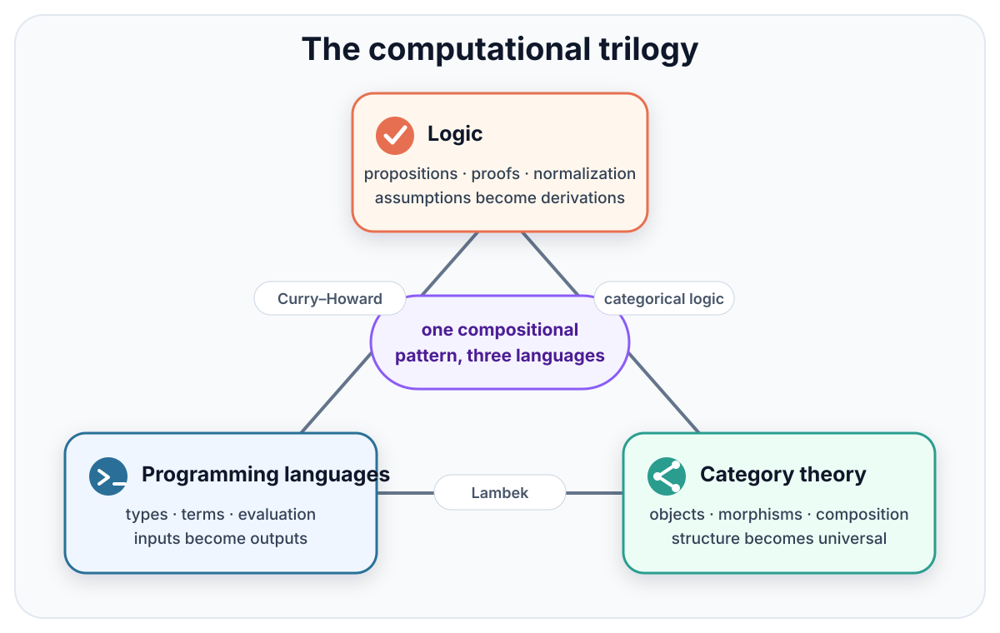
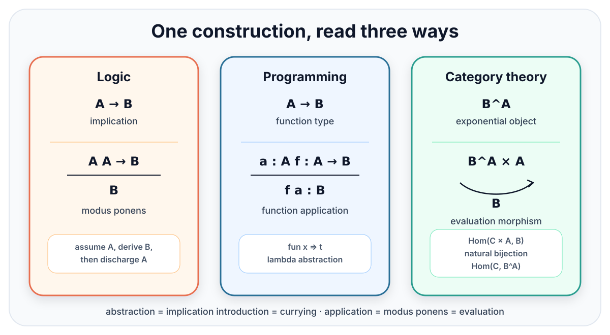
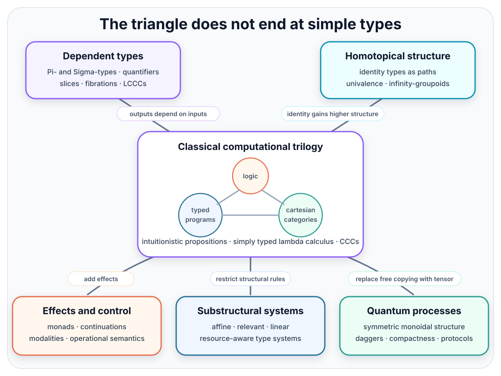
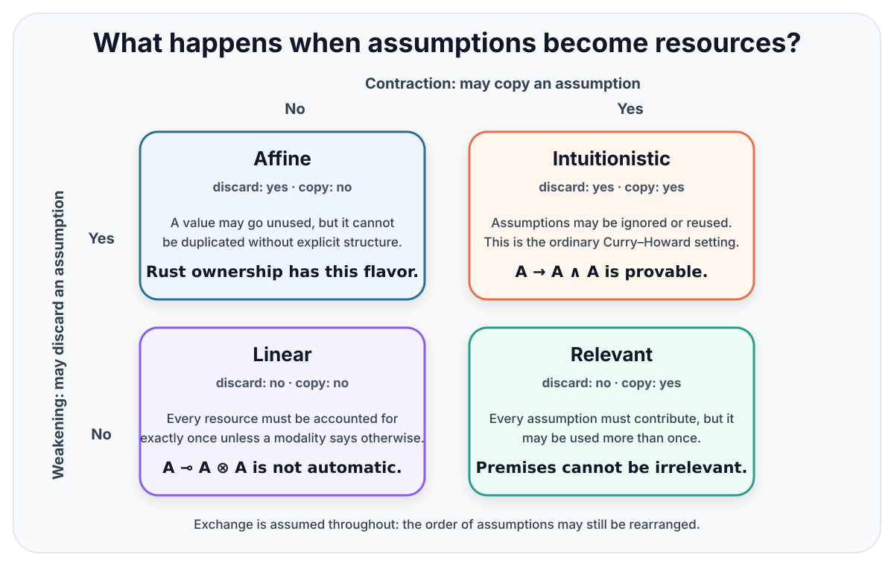

+++
title = "The Computational Trilogy: Three Languages for One Structure"
date = "2025-02-27"
updated = "2026-06-23"
description = "A guy tries to explain why proofs, programs, and morphisms keep turning into each other."
[extra]
comment = true
repo_view = true
read_time = true
mathjax = true
[taxonomies]
tags = ["math", "logic", "programming-languages", "category-theory"]
+++

## Motivation

Ask three people what computation is and you may get three answers that barely seem related.

A computer scientist might talk about programs, evaluation, and types. A logician might talk about propositions, derivations, and normalization. A category theorist might draw arrows until everyone else leaves the room.

For a long time I treated these as neighboring subjects. They shared notation, borrowed ideas from each other, and occasionally occupied the same seminar. Then I encountered the claim usually called the **computational trilogy** or **computational trinitarianism**:

> Propositions correspond to types and objects.  
> Proofs correspond to programs and morphisms.

The slogan is often compressed even further:

> Proofs are programs. Programs are morphisms.

When I first saw this, I thought it was either one of the deepest ideas I had encountered or an elaborate abuse of the word “are.” It is, in a sense, both.

There is a precise theorem underneath the slogan. Intuitionistic propositional logic, the simply typed lambda calculus, and cartesian closed categories present the same basic structure in three different languages. That precision matters, but it also creates more ideas we can explore. Nonetheless, the claim is not that every Python script is secretly a proof, that every mathematical proof should be executable, or that category theory has abolished the distinction between syntax and semantics. Those versions sound exciting and are mostly wrong.

The real correspondence is a bit narrower, but I now find it more interesting because of those limits. It tells us exactly which parts of logic behave computationally, exactly which type systems carry logical meaning, and exactly which categorical structures model those systems. When the correspondence breaks, the way it breaks usually points toward another logic, another language, or another category.

This post is my attempt to explain that triangle without sanding off the technical details that make it true. It began as an accessible companion to the [nLab page on the computational trilogy](https://ncatlab.org/nlab/show/computational+trilogy), but it has become partly an argument with my earlier draft.


The 2025 version was too confident in several places. I treated type errors as contradictions, implied that monads simply “are” modal logic, and moved from linear logic to quantum mechanics much too quickly. This revision narrows those claims, updates the examples to Lean 4, Rust, and current Q# syntax, and replaces the borrowed screenshots with original diagrams.




## What the trilogy actually says

The cleanest version of the story starts with three formal systems:

1. intuitionistic propositional logic;
2. the simply typed lambda calculus with products and a unit type;
3. cartesian closed categories.

Each system has its own vocabulary. Logic speaks about propositions and proofs. Type theory speaks about types and terms. Category theory speaks about objects and morphisms. The correspondence matches their constructions:

| Logic | Type theory / programming | Category theory |
|---|---|---|
| proposition $A$ | type $A$ | object $A$ |
| proof of $A$ | term $t : A$ | global element $1 \to A$ |
| assumption $A$ used to prove $B$ | term $x : A \vdash t : B$ | morphism $A \to B$ |
| implication $A \to B$ | function type $A \to B$ | exponential object $B^A$ |
| conjunction $A \land B$ | product type $A \times B$ | categorical product $A \times B$ |
| truth $\top$ | unit type $1$ | terminal object $1$ |
| proof normalization | program evaluation | equality of morphisms induced by the categorical laws |

This table is already enough to explain why the trilogy is not a loose metaphor. The same introduction and elimination rules appear on all three sides. Function abstraction, implication introduction, and currying are three presentations of one operation. Function application, modus ponens, and evaluation are three presentations of another.

There are also immediate caveats. Disjunction and falsity require coproducts and an initial object, so a bare cartesian closed category is not enough; one usually asks for a bicartesian closed category. Quantifiers require dependent types and additional categorical structure. Effects, general recursion, mutable state, concurrency, and control operators require still more. However, the triangle is a starting point of the ideas to come.

## Curry–Howard: proofs as programs

The first edge of the triangle connects logic and typed computation. Suppose I want to prove the transitivity of implication:

$$
(A \to B) \to (B \to C) \to (A \to C).
$$

A proof is almost forced. Assume a proof of $A \to B$, assume a proof of $B \to C$, and assume $A$. Apply the first implication to get $B$, then the second to get $C$.

Written as a lambda term, the proof is:

$$
\lambda f.\,\lambda g.\,\lambda x.\,g(f(x)).
$$

Written as a Haskell program, it is ordinary function composition:

```haskell
compose :: (a -> b) -> (b -> c) -> a -> c
compose f g x = g (f x)
```

Written in Lean 4, the theorem and the program have almost the same body:

```lean4
variable {A B C : Prop}

theorem implicationTransitivity
    (ab : A → B) (bc : B → C) : A → C :=
  fun a => bc (ab a)

def compose {α β γ : Type}
    (f : α → β) (g : β → γ) : α → γ :=
  fun x => g (f x)
```

Lean reads a proposition as a type and a proof as a term inhabiting that type. To prove `A → C`, we construct a function that turns a proof of `A` into a proof of `C`. The logical and computational readings are not merely similar descriptions of the code. They are the same typing judgment read in two ways.

### Introduction rules become constructors

The correspondence is especially visible in natural deduction. Implication introduction says:

\begin{prooftree}
\AxiomC{$\Gamma, x : A \vdash t : B$}
\RightLabel{\scriptsize $\to\ \mathrm{introduction}$}
\UnaryInfC{$\Gamma \vdash (\mathsf{fun}\ x \Rightarrow t) : A \to B$}
\end{prooftree}

If, under the assumption $x : A$, we can construct a proof of $B$, then we can discharge that assumption and obtain a proof of $A \to B$. In programming language terms, we define a function.

Implication elimination, better known as modus ponens, says:

\begin{prooftree}
\AxiomC{$\Gamma \vdash f : A \to B$}
\AxiomC{$\Gamma \vdash a : A$}
\RightLabel{\scriptsize $\to\ \mathrm{elimination}$}
\BinaryInfC{$\Gamma \vdash f\ a : B$}
\end{prooftree}

In programming language terms, we apply a function.

Products work the same way. A proof of $A \land B$ contains a proof of $A$ and a proof of $B$, so it behaves like a pair. A proof of $A \lor B$ contains either a proof of $A$ or a proof of $B$, together with a tag telling us which, so it behaves like a sum type. A proof of $\bot$ would be an inhabitant of the empty type, which is why a function $A \to \bot$ represents a proof of $\neg A$.

| Logic | Type |
|---|---|
| $A \land B$ | $A \times B$ |
| $A \lor B$ | $A + B$ |
| $A \to B$ | function type $A \to B$ |
| $\top$ | unit type |
| $\bot$ | empty type |
| $\neg A$ | $A \to \bot$ |

The important correction to my old draft is this: **a type error is not a logical contradiction**. A type error means that a term fails to constitute a proof in the system. A contradiction would be a well-typed closed term of the empty type. Those are very different failures.

### Evaluation becomes normalization

Proofs can contain detours. We might build a conjunction and immediately project its first component:

\begin{prooftree}
\AxiomC{$a : A$}
\AxiomC{$b : B$}
\RightLabel{\scriptsize $\land\ \mathrm{introduction}$}
\BinaryInfC{$(a,b) : A \land B$}
\RightLabel{\scriptsize $\land\ \mathrm{elimination}_1$}
\UnaryInfC{$a : A$}
\end{prooftree}

The corresponding program is:

```haskell
fst (a, b)
```

Evaluation reduces it to `a`. Proof normalization removes the same detour. This is the computational content of cut elimination and normalization: executing a term corresponds to simplifying a proof.

Again, the scope matters. This clean story applies most directly to total, pure calculi in which evaluation behaves well. A general-purpose language may diverge, throw an exception, mutate memory, inspect a continuation, or communicate with another process. None of that destroys Curry–Howard, but each feature changes the logical system and the semantics needed to model it.

### Proof assistants make the correspondence visible

Lean, Agda, and the Rocq Prover (formerly Coq) make this shared structure hard to ignore. Their kernels check terms against types; some of those types represent data and others represent propositions. The boundary between “program” and “proof” is therefore not a boundary in the core syntax.

Still, it would be misleading to say that ordinary mathematical proof and ordinary programming have become indistinguishable. A human proof in a paper leaves many steps implicit. A proof assistant elaborates those steps into a formal term that a small kernel can check. The machine-checked term is a proof in a formal calculus; the prose argument is usually a guide to a term that still has to survive elaboration and kernel checking. The difference matters, especially when formalization becomes a research tool.

## Lambek: programs as morphisms

Curry–Howard gives us logic and programming. Joachim Lambek supplied the third corner by showing that the simply typed lambda calculus has the equational structure of a cartesian closed category.

A category consists of objects and morphisms. Every object $A$ has an identity morphism $\mathrm{id}_A : A \to A$, and composable morphisms

$$
f : A \to B, \qquad g : B \to C
$$

have a composite

$$
g \circ f : A \to C.
$$

Composition is associative, and identities act neutrally. That definition is famously small. The point is not that every category is about computation. The point is that typed functions already obey these laws, so categories provide a language in which we can describe what is essential about composition while ignoring implementation details.

### A typed term is a morphism from its context

A judgment such as

$$
x : A,\ y : B \vdash t : C
$$

can be read categorically as a morphism

$$
A \times B \longrightarrow C.
$$

The entire typing context becomes a product object. Substitution becomes composition. A variable becomes a projection. The identity term becomes an identity morphism.

For a term with one free variable,

$$
x : A \vdash t : B,
$$

we obtain a morphism $A \to B$. If the term is closed, the context is empty, represented by the terminal object $1$, so a closed term $t : A$ becomes a global element $1 \to A$.

This is the categorical version of the proofs-as-programs idea: a proof of $B$ from an assumption $A$ is a morphism from $A$ to $B$.

### Why cartesian closed categories appear

A cartesian closed category has exactly the structure needed to interpret the simply typed lambda calculus with products:

- a terminal object $1$;
- binary products $A \times B$;
- exponential objects $B^A$.

The exponential $B^A$ plays the role of the function type $A \to B$. It comes with an evaluation morphism

$$
\operatorname{ev}_{A,B} : B^A \times A \to B,
$$

which is categorical function application.

Currying is expressed by a natural bijection

$$
\operatorname{Hom}(C \times A, B)
\cong
\operatorname{Hom}(C, B^A).
$$

A function of two arguments can be regarded as a function returning a function. The same equation appears as lambda abstraction in programming and implication introduction in logic.



This was the point at which the subject clicked for me. Category theory was not adding a decorative layer on top of lambda calculus. It was extracting the algebra of substitution, pairing, abstraction, and application.

### Syntax and semantics are related, not identical

There are two directions here.

Given a typed lambda calculus, we can construct its **syntactic category**: types are objects, and equivalence classes of terms are morphisms. Beta–eta equality becomes equality of morphisms. This category is cartesian closed.

Conversely, any cartesian closed category gives a semantics for the simply typed lambda calculus. Types are interpreted as objects, terms as morphisms, pairing as the universal property of products, and lambda abstraction through the exponential adjunction.

This is why saying “programs are morphisms” is useful but incomplete. A source program has syntax, reduction steps, variable names, and operational behavior. A morphism in a semantic category may forget some or all of that. The correspondence concerns the structure preserved by the interpretation, not a literal identity between text files and arrows.

## Harper’s computational trinitarianism

Robert Harper gave this three-way unity its most memorable name. His “computational trinitarianism” treats logic, programming languages, and categories as three manifestations of one notion of computation. The religious language is intentionally playful, but the methodological point is serious: no corner has permanent priority.

A logical connective can suggest a type former. A type system can reveal a proof theory. A categorical construction can expose the universal property shared by both. Moving around the triangle is often easier than attacking a problem in one language alone.

The following table gives the basic translation. It is corrected from my old version, which confused products with composition and exponentials with Kan extensions.

| Categorical structure | Sets and functions | Logic | Typed lambda calculus |
|---|---|---|---|
| object | set | proposition | type |
| morphism $A \to B$ | function | proof of $B$ from $A$ | term with input $A$ and output $B$ |
| terminal object $1$ | singleton set | truth $\top$ | unit type |
| product $A \times B$ | cartesian product | conjunction $A \land B$ | pair type |
| exponential $B^A$ | function set | implication $A \to B$ | function type |
| evaluation | function application | modus ponens | term application |
| currying | curried function | deduction theorem | lambda abstraction |

The table is thus not merely a dictionary. Line the equations up. Beta reduction corresponds to applying an abstraction; eta expansion corresponds to the extensional principle that a function is determined by how it acts on arguments; product laws correspond to the introduction and elimination equations for conjunction.

John Baez and Mike Stay used the image of a Rosetta Stone for a larger network connecting physics, topology, logic, and computation. I like that analogy because a Rosetta Stone does not claim that its languages are visually identical, but it lets us translate while preserving meaning. Isomorphisms, universal properties, and naturality are the preserved meaning.

### A research heuristic; not a law of nature

The trinitarian viewpoint suggests a useful habit:

- when a new logic appears, look for its type theory and categorical semantics;
- when a new type discipline appears, ask what proof rules it enforces;
- when a categorical structure appears, ask what language has it as a model.

This habit has been productive. Linear logic led to linear type systems and monoidal semantics. Classical logic is connected to continuations and control operators. Moggi’s use of monads gave a compositional semantics for computational effects. Modal logics have informed staged computation, guarded recursion, mobility, and effect systems.

But the translations are not usually one-line identities. “Monads are modal logic” is too crude. Certain monads interpret certain modalities or notions of computation under specific conditions. “Continuations are classical logic” is also shorthand for a precise family of correspondences involving control operators, double-negation translations, and evaluation strategy. The trilogy is strongest when it makes us ask for the missing hypotheses.

## Where the slogan breaks

The phrase “proofs are programs” is so satisfying that it tempts people, including me, to stop reading too early. Several distinctions survive the correspondence.

### Not every type is a proposition in the same sense

In a propositions-as-types reading, a type is interpreted as the proposition that it is inhabited. But programming languages use types for many purposes: memory layout, representation, optimization, effects, ownership, protocol state, and abstraction boundaries. The logical reading may still exist, but it may not be the only useful one.

Lean makes a deliberate distinction between `Prop` and data-bearing universes such as `Type`. Proofs in `Prop` are proof-irrelevant: the system does not computationally distinguish two proofs of the same proposition. Terms in `Type` can carry data that matters at runtime. That design is itself a reminder that “types are propositions” has variants.

### Nontermination changes the logic

In a strongly normalizing calculus, every well-typed term evaluates to a normal form. This supports the reading of an inhabitant as a completed proof. Add unrestricted general recursion and we can write a term that claims any type but never produces a value. Logically, divergence behaves like a serious complication, not a free theorem.

Languages handle this in different ways. Some isolate partiality in an effect. Some use domain theory. Some distinguish total functions from general computations. The simple Curry–Howard story does not disappear, but it no longer describes the whole language.

### Effects need semantics beyond plain functions

A function that reads mutable state is not determined only by its explicit argument. A computation that may throw an exception does not simply return a value of type $B$. A nondeterministic computation may return several possible values. Moggi’s insight was to separate values from computations, often interpreting an effectful computation returning a $B$ as a morphism into $T B$ for a suitable monad $T$.

This is a beautiful extension of the categorical corner, but it is not the claim that every Haskell monad corresponds to a familiar modal logic. The details depend on the monad, the type theory, and the equations we impose.

### Human proofs are not formal terms on the page

The trilogy can make formalists sound as if an informal proof is merely badly formatted source code. I do not think that is right.

Mathematicians use diagrams, analogies, omitted cases, appeals to symmetry, changes of viewpoint, and judgments about which lemma is worth proving. A formal term records enough detail for a kernel to verify correctness inside a chosen foundation. It does not automatically record why the proof was discovered, which representation made it visible, or which parts a human considers explanatory.

The computational trilogy tells us something profound about formal derivations. It does not settle the philosophy of mathematical understanding.

## Dependent types: computation in context

The simply typed triangle treats a function’s output type as independent of its input. Dependent type theory removes that restriction.

A dependent function type

$$
\prod_{x:A} B(x)
$$

contains functions that take $x : A$ and return a value of type $B(x)$. Logically, this corresponds to universal quantification. A dependent pair

$$
\sum_{x:A} B(x)
$$

contains an $x : A$ together with a witness of $B(x)$, corresponding to existential quantification.

| Logic | Dependent type theory |
|---|---|
| $\forall x:A.\,B(x)$ | dependent function $\prod_{x:A} B(x)$ |
| $\exists x:A.\,B(x)$ | dependent pair $\sum_{x:A} B(x)$ |

Categorically, contexts and substitutions are no longer captured by one cartesian closed category alone. We need structure that tracks families of types varying over a base. Slice categories, fibrations, comprehension categories, categories with families, and locally cartesian closed categories are several related ways to organize this.

The slice category $\mathcal{C}/\Gamma$ consists of objects and morphisms living over a context $\Gamma$. A dependent type over $\Gamma$ can be represented by a map into $\Gamma$, and substitution becomes pullback. This is the rigorous version of the phrase “computation happens in context.”

My old draft leapt from this observation to claims about practical program verification through non-abelian cohomology. That was not justified. There are genuine connections between higher toposes, classifying maps, cocycles, and dependent type theory, especially in work around cohesive and homotopical mathematics. But that does not currently mean that one can feed ordinary source code into cohomology and read off unreachable states. The mathematics is real; my application story was not.

## Homotopy type theory: proofs have shape

Homotopy type theory changes the picture again by taking identity types seriously as mathematical objects.

In ordinary set-level thinking, equality often behaves like a yes-or-no relation. In homotopy type theory, a proof of equality $x =_A y$ can be viewed as a path from $x$ to $y$ in the space represented by $A$. Equalities between equalities become homotopies between paths, and this continues to higher dimensions.

The correspondence expands:

| Type theory | Homotopy theory | Higher category theory |
|---|---|---|
| type | space / $\infty$-groupoid | object-like higher structure |
| term | point | object / generalized element |
| identity proof | path | invertible higher morphism |
| equality between identity proofs | homotopy between paths | higher morphism |

The univalence axiom is often summarized as “equivalence is equality.” More precisely, for types $A$ and $B$ in a universe $\mathcal{U}$, the canonical map from identity to equivalence is itself an equivalence:

$$
(A =_{\mathcal{U}} B) \simeq (A \simeq B).
$$

This does not mean that two data structures with the same number of elements are interchangeable at zero cost in an ordinary compiler. It means that, inside univalent type theory, an equivalence between types can be used as a path along which constructions and proofs may be transported.

Cubical type theories give computational content to this idea. Cubical Agda, for example, supports computational univalence and higher inductive types rather than treating univalence only as an opaque axiom. That is one place where the phrase “proofs are programs” becomes stranger and more literal: paths, transport, and higher structure participate in computation.



I am still fascinated by this higher version, but I now resist calling it a completed “tetralogy.” There are several overlapping correspondences here, and researchers do not package them all in one universally agreed framework. The map is useful; the branding is optional.

## Structural rules: linear, affine, and relevant computation

One of the best ways to understand the trilogy is to change the logical rules and watch all three corners move.

Ordinary intuitionistic logic permits three structural rules on assumptions:

- **exchange**: assumptions may be reordered;
- **weakening**: an assumption may go unused;
- **contraction**: an assumption may be duplicated.

Substructural logics restrict some of these rules. Assuming exchange remains available, we obtain a useful four-way comparison:

| Logic | Weakening | Contraction | Informal resource reading |
|---|---:|---:|---|
| intuitionistic | yes | yes | values may be discarded or copied |
| affine | yes | no | values may be discarded but not implicitly copied |
| relevant | no | yes | values must be used but may be copied |
| linear | no | no | values must be used exactly once |

The difference is concrete. In ordinary intuitionistic logic, the proposition

$$
A \to A \land A
$$

is provable because we may use the assumption $A$ twice. In linear logic, the analogous formula

$$
A \multimap A \otimes A
$$

is not generally provable. Producing two resources from one would require an explicit copying structure. The exponential modality $!A$ marks resources that may be duplicated and discarded.

A 2026 paper by Fernando Cano-Jorge develops trinitarian presentations not only for linear logic but also for affine and relevant logic. I like this update because it corrects an impression my old post gave: the trilogy is not one fixed triangle with a quantum annex. Changing structural rules systematically changes the proof theory, the term calculus, and the categorical semantics.



### Rust has an affine flavor

Rust is often described as having an affine ownership discipline. For values that do not implement `Copy`, moving the value consumes the original binding; the value may be used at most once unless it is borrowed or explicitly cloned.

```rust
fn consume(text: String) -> usize {
    text.len()
}

fn main() {
    let message = String::from("proofs as programs");
    let length = consume(message);

    println!("{length}");
    // println!("{message}");
    // Error: `message` was moved into `consume`.
}
```

This does not mean that the whole Rust language is a direct implementation of affine logic. Borrowing, lifetimes, `Copy`, mutation, unsafe code, and the operational semantics all add structure. But the resource-sensitive intuition is genuine: ownership prevents unrestricted implicit duplication of certain values.

## The quantum connection, with fewer miracles

My old draft presented a neat parallel:

1. intuitionistic logic becomes linear logic;
2. classical computation becomes quantum computation;
3. cartesian closed categories become monoidal categories.

There is something important here, but we must expand.

Linear logic and quantum theory both care about copying and deletion. The no-cloning theorem says there is no universal physical operation that perfectly copies an arbitrary unknown quantum state. Cartesian categories, by contrast, provide a natural diagonal map $A \to A \times A$ for every object, exactly the kind of uniform copying operation that quantum states do not possess.

This is one reason symmetric monoidal categories, rather than cartesian categories, are natural for quantum processes. A tensor product $A \otimes B$ combines systems without automatically supplying diagonal and deletion maps. Categorical quantum mechanics adds further structure, commonly dagger compact structure, to model adjoints, entanglement, and process composition.

But linear logic is not quantum mechanics. Many linear systems have nothing quantum about them. The no-cloning theorem does not say that a qubit can be touched only once; quantum gates can act on the same qubit sequentially. It says that an arbitrary unknown state cannot be duplicated by one uniform quantum operation. And a quantum programming language need not expose a linear type system directly.

Given two qubits initialized to $|0\rangle$, a current Q# operation for preparing a Bell pair is simple:

```qsharp
operation CreateBellPair(q1 : Qubit, q2 : Qubit) : Unit {
    H(q1);
    CNOT(q1, q2);
}
```

This circuit applies a Hadamard gate to `q1` and then entangles `q1` with `q2` using `CNOT`. It illustrates monoidal composition and entanglement. It does **not** by itself demonstrate a Curry–Howard correspondence for quantum computation, and Q#’s type system is not being used here as a proof of no-cloning.

The more defensible picture is you may see in papers is:

- linear logic supplies a resource-sensitive proof theory;
- linear type systems and quantum data share a concern with unrestricted copying;
- symmetric monoidal and dagger compact categories organize process composition;
- categorical quantum mechanics shows that this structure captures substantial quantum protocols.

Which is really cool already.

## One example across all three corners

It helps to finish the technical part with one construction and carry it around the triangle.

Suppose we have:

$$
f : A \to B, \qquad g : B \to C.
$$

### In logic

From $A \to B$ and $B \to C$, we derive $A \to C$. This is transitivity of implication.

### In programming

We compose functions:

```haskell
compose :: (a -> b) -> (b -> c) -> a -> c
compose f g = \x -> g (f x)
```

### In category theory

We compose morphisms:

$$
A \xrightarrow{f} B \xrightarrow{g} C
$$

into

$$
A \xrightarrow{g \circ f} C.
$$

The three descriptions preserve more than the final input-output relationship. Identity proofs correspond to identity functions and identity morphisms. Substitution corresponds to function composition and categorical composition. Associativity appears in all three languages.

This is what I mean by “one structure.” Not that the notation disappears, or that every question transfers automatically, but that the operations and equations line up tightly enough that a result in one corner can become a theorem, a program, or a semantic construction in another.

## Conclusion

What still amazes me about the computational trilogy is the potential for translation. The three corners are not identical, but they are close enough that we can move between them systematically. We can ask what information is preserved, what is forgotten, and what new structure is needed when the correspondence fails.

Implication becomes a function type and an exponential object. Modus ponens becomes application and evaluation. Proof normalization becomes term reduction. Substitution becomes composition. When we change the treatment of assumptions, intuitionistic logic separates into affine, relevant, and linear systems, and corresponding type systems and categories appear with it. When types depend on terms, slice categories and fibrations enter. When identity proofs carry higher structure, homotopy theory enters. When copying ceases to be free, monoidal categories become unavoidable.

None of this proves that computation is the fabric of reality. I am less willing to make that sentence now than I was a year ago. It does show that logic, programs, and mathematical structure repeatedly organize themselves around the same compositional patterns.

The borders do not vanish. A proof is still not the same cultural object as a program, and a program is still not the same syntactic object as a morphism. But crossing the borders becomes systematic. We can ask what information a translation preserves, what it forgets, and what new structure is needed when it fails.

That, to me, is the real value of the trilogy. It is not one grand answer. It is a disciplined way to move between questions.


1. H. B. Curry, “Functionality in Combinatory Logic,” *Proceedings of the National Academy of Sciences* 20(11), 1934, 584–590.
2. William A. Howard, “The Formulae-as-Types Notion of Construction,” in J. P. Seldin and J. R. Hindley (eds.), *To H. B. Curry: Essays on Combinatory Logic, Lambda Calculus and Formalism*, Academic Press, 1980, 479–490. The manuscript dates from 1969.
3. Joachim Lambek, “From $\lambda$-Calculus to Cartesian Closed Categories,” in J. P. Seldin and J. R. Hindley (eds.), *To H. B. Curry: Essays on Combinatory Logic, Lambda Calculus and Formalism*, Academic Press, 1980, 375–402.
4. Joachim Lambek and Philip J. Scott, *Introduction to Higher-Order Categorical Logic*, Cambridge University Press, 1986. [doi:10.1017/CBO9780511525858](https://doi.org/10.1017/CBO9780511525858)
5. Robert Harper, [“The Holy Trinity”](https://existentialtype.wordpress.com/2011/03/27/the-holy-trinity/), 2011.
6. Philip Wadler, “Propositions as Types,” *Communications of the ACM* 58(12), 2015, 75–84. [doi:10.1145/2699407](https://doi.org/10.1145/2699407)
7. John C. Baez and Mike Stay, “Physics, Topology, Logic and Computation: A Rosetta Stone,” in *New Structures for Physics*, Lecture Notes in Physics 813, 2011, 95–174. [arXiv:0903.0340](https://arxiv.org/abs/0903.0340)
8. Jeremy Avigad, Leonardo de Moura, Soonho Kong, Sebastian Ullrich, and contributors, [*Theorem Proving in Lean 4*](https://lean-lang.org/theorem_proving_in_lean4/), current online edition.
9. The Rocq Prover team, [The Rocq Prover](https://rocq-prover.org/), formerly the Coq Proof Assistant.
10. Eugenio Moggi, “Notions of Computation and Monads,” *Information and Computation* 93(1), 1991, 55–92. [doi:10.1016/0890-5401(91)90052-4](https://doi.org/10.1016/0890-5401(91)90052-4)
11. Timothy G. Griffin, “A Formulae-as-Type Notion of Control,” *POPL ’90*, 1990, 47–58. [doi:10.1145/96709.96714](https://doi.org/10.1145/96709.96714)
12. The Univalent Foundations Program, [*Homotopy Type Theory: Univalent Foundations of Mathematics*](https://homotopytypetheory.org/book/), 2013.
13. Michael Shulman, [“Homotopical Trinitarianism: A Perspective on Homotopy Type Theory”](https://home.sandiego.edu/~shulman/papers/trinity.pdf), 2018 slides.
14. Agda documentation, [“Cubical”](https://agda.readthedocs.io/en/latest/language/cubical.html), current online edition.
15. Jean-Yves Girard, “Linear Logic,” *Theoretical Computer Science* 50, 1987, 1–101. [doi:10.1016/0304-3975(87)90045-4](https://doi.org/10.1016/0304-3975(87)90045-4)
16. Fernando Cano-Jorge, “Extending Computational Trinitarianism,” *Logic Journal of the IGPL*, published online 8 June 2026; assigned to volume 34, issue 4. [doi:10.1093/jigpal/jzag037](https://doi.org/10.1093/jigpal/jzag037)
17. Samson Abramsky and Bob Coecke, “A Categorical Semantics of Quantum Protocols,” *LICS 2004*, 415–425. [doi:10.1109/LICS.2004.1319636](https://doi.org/10.1109/LICS.2004.1319636)
18. Peter Selinger, “A Survey of Graphical Languages for Monoidal Categories,” in *New Structures for Physics*, 2011. [arXiv:0908.3347](https://arxiv.org/abs/0908.3347)
19. Microsoft, [“Quantum Intermediate Representation”](https://learn.microsoft.com/en-us/azure/quantum/concepts-qir), including the Q# Bell-pair example.
20. nLab, [“Computational Trilogy”](https://ncatlab.org/nlab/show/computational+trilogy), accessed June 2026.

